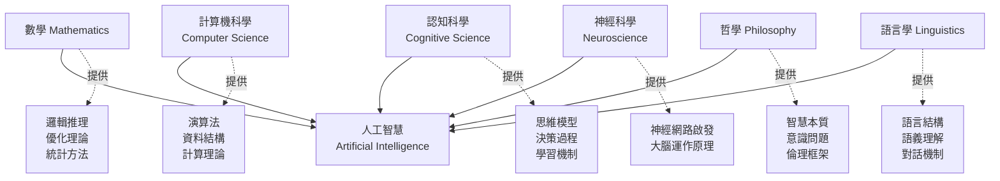
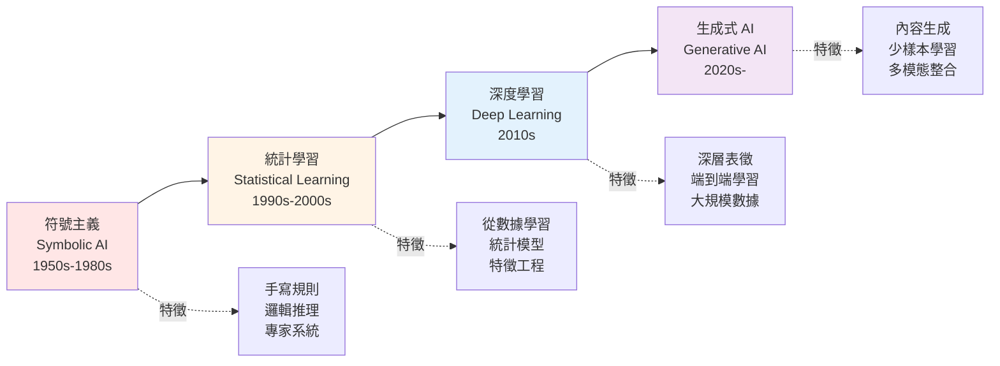
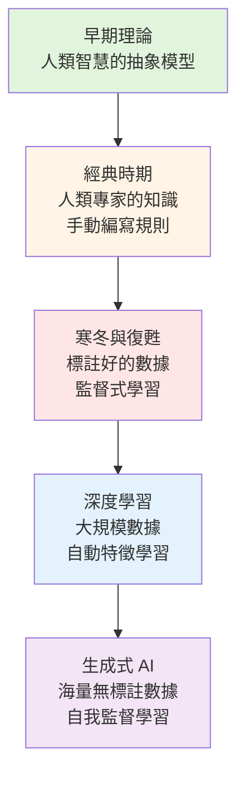
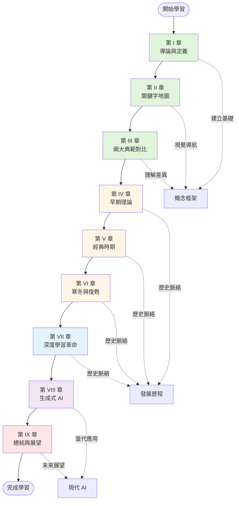

<!-- Path: 114A_AI_intro/History | Timestamp: 2025-10-26 10:20:00 | Version: b02 -->
# 第 I 章：導論 — AI 的起源與意義

[← 返回目錄](./README_b02.md) | [下一章：關鍵字地圖 →](./Chapter_02_KeywordMap_b02.md)

---

## 1.1 人工智慧的核心定義

**人工智慧 (Artificial Intelligence, AI)** 的核心定義是「利用機器模擬人類智慧的科學與工程」。這不僅僅是關於計算，更是試圖複製人類的認知能力，如學習、推理、問題解決、感知和語言理解。

### 什麼是「智慧」？

在定義人工智慧之前，我們必須先問：什麼是智慧？這是一個哲學與科學交織的問題。

**傳統觀點的智慧特徵**：
- **學習能力**：從經驗中獲取知識
- **推理能力**：根據已知推導未知
- **問題解決**：面對新情境找出解決方案
- **適應能力**：根據環境變化調整行為
- **語言理解**：理解和生成有意義的語言
- **感知能力**：理解視覺、聽覺等感官輸入

**AI 的挑戰**：
如何將這些抽象的認知能力轉化為可計算的過程？這正是 AI 研究的核心挑戰。

---

## 1.2 哲學與科學根源

AI 的思想並非憑空而生，它可以追溯到古典哲學家對人類思維本質的探討。

### 1.2.1 亞里斯多德的邏輯三段論

**亞里斯多德 (Aristotle, 384-322 BC)** 建立了形式邏輯的基礎，提供了推理的規則系統。

**三段論範例**：
```
大前提：所有人都會死
小前提：蘇格拉底是人
結論：因此，蘇格拉底會死
```

**對 AI 的影響**：
- 展示了推理可以被形式化為規則
- 成為後來專家系統的理論基礎
- 證明了某些智慧行為可以被結構化描述

**局限性**：
- 只能處理確定性推理
- 難以處理模糊、不確定的現實問題
- 無法處理例外情況

### 1.2.2 萊布尼茲的「通用語言」

**戈特弗里德·萊布尼茲 (Gottfried Wilhelm Leibniz, 1646-1716)** 是德國哲學家、數學家，他提出了一個大膽的構想。

**Characteristica Universalis（通用符號系統）**：
- 設想創造一種通用的形式語言
- 這種語言可以表達所有人類思想
- 所有推理都可以轉化為符號計算
- 爭論可以透過「讓我們計算吧！」(Calculemus!) 來解決

**預示意義**：
- 「推理即計算」的理念
- 預示了現代計算機科學的核心思想
- 影響了後來的形式語言與 logique 系統設計

**名言**：
> "當爭論出現時，兩位哲學家之間不需要比兩位會計師之間更多的爭論。拿起筆和紙，坐下來說：讓我們計算吧。"

### 1.2.3 喬治·布爾的邏輯代數化

**喬治·布爾 (George Boole, 1815-1864)** 將邏輯從哲學領域帶入了數學領域。

**布爾代數 (Boolean Algebra, 1854)**：
- 將邏輯運算轉化為代數運算
- 發明了二元邏輯系統：真/假、1/0
- 定義了 AND、OR、NOT 等邏輯運算

**基本運算**：
```
AND (且)：兩者都為真時，結果為真
OR (或)：至少一個為真時，結果為真
NOT (非)：反轉真假值
```

**深遠影響**：
- 成為數位電路的理論基礎
- 所有現代電腦都基於布林邏輯運作
- 直接影響了程式語言的邏輯運算

**實例**：
```python
# 現代程式語言中的布林邏輯
if (age >= 18) AND (has_license == True):
    print("可以開車")
```

---

## 1.3 從哲學到工程：計算理論的建立

### 1.3.1 計算的本質

20 世紀初，數學家開始嚴格探討「什麼可以被計算」的問題。

**關鍵問題**：
- 是否存在一個通用的方法可以解決所有數學問題？
- 哪些問題原則上是可解的？
- 計算的能力邊界在哪裡？

**影響**：
這些理論探討為 AI 提供了基礎：
- 定義了機器能力的理論上限
- 幫助我們理解 AI 的可能性與局限性
- 指引了 AI 研究的方向

### 1.3.2 AI 的多學科本質

**AI 建立在以下學科的交會點**：



**各學科的貢獻**：

| 學科 | 核心貢獻 | 代表概念 |
|------|----------|----------|
| **數學** | 提供形式化工具與優化方法 | 微積分、線性代數、機率論 |
| **計算機科學** | 實現 AI 的技術基礎 | 演算法、資料結構、平行計算 |
| **認知科學** | 理解人類思維過程 | 記憶模型、注意力機制、學習理論 |
| **神經科學** | 啟發神經網路設計 | 神經元、突觸、大腦分區 |
| **哲學** | 探討智慧與意識本質 | 心靈哲學、知識論、倫理學 |
| **語言學** | 提供語言理解框架 | 語法、語義、語用學 |

---

## 1.4 為什麼要學習 AI 歷史？

### 1.4.1 為什麼要學習 AI 歷史？

了解 AI 的發展歷程不僅僅是知識的累積，更有以下重要意義：

**1. 理解典範轉移 (Paradigm Shifts)**

AI 的發展並非線性進步，而是經歷了多次根本性的典範轉移：



**典範轉移的啟示**：
- 沒有一種方法是「終極解答」
- 每個典範都有其適用範圍與局限
- 新典範往往建立在舊典範的基礎上
- 理解過去能幫助我們預測未來

**2. 避免過度樂觀與悲觀**

**歷史教訓 — AI 寒冬**：

AI 歷史上經歷了兩次「寒冬期」：
- **第一次 AI 寒冬 (1974-1980)**：符號 AI 的局限性暴露
- **第二次 AI 寒冬 (1987-1993)**：專家系統的泡沫破滅

**寒冬的成因**：
- 過度承諾：研究者的預測過於樂觀
- 資金削減：未能實現承諾，導致投資者失去信心
- 技術瓶頸：硬體性能、數據匱乏、理論限制

**當代的類比**：
今天的生成式 AI 熱潮是否會重蹈覆轍？歷史告訴我們：
- ✅ 保持理性：技術有其局限性
- ✅ 長期視角：真正的突破需要時間
- ✅ 務實態度：關注實際應用與價值
- ❌ 盲目樂觀：避免過度誇大能力
- ❌ 全盤否定：也不應因挑戰而放棄

**3. 理解技術的連續性**

今天的 AI 成就並非憑空而來，而是建立在幾十年的累積之上：

**範例：神經網路的演進**
```
1943: McCulloch-Pitts 神經元模型
  ↓
1958: Rosenblatt 的感知器
  ↓
1969: Minsky 指出感知器局限 → 寒冬
  ↓
1986: Rumelhart 的反向傳播演算法 → 復甦
  ↓
2012: Hinton 的 AlexNet → 深度學習革命
  ↓
2017: Vaswani 的 Transformer → 當代 AI 基礎
  ↓
2022: ChatGPT → 生成式 AI 爆發
```

**啟示**：
- 許多「新」技術其實有深厚的歷史根源
- 突破往往需要數十年的積累
- 失敗的嘗試也是進步的一部分

**4. 學習前人的智慧與錯誤**

**成功的經驗**：
- AlexNet：證明了深度學習的潛力
- Transformer：簡化架構反而更有效
- 預訓練-微調：減少對標註數據的需求

**失敗的教訓**：
- 過度依賴符號推理的脆弱性
- 忽視硬體限制的代價
- 缺乏常識推理的困境

---

## 1.5 AI 發展的五個主要時期

### 時期劃分

為了更好地理解 AI 的演進，我們將其歷史劃分為五個主要時期，這與第二章的關鍵字地圖保持一致。

| 時期 | 年代 | 核心特徵 | 代表典範 |
|------|------|----------|----------|
| **早期理論基礎** | 1940s-1950s | 奠定理論基礎，提出核心概念 | 計算理論、控制論 |
| **經典時期** | 1956-1970s | AI 正式誕生，早期探索與樂觀 | 符號主義 vs. 連結主義 |
| **寒冬與復甦** | 1970s-1990s | 遭遇挫折，典範轉移開始 | 專家系統、機器學習 |
| **深度學習革命** | 2000s-2010s | 三要素匯聚，AI 爆發 | 深度學習、CNN、Transformer |
| **生成式 AI 時代** | 2020s- | 從理解到創造，AI 新紀元 | 大型語言模型、擴散模型 |

### 知識來源的演變



---

## 1.6 課程學習地圖

為了幫助您理解本課程的整體結構，以下是學習地圖：



---

## 1.7 本章小結

### 核心要點

1. **AI 的定義**：模擬人類智慧的科學與工程，涉及學習、推理、問題解決等認知能力

2. **哲學根源**：
   - 亞里斯多德：形式邏輯與推理規則
   - 萊布尼茲：推理即計算的理念
   - 布爾：邏輯的代數化

3. **多學科本質**：AI 融合了數學、計算機科學、認知科學、神經科學、哲學、語言學

4. **歷史視角的價值**：
   - 理解典範轉移
   - 避免過度樂觀/悲觀
   - 認識技術的連續性
   - 學習前人的智慧與錯誤

5. **五個發展時期**：
   - 早期理論 → 經典時期 → 寒冬與復甦 → 深度學習 → 生成式 AI

### 思考問題

1. **哲學思考**：如果一個 AI 系統通過了圖靈測試，它是否真的「理解」了對話內容？還是只是巧妙地模擬？

2. **歷史反思**：AI 寒冬給我們的最大教訓是什麼？當代的生成式 AI 熱潮應該如何避免重蹈覆轍？

3. **跨學科視角**：為什麼 AI 需要如此多學科的貢獻？單靠計算機科學是否足夠？

4. **未來展望**：從符號主義到生成式 AI 的演進，下一個典範轉移可能是什麼？

---

## 延伸閱讀

**經典著作**：
- Alan Turing (1950). "Computing Machinery and Intelligence"
  - 圖靈測試的原始論文，探討機器是否能思考

**推薦影片**：
- 【AI世代的教與學】part2/ 陳宜欣教授
  - 探討 AI 對教育的衝擊與啟示

**深入探討**：
- 第 IV 章將詳細介紹圖靈測試與早期理論
- 第 VI 章將深入分析 AI 寒冬的成因與教訓

---

[← 返回目錄](./README_b02.md) | [下一章：關鍵字地圖 →](./Chapter_02_KeywordMap_b02.md)
