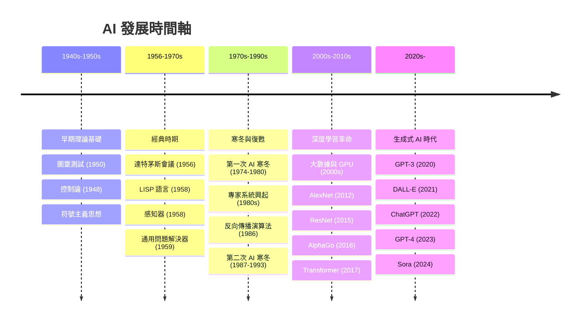
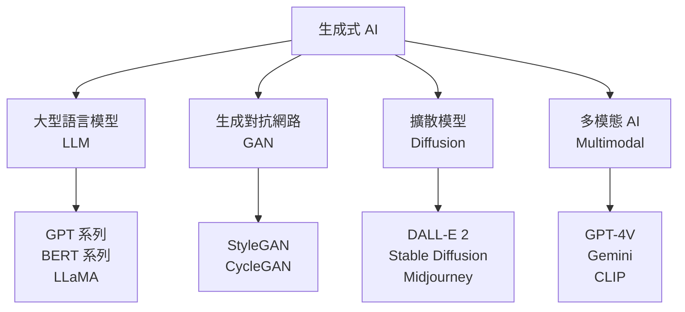
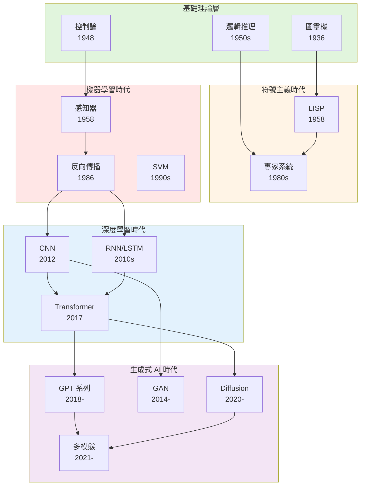

<!-- Path: 114A_AI_intro/History | Timestamp: 2025-10-26 10:21:00 | Version: b02 -->
# 第 II 章：AI 發展關鍵字探究地圖

[← 上一章：導論](./Chapter_01_Introduction_b02.md) | [返回目錄](./README_b02.md) | [下一章：兩大典範 →](./Chapter_03_TwoParadigms_b01.md)

---

## 2.1 章節目的

本章提供了 AI 發展的**視覺化時間軸**，作為整個課程的導航工具。透過關鍵字與技術里程碑的梳理，您可以：

1. **建立全局視野**：快速掌握 AI 發展的完整脈絡
2. **識別重要節點**：了解哪些技術與事件是轉折點
3. **規劃學習路徑**：根據興趣選擇深入探討的主題
4. **理解技術演進**：看到技術之間的承繼與發展關係

---

## 2.2 AI 發展時間軸 — 視覺化地圖

以下圖表呈現了從 1940 年代至今的 AI 發展關鍵里程碑，並標示了五個主要時期。



### 圖例說明

| 顏色 | 時期 | 年代 | 核心特徵 |
|------|------|------|----------|
| 🟢 **綠色** | 早期理論基礎 | 1940s-1950s | 奠定理論基礎，提出核心概念 |
| 🟠 **橙色** | 經典時期 | 1956-1970s | AI 正式誕生，早期探索與樂觀 |
| 🔴 **紅色** | 寒冬與復甦 | 1970s-1990s | 遭遇挫折，典範轉移開始 |
| 🔵 **藍色** | 深度學習革命 | 2000s-2010s | 三要素匯聚，AI 爆發 |
| 🟣 **紫色** | 生成式 AI 時代 | 2020s- | 從理解到創造，AI 新紀元 |

---

## 2.3 五個時期的關鍵字解析

### 🟢 時期 I：早期理論基礎 (1940s-1950s)

**時代背景**：
- 電腦剛被發明
- 科學家開始思考「機器能思考嗎？」
- 理論探索多於實際應用

**關鍵字與概念**：

| 關鍵字 | 年份 | 提出者/發明者 | 核心貢獻 |
|--------|------|---------------|----------|
| **圖靈測試** | 1950 | Alan Turing | 定義機器智慧的行為標準 |
| **控制論** | 1948 | Norbert Wiener | 回饋系統、自我調節機制 |
| **符號主義** | 1950s | 多位學者 | 用符號和規則表示知識 |
| **圖靈機** | 1936 | Alan Turing | 計算理論基礎，定義可計算性 |

**為什麼重要？**
- 建立了 AI 的哲學與理論基礎
- 提出了核心問題：「什麼是智慧？」「機器能思考嗎？」
- 為後續發展提供了概念框架

**詳細內容** → [第 IV 章：早期理論基礎](./Chapter_04_EarlyFoundations_b02.md)

---

### 🟠 時期 II：經典時期 (1956-1970s)

**時代背景**：
- AI 正式成為一門學科
- 研究者極度樂觀，預測 20 年內實現人類級 AI
- 政府與企業大量投資

**關鍵字與概念**：

| 關鍵字 | 年份 | 提出者/發明者 | 核心貢獻 |
|--------|------|---------------|----------|
| **達特茅斯會議** | 1956 | McCarthy 等 | AI 正式誕生的標誌 |
| **LISP 語言** | 1958 | John McCarthy | 第一個 AI 專用程式語言 |
| **感知器** | 1958 | Frank Rosenblatt | 第一個學習演算法 |
| **GPS** | 1959 | Newell & Simon | 第一個通用問題解決程式 |
| **Logic Theorist** | 1956 | Newell & Simon | 證明數學定理，展現推理能力 |

**為什麼重要？**
- AI 從概念變為實際研究領域
- 建立了兩條主要研究路線：符號主義 vs 連結主義
- 創造了許多沿用至今的基礎工具與概念

**典範**：
- 符號主義（邏輯、規則）
- 連結主義（神經網路）

**詳細內容** → [第 V 章：經典時期](./Chapter_05_ClassicalPeriod_b01.md)

---

### 🔴 時期 III：寒冬與復甦 (1970s-1990s)

**時代背景**：
- 早期承諾未能實現，資金大幅削減
- 經歷兩次「AI 寒冬」
- 典範開始轉移：從符號主義到機器學習

**關鍵字與概念**：

| 關鍵字 | 年份 | 背景/貢獻 |
|--------|------|-----------|
| **第一次 AI 寒冬** | 1974-1980 | 符號 AI 局限暴露，資金枯竭 |
| **專家系統** | 1980s | 短暫復興，商業應用 |
| **MYCIN** | 1972 | 醫療診斷專家系統，準確率高 |
| **第二次 AI 寒冬** | 1987-1993 | 專家系統泡沫破滅 |
| **反向傳播** | 1986 | Rumelhart 等 | 使多層神經網路訓練成為可能 |
| **決策樹** | 1986 | Quinlan (ID3) | 經典機器學習演算法 |
| **SVM** | 1990s | Vapnik | 支持向量機，小樣本利器 |

**為什麼重要？**
- 揭示了符號 AI 的根本局限
- 催生了典範轉移：從規則到數據
- 反向傳播為深度學習復興埋下伏筆

**關鍵轉折**：
```
手動編寫規則 → 從數據中自動學習
確定性推理 → 統計與機率方法
邏輯符號 → 數值計算
```

**詳細內容** → [第 VI 章：寒冬與復甦](./Chapter_06_WinterAndRevival_b01.md)

---

### 🔵 時期 IV：深度學習革命 (2000s-2010s)

**時代背景**：
- 網際網路普及，數據爆炸
- GPU 從遊戲領域進入 AI 計算
- 演算法突破與硬體進步同時發生

**關鍵字與概念**：

| 關鍵字 | 年份 | 核心貢獻 |
|--------|------|----------|
| **大數據** | 2000s | 網際網路產生海量訓練數據 |
| **GPU 加速** | 2009 | Andrew Ng 證明 GPU 可加速神經網路訓練 |
| **ImageNet** | 2009 | 大規模圖像資料集，推動視覺研究 |
| **AlexNet** | 2012 | Hinton 團隊 | CNN 在 ImageNet 奪冠，開啟深度學習時代 |
| **Word2Vec** | 2013 | Google | 詞向量表示，捕捉語義關係 |
| **ResNet** | 2015 | 何凱明等 | 殘差連接，訓練超深網路（152 層） |
| **AlphaGo** | 2016 | DeepMind | 擊敗圍棋世界冠軍，震驚世界 |
| **Transformer** | 2017 | Vaswani 等 | 注意力機制，徹底改變 NLP |

**為什麼重要？**
- **三要素匯聚**：大數據 + GPU + 演算法
- AI 從實驗室走向實際應用
- 證明了深度學習的巨大潛力
- Transformer 成為當代 AI 的基石

**革命性突破**：
- **電腦視覺**：CNN 實現超越人類的圖像識別
- **自然語言處理**：Transformer 取代 RNN，性能飛躍
- **遊戲 AI**：AlphaGo 展現超人類水平
- **語音辨識**：準確率從 70% 提升到 95%+

**詳細內容** → [第 VII 章：深度學習革命](./Chapter_07_DeepLearning_b01.md)

---

### 🟣 時期 V：生成式 AI 時代 (2020s-)

**時代背景**：
- 從「理解世界」到「創造世界」
- 模型規模爆炸式增長（億 → 千億 → 兆參數）
- AI 能力出現「湧現」(Emergence)
- 普通大眾開始廣泛使用 AI

**關鍵字與概念**：

| 關鍵字 | 年份 | 核心貢獻 |
|--------|------|----------|
| **GPT-3** | 2020 | OpenAI | 1750 億參數，展現驚人少樣本學習能力 |
| **DALL-E** | 2021 | OpenAI | 文字生成圖像，開啟 AI 藝術時代 |
| **Stable Diffusion** | 2022 | Stability AI | 開源擴散模型，普及圖像生成 |
| **ChatGPT** | 2022.11 | OpenAI | 對話 AI 爆紅，用戶破億 |
| **GPT-4** | 2023.03 | OpenAI | 多模態 LLM，推理能力大幅提升 |
| **Claude** | 2023 | Anthropic | 注重安全性的對話 AI |
| **LLaMA** | 2023 | Meta | 開源 LLM，催生社群創新 |
| **Gemini** | 2023 | Google | 原生多模態架構 |
| **Sora** | 2024 | OpenAI | 文字生成影片 |

**核心技術**：



**為什麼重要？**
- AI 從「工具」變為「創作夥伴」
- 降低了內容創作的門檻
- 引發了深刻的倫理與社會討論
- 可能是通向 AGI 的道路

**應用爆發**：
- **文字生成**：文章、代碼、對話、翻譯
- **圖像生成**：藝術創作、設計、概念圖
- **音訊生成**：語音合成、音樂創作
- **影片生成**：Sora 等開啟影片生成時代
- **多模態**：理解並生成跨模態內容

**詳細內容** → [第 VIII 章：生成式 AI 時代](./Chapter_08_GenerativeAI_b01.md)

---

## 2.4 技術演進關係圖

以下圖表展示了主要技術之間的承繼與發展關係：



---

## 2.5 關鍵技術速查表

### 經典演算法與架構

| 技術 | 年份 | 應用領域 | 核心特點 | 當前狀態 |
|------|------|----------|----------|----------|
| **決策樹** | 1986 | 分類、回歸 | 可解釋性強 | 仍廣泛使用 |
| **SVM** | 1995 | 分類 | 小樣本效果好 | 經典方法 |
| **隨機森林** | 2001 | 分類、回歸 | 集成學習 | 仍是主流 |
| **CNN** | 2012 | 電腦視覺 | 卷積、池化 | 視覺領域基礎 |
| **RNN/LSTM** | 1997/2010s | 序列數據 | 記憶機制 | 被 Transformer 取代 |
| **Transformer** | 2017 | NLP、視覺、多模態 | 自注意力機制 | 當代 AI 基石 |
| **GAN** | 2014 | 圖像生成 | 對抗訓練 | 仍在發展 |
| **Diffusion** | 2020 | 圖像生成 | 去噪過程 | 當前最佳生成方法 |

### 里程碑模型

| 模型 | 年份 | 機構 | 意義 |
|------|------|------|------|
| **AlexNet** | 2012 | 多倫多大學 | 深度學習革命起點 |
| **VGGNet** | 2014 | 牛津大學 | 證明深度的重要性 |
| **ResNet** | 2015 | 微軟亞洲研究院 | 殘差連接，訓練超深網路 |
| **BERT** | 2018 | Google | 雙向預訓練，NLP 突破 |
| **GPT-3** | 2020 | OpenAI | 湧現能力，少樣本學習 |
| **AlphaFold** | 2020 | DeepMind | 蛋白質結構預測，科學突破 |
| **DALL-E 2** | 2022 | OpenAI | 文字生成圖像 |
| **ChatGPT** | 2022 | OpenAI | 對話 AI 普及 |
| **GPT-4** | 2023 | OpenAI | 多模態，推理飛躍 |

---

## 2.6 如何使用本地圖

### 🎯 學習策略建議

**1. 全局優先策略**
- 先通讀本章，建立整體時間軸概念
- 識別對您最有興趣的時期或技術
- 規劃深入學習的路徑

**2. 問題驅動策略**
- 如果您想了解「AI 為何會有寒冬」→ 第 VI 章
- 如果您想了解「ChatGPT 如何工作」→ 第 VIII 章
- 如果您想了解「深度學習的突破」→ 第 VII 章

**3. 技術追蹤策略**
選擇一個技術（如神經網路），追蹤其演進：
```
感知器 (1958)
  ↓
反向傳播 (1986)
  ↓
CNN (2012)
  ↓
Transformer (2017)
  ↓
GPT (2018-)
```

**4. 對比學習策略**
同時學習兩個典範的對比：
- 符號 AI vs 機器學習（第 V 章 vs 第 VI 章）
- 傳統 AI vs 生成式 AI（第 III 章）

---

## 2.7 本章小結

### 核心要點

1. **五個主要時期**：
   - 早期理論 → 經典時期 → 寒冬復甦 → 深度學習 → 生成式 AI

2. **關鍵轉折點**：
   - 1956：AI 正式誕生（達特茅斯會議）
   - 1974：第一次 AI 寒冬開始
   - 1986：反向傳播復興神經網路
   - 2012：AlexNet 開啟深度學習時代
   - 2017：Transformer 奠定當代基礎
   - 2022：ChatGPT 引爆生成式 AI 熱潮

3. **技術演進路徑**：
   - 符號推理 → 統計學習 → 深度表徵 → 生成創造

4. **本地圖的用途**：
   - 全局導航工具
   - 學習路徑規劃
   - 技術關係索引

### 下一步

現在您已經建立了 AI 發展的全局視野，建議：

1. **先閱讀** [第 III 章：兩大典範](./Chapter_03_TwoParadigms_b01.md)
   - 建立傳統 AI vs 生成式 AI 的概念框架

2. **再深入歷史**：從第 IV 章開始按時間順序學習

3. **或直接跳到感興趣的章節**：利用本地圖快速定位

---

[← 上一章：導論](./Chapter_01_Introduction_b02.md) | [返回目錄](./README_b02.md) | [下一章：兩大典範 →](./Chapter_03_TwoParadigms_b01.md)
