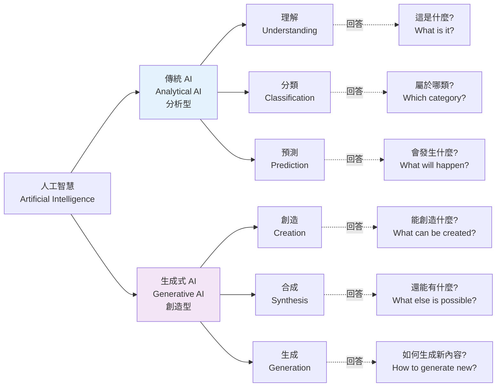
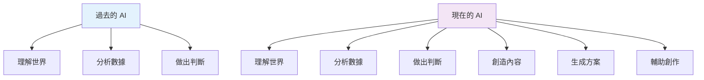
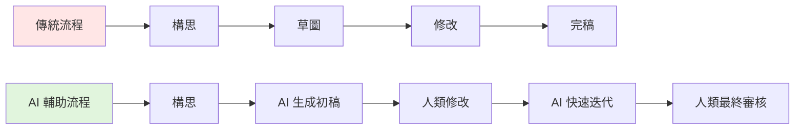
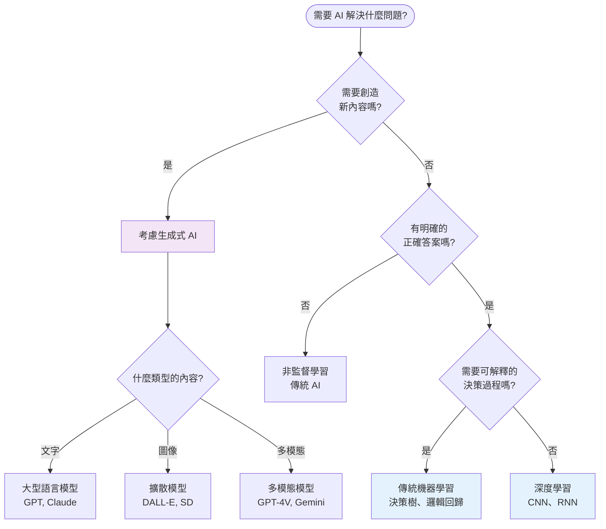

<!-- Path: 114A_AI_intro/History | Timestamp: 2025-10-25 14:15:00 | Version: b01 -->
# 第 III 章：理解 AI 的兩大典範

[← 上一章：關鍵字地圖](./Chapter_02_KeywordMap_b01.md) | [返回目錄](./README_b01.md) | [下一章：早期理論基礎 →](./Chapter_04_EarlyFoundations_b01.md)

---

## 3.1 為什麼需要先理解兩大典範？

在深入 AI 的歷史發展之前，我們需要先建立一個重要的概念框架：**傳統 AI 與生成式 AI 的本質差異**。

理解這個區別將幫助您：
1. ✅ **清晰定位技術**：知道不同技術屬於哪個典範
2. ✅ **理解演進邏輯**：明白為何會發生典範轉移
3. ✅ **評估應用場景**：判斷何時使用哪種技術
4. ✅ **把握未來趨勢**：預測技術發展方向

---

## 3.2 核心差異：分析 vs 創造

人工智慧的發展可以大致分為兩個主要階段，它們在**目標、方法和應用**上存在根本性的差異。

### 兩大典範的定義



### 本質區別

| 維度 | 傳統 AI（分析型） | 生成式 AI（創造型） |
|------|------------------|---------------------|
| **核心問題** | 「這是什麼？」 | 「還能有什麼？」 |
| **主要目標** | 理解、分類、預測 | 創造、合成、生成 |
| **數據角色** | 輸入 → 分析 | 學習 → 創造 |
| **創造性** | 無（僅做判斷） | 有（生成新內容） |

---

## 3.3 詳細對比表

### 核心特徵對比

| 特性 | 傳統 AI (Analytical AI) | 生成式 AI (Generative AI) |
| :--- | :--- | :--- |
| **主要目標** | **分析與預測** (Analysis & Prediction) | **創造與合成** (Creation & Synthesis) |
| **核心任務** | 分類、回歸、聚類、推薦 | 內容生成、風格轉換、數據增強 |
| **輸出類型** | 一個標籤、數值、判斷<br/>(e.g., "是貓", "75分", "會購買") | 全新的複雜數據<br/>(e.g., 一篇文章、一張圖片、一段音樂) |
| **輸出性質** | 離散（類別）或連續（數值） | 複雜結構（文本、圖像、音訊、影片） |
| **創造性** | 無創造性，只做判斷 | 具有創造性，生成新內容 |
| **訓練數據** | 通常需要大量**標記好**的數據<br/>(每個樣本都有正確答案) | 傾向於使用海量的**未標記**數據<br/>(自我監督學習) |
| **模型複雜度** | 相對簡單（百萬到千萬參數） | 極其複雜（億到兆參數） |
| **可解釋性** | 相對較好（特別是傳統方法如決策樹） | 較差（深度生成模型是「黑盒子」） |
| **計算需求** | 較低（推理快速） | 極高（訓練和推理都需要大量算力） |

### 技術方法對比

| 技術層面 | 傳統 AI | 生成式 AI |
|----------|---------|-----------|
| **核心技術** | 決策樹、SVM、邏輯回歸、<br/>早期神經網路、隨機森林 | Transformer、GAN、VAE、<br/>擴散模型、大型語言模型 |
| **學習方式** | 監督式學習（主要）<br/>非監督式學習、強化學習 | 自我監督學習<br/>對抗學習、去噪學習 |
| **數據標註** | 高度依賴人工標註 | 可利用未標註數據 |
| **遷移能力** | 有限（需要重新訓練） | 強大（預訓練-微調範式） |
| **少樣本學習** | 困難（需要大量樣本） | 優秀（GPT-3 展現 few-shot 能力） |

### 應用場景對比

| 應用領域 | 傳統 AI 範例 | 生成式 AI 範例 |
|----------|--------------|----------------|
| **文本處理** | 情感分析（正面/負面）<br/>垃圾郵件過濾<br/>關鍵字提取 | 文章撰寫<br/>詩歌創作<br/>代碼生成<br/>對話系統 |
| **圖像處理** | 圖像分類（貓/狗）<br/>物體偵測（找出車輛）<br/>人臉辨識 | 圖像生成（根據描述創作）<br/>風格轉換（照片→油畫）<br/>圖像修復 |
| **語音處理** | 語音辨識（語音→文字）<br/>說話人識別<br/>語音情緒分析 | 語音合成（文字→語音）<br/>語音轉換（改變聲音特徵）<br/>音樂創作 |
| **數據分析** | 信用評分<br/>疾病診斷<br/>股價預測 | 合成訓練數據<br/>數據增強<br/>異常檢測 |

---

## 3.4 具體範例對比

讓我們透過具體案例來理解兩者的差異。

### 範例 1：文本領域

#### 任務：處理電影評論

**傳統 AI 的做法**：
```
輸入：「這部電影太無聊了，浪費時間。」

模型分析：
- 提取特徵：「無聊」、「浪費時間」（負面詞彙）
- 計算情感分數
- 分類判斷

輸出：負面評論（信心度：95%）
```

**生成式 AI 的做法**：
```
輸入提示：「請寫一篇關於科幻電影的正面評論」

模型生成：
「這部科幻電影的視覺效果令人驚嘆，導演巧妙地將
深刻的哲學思考融入緊湊的劇情中。演員的表演細膩
動人，配樂更是恰到好處地烘托了緊張氣氛。強烈推薦
給所有科幻愛好者！」

輸出：一篇完整的原創評論
```

**關鍵差異**：
- 傳統 AI：判斷已有評論的情感（分析）
- 生成式 AI：創作全新的評論內容（創造）

### 範例 2：圖像領域

#### 任務：處理貓的圖片

**傳統 AI 的做法**：
```
輸入：一張圖片

模型處理：
- 提取視覺特徵（邊緣、紋理、形狀）
- 與訓練數據比對
- 計算相似度

輸出：
- 類別：貓（信心度：99.2%）
- 品種：波斯貓
- 位置：圖片中央
```

**生成式 AI 的做法**：
```
輸入提示：「一隻戴著太空頭盔的貓,站在火星表面,
夕陽西下,數位藝術風格」

模型生成：
根據描述創造一張全新的圖像,其中包含：
- 一隻貓（結合訓練數據中的貓特徵）
- 太空頭盔（創意組合）
- 火星景觀（風格融合）
- 夕陽光影效果（藝術處理）

輸出：一張從未存在過的原創圖像
```

**關鍵差異**：
- 傳統 AI：識別圖片中有什麼（理解）
- 生成式 AI：根據描述創造圖片（創造）

### 範例 3：醫療領域

#### 任務：處理醫療影像

**傳統 AI 的做法**：
```
輸入：胸部 X 光片

模型處理：
- 掃描影像，尋找異常模式
- 與已知病例比對
- 計算機率

輸出：
- 診斷：疑似肺炎
- 位置：左肺下葉
- 嚴重程度：中度
- 建議：進一步檢查
```

**生成式 AI 的做法**：
```
輸入：少量訓練數據

模型生成：
- 合成大量逼真的 X 光片數據
- 包含各種疾病的變化形式
- 用於訓練診斷模型

輸出：用於數據增強的合成醫療影像
（不直接用於診斷，而是幫助訓練更好的診斷系統）
```

**關鍵差異**：
- 傳統 AI：診斷已有影像（判斷）
- 生成式 AI：生成訓練數據或輔助報告（創造）

---

## 3.5 典範轉移的意義

### 3.5.1 不是替代，而是擴展

生成式 AI 並非要取代傳統 AI，而是**擴展了 AI 的能力邊界**。



**互補關係**：
- 傳統 AI 仍然在**判斷、分類、預測**方面不可或缺
- 生成式 AI 在**內容創作、方案生成**方面開闢新天地
- 兩者可以結合使用，發揮更大效用

**實際應用中的結合**：
```
傳統 AI (分析) + 生成式 AI (創造) = 強大系統

範例：智能內容推薦系統
1. 傳統 AI：分析用戶喜好（分類預測）
2. 生成式 AI：生成個性化內容（創造合成）
3. 傳統 AI：評估生成質量（品質判斷）
```

### 3.5.2 對各產業的影響

#### 內容產業

| 產業 | 傳統 AI 應用 | 生成式 AI 應用 | 影響 |
|------|-------------|----------------|------|
| **新聞媒體** | 自動分類、推薦 | 新聞稿撰寫、摘要生成 | 記者角色轉變 |
| **廣告行銷** | 受眾分析、效果預測 | 文案生成、創意設計 | 降低製作成本 |
| **影視娛樂** | 推薦系統、字幕生成 | 劇本輔助、特效生成 | 創作流程改變 |
| **遊戲產業** | NPC 行為、難度調整 | 關卡生成、劇情創作 | 內容豐富度提升 |

#### 創意產業



**改變**：
- ✅ 降低創作門檻
- ✅ 加速迭代過程
- ✅ 探索更多可能性
- ⚠️ 需要新的技能（提示工程）
- ⚠️ 原創性與版權問題

#### 軟體開發

**傳統 AI 在軟體開發的應用**：
- Bug 檢測
- 代碼審查
- 性能分析
- 測試用例生成

**生成式 AI 帶來的變革**：
- **代碼生成**（GitHub Copilot）：
  - 根據註釋生成代碼
  - 自動完成函數
  - 提供多種實現方案

- **文件生成**：
  - 自動撰寫 API 文件
  - 生成使用教程
  - 創建測試報告

- **影響**：
  - 開發效率提升 30-50%
  - 初學者門檻降低
  - 程式設計師角色轉向架構與設計

#### 科學研究

| 領域 | 傳統 AI | 生成式 AI | 突破 |
|------|---------|-----------|------|
| **藥物研發** | 活性預測 | 新分子生成 | 加速發現過程 |
| **材料科學** | 性質預測 | 新材料設計 | 探索未知空間 |
| **蛋白質研究** | 結構預測 (AlphaFold) | 蛋白質設計 | 從理解到創造 |
| **基因研究** | 序列分析 | 基因編輯設計 | 精準醫療 |

---

## 3.6 技術實現的差異

### 3.6.1 訓練目標的差異

**傳統 AI（監督式學習）**：
```
目標：學習從輸入 X 到標籤 Y 的映射

範例：圖像分類
輸入 X：圖片像素
標籤 Y：「貓」或「狗」
目標：最小化分類錯誤率

訓練過程：
for each 標註好的樣本 (X, Y):
    預測 = 模型(X)
    誤差 = 預測 與 Y 的差距
    調整模型參數以減少誤差
```

**生成式 AI（自我監督學習）**：
```
目標：學習數據的分佈，能夠生成新樣本

範例：語言模型（GPT）
輸入：前面的文字
目標：預測下一個詞

訓練過程（無需人工標註）：
for each 文本：
    遮蔽部分詞
    讓模型預測被遮蔽的詞
    根據預測準確度調整參數

結果：模型學會了語言的統計規律
→ 可以生成連貫的新文本
```

### 3.6.2 模型架構的差異

**傳統 AI 模型範例**：
```python
# 決策樹（傳統 AI）
if 特徵1 > 閾值A:
    if 特徵2 < 閾值B:
        return 類別A
    else:
        return 類別B
else:
    return 類別C

# 特點：規則明確，可解釋性強
```

**生成式 AI 模型範例**：
```python
# Transformer（生成式 AI 基礎）
class Transformer:
    def __init__(self):
        self.attention_layers = [多頭注意力層] * N
        self.feedforward_layers = [前饋網路] * N
        self.parameters = 數億到數兆個參數

    def generate(self, prompt):
        # 理解 prompt 的語義
        context = self.encode(prompt)

        # 逐步生成新內容
        output = []
        while not 結束條件:
            next_token = self.predict_next(context)
            output.append(next_token)
            context = update(context, next_token)

        return output

# 特點：極其複雜，難以解釋，但能創造新內容
```

---

## 3.7 何時使用哪種 AI？

### 決策樹



### 實用建議

| 場景 | 推薦方案 | 理由 |
|------|----------|------|
| **醫療診斷** | 傳統 AI（需監督的深度學習） | 需要高準確率、可解釋性、問責制 |
| **信用評分** | 傳統機器學習 | 需要透明決策、符合監管要求 |
| **內容推薦** | 傳統 AI + 部分生成 | 判斷喜好（傳統）+ 生成摘要（生成） |
| **文章撰寫** | 生成式 AI | 需要創造性、語言流暢度 |
| **圖像創作** | 生成式 AI | 需要藝術性、創意表達 |
| **代碼輔助** | 生成式 AI | 提升開發效率、探索多種實現 |
| **客服系統** | 混合方案 | 意圖分類（傳統）+ 回覆生成（生成） |

---

## 3.8 本章小結

### 核心要點

1. **兩大典範**：
   - **傳統 AI**：分析、分類、預測（回答「是什麼」）
   - **生成式 AI**：創造、合成、生成（回答「能創造什麼」）

2. **關鍵差異**：
   - 目標：判斷 vs 創造
   - 輸出：標籤/數值 vs 複雜內容
   - 訓練：需標註數據 vs 可用未標註數據
   - 創造性：無 vs 有

3. **互補關係**：
   - 不是替代，而是擴展
   - 可以結合使用，發揮更大效用
   - 各有適用場景

4. **選擇標準**：
   - 需要創造新內容 → 生成式 AI
   - 需要判斷分類 → 傳統 AI
   - 需要可解釋性 → 傳統機器學習
   - 需要創意表達 → 生成式 AI

### 理解這個框架的價值

現在您已經建立了理解 AI 發展的基本框架，當您在後續章節學習歷史發展時，可以清楚地看到：

- **1950s-2000s**：主要發展傳統 AI（符號主義 → 機器學習）
- **2010s**：深度學習同時推進兩個方向
- **2020s-**：生成式 AI 爆發，開啟新紀元

### 思考問題

1. **技術選擇**：如果要開發一個智能寫作助手，應該如何結合傳統 AI 和生成式 AI？

2. **倫理思考**：生成式 AI 的「創造能力」帶來哪些新的倫理挑戰？

3. **未來展望**：下一個典範轉移可能是什麼？從生成式 AI 到？

4. **個人影響**：在您的專業領域中，哪些工作更適合傳統 AI，哪些更適合生成式 AI？

---

## 延伸閱讀

**深入理解生成式 AI**：
- 第 VIII 章詳細介紹生成式 AI 的技術細節

**理解歷史演進**：
- 第 IV-VII 章展示從符號 AI 到深度學習的完整歷程

**技術實現**：
- 李宏毅教授的《生成式 AI 時代下的機器學習》課程

---

[← 上一章：關鍵字地圖](./Chapter_02_KeywordMap_b01.md) | [返回目錄](./README_b01.md) | [下一章：早期理論基礎 →](./Chapter_04_EarlyFoundations_b01.md)
