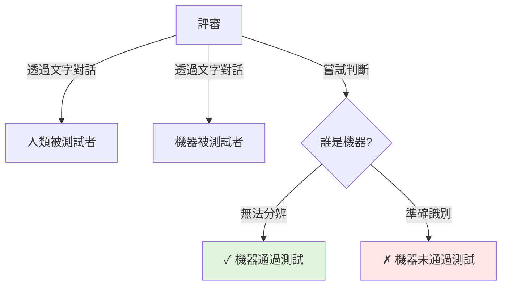
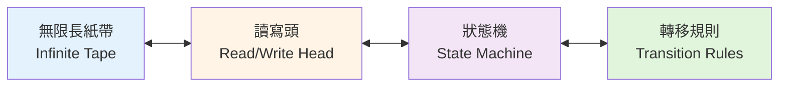
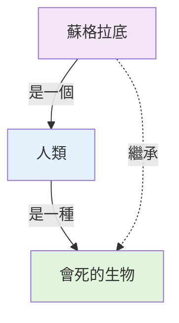
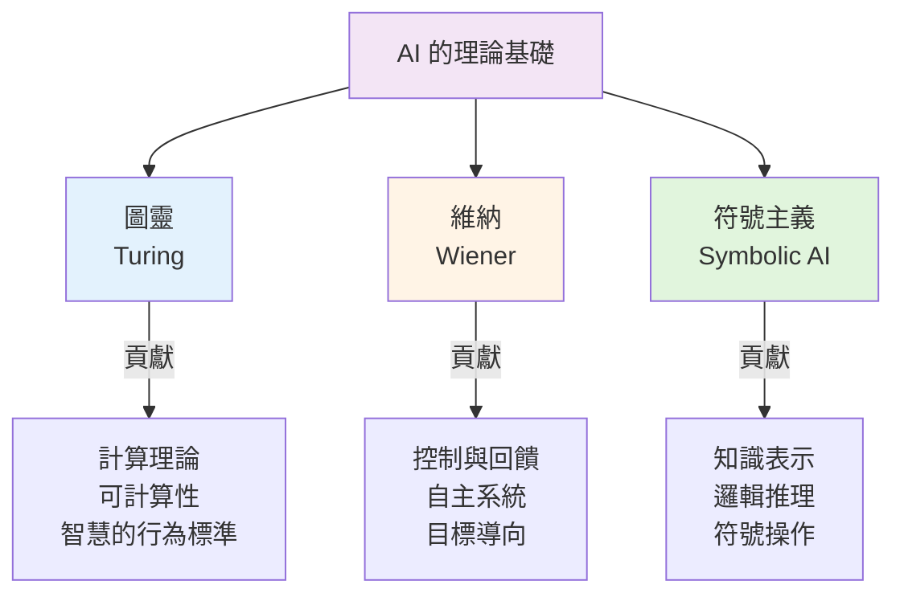

<!-- Path: 114A_AI_intro/History | Timestamp: 2025-10-26 10:22:00 | Version: b02 -->
# 第 IV 章：早期理論基礎 (1940s-1950s)

[← 上一章：兩大典範](./Chapter_03_TwoParadigms_b01.md) | [返回目錄](./README_b02.md) | [下一章：經典時期 →](./Chapter_05_ClassicalPeriod_b01.md)

---

## 4.1 時代背景

在電腦被發明出來的初期，科學家們就開始思考一個深刻的問題：**機器是否可能「思考」？**

### 歷史情境

**1940年代的世界**：
- 🌍 第二次世界大戰期間與戰後
- 💻 第一台電子計算機誕生（ENIAC, 1946）
- 🔬 科學技術快速發展
- 🧠 對人類智慧本質的哲學探討

**技術條件**：
- 計算機體積龐大（佔據整個房間）
- 運算能力極其有限
- 主要用於軍事計算與科研
- 程式設計需要直接操作硬體

**思想氛圍**：
- 科學樂觀主義盛行
- 跨學科研究興起
- 控制論、資訊理論等新領域誕生
- 哲學與科學的密切對話

---

## 4.2 艾倫·圖靈與圖靈測試

### 4.2.1 艾倫·圖靈 — 計算機科學與 AI 之父

**Alan Turing (1912-1954)**
- 🇬🇧 英國數學家、邏輯學家、密碼學家
- 🏆 被譽為「計算機科學與人工智慧之父」
- 🔐 二戰期間破解德國 Enigma 密碼機
- 💡 奠定了現代計算理論的基礎

**生平重要貢獻**：
1. **圖靈機 (1936)** — 計算理論的基石
2. **破解 Enigma (1940-1945)** — 協助盟軍獲勝
3. **圖靈測試 (1950)** — 定義機器智慧的標準
4. **化學形態發生 (1952)** — 開創生物數學領域

---

### 4.2.2 圖靈測試 (The Turing Test, 1950)

#### 論文：《計算機器與智能》

**發表**：Mind 期刊，1950年
**核心問題**：「機器能思考嗎？」(Can machines think?)

**圖靈的策略**：
不直接回答「什麼是思考」，而是提出一個**行為測試**：

> "如果一台機器的行為在所有方面都無法與人類區分，那麼我們就應該說它能夠思考。"

#### 測試設計

**參與者**：
- 👤 **評審**（人類）
- 👤 **人類被測試者** (Human)
- 🤖 **機器被測試者** (Machine)

**測試流程**：



**關鍵規則**：
1. ✅ 只能透過**文字**交流（避免聲音、外觀干擾）
2. ✅ 評審不知道誰是人類、誰是機器
3. ✅ 如果評審無法穩定區分，機器通過測試

**對話範例**：

```
評審：你能告訴我一首莎士比亞十四行詩嗎？
回應A：當然可以。「我能否將你比作夏日？你比夏日更可愛、更溫和...」
回應B：抱歉，我對詩歌不太在行。

評審：請計算 34957 + 70764。
回應A：105721。
回應B：讓我想想... 大概是 105720 左右？（故意延遲並稍微出錯）

評審：你覺得這個笑話好笑嗎？「為什麼火雞不會飛？因為它們更喜歡走路！」
回應A：哈哈，有點冷笑話的感覺。
回應B：我覺得還挺有趣的，雖然不是特別好笑。

問題：哪個是機器？
```

**圖靈的洞察**：
- 🤖 **機器可能故意答錯數學題**（表現得像人類）
- 🧠 **智慧不在於完美計算**，而在於「像人類一樣」
- 🎭 **行為主義定義**：重要的是行為，而非內在機制

---

#### 圖靈測試的意義

**哲學意義**：
1. **操作化定義**：
   - 將抽象的「思考」轉化為可測試的行為
   - 避免陷入「意識」的哲學泥潭

2. **行為主義視角**：
   - 如果看起來能思考，就應該被視為能思考
   - 類似「如果走路像鴨子、叫聲像鴨子，就是鴨子」

3. **功能等價性**：
   - 重點不是「如何思考」，而是「能否表現出智慧行為」

**對 AI 的影響**：
- ✅ 提供了**可操作的目標**
- ✅ 啟發了對話系統的研究
- ✅ 成為衡量 AI 的經典標準

**爭議與批評**：

❌ **中文房間論證** (John Searle, 1980)：
- 即使通過圖靈測試，也不代表真正「理解」
- 可能只是巧妙的符號操作，沒有真實的理解

❌ **意識問題**：
- 通過測試 ≠ 擁有意識或自我意識
- 行為相似 ≠ 內在體驗相同

❌ **測試局限**：
- 只測試語言能力，忽略其他智慧形式
- 可能被欺騙策略通過

---

### 4.2.3 圖靈機 — 計算理論的基石

雖然在 1936 年就提出（早於 AI 概念），但圖靈機為 AI 提供了理論基礎。

#### 圖靈機的結構

**組成部分**：



1. **無限長紙帶**：
   - 分成一個個格子
   - 每個格子包含一個符號（0, 1, 空白）

2. **讀寫頭**：
   - 可以讀取當前格子的符號
   - 可以寫入新符號
   - 可以左移或右移一格

3. **狀態機**：
   - 處於某個內部狀態
   - 根據當前狀態和讀取的符號決定動作

4. **轉移規則**：
   - 形式：(當前狀態, 讀取符號) → (新狀態, 寫入符號, 移動方向)

**範例：計算 1 + 1**

```
初始紙帶：..._ 1 1 _...

步驟 1：讀取第一個 1，寫入 #（標記）
步驟 2：向右移動
步驟 3：讀取第二個 1
步驟 4：將其改為 0，向左移動
步驟 5：找到 #，將其改為 1
步驟 6：向右移動，寫入 0
步驟 7：停機

最終紙帶：..._ 1 0 _...  （表示 2，二進制）
```

#### 圖靈機的意義

**計算理論基礎**：

1. **通用計算**：
   - 圖靈證明了存在一台「通用圖靈機」
   - 可以模擬任何其他圖靈機
   - 這是現代通用電腦的理論原型

2. **Church-Turing 論題**：
   > "任何可被演算法解決的問題，都可以被圖靈機解決。"

   - 定義了「可計算性」的邊界
   - 為 AI 的能力上限提供理論基礎

3. **不可判定問題**：
   - 圖靈證明了某些問題原則上不可解
   - 例如：**停機問題** (Halting Problem)
     - 無法寫出一個通用程式判斷任意程式是否會停機
     - 展示了計算的根本限制

   **換句話說，這證明了有些看似明確的問題，是演算法永遠無法完美解決的。這個發現為電腦科學和 AI 的能力劃定了理論上的邊界，讓我們知道並非所有問題都能透過計算找到答案。**

**對 AI 的啟示**：
- ✅ AI 的能力受限於可計算性
- ✅ 某些問題可能原則上無解
- ✅ 理解這些限制幫助我們設定合理期望

---

## 4.3 諾伯特·維納與控制論

### 4.3.1 控制論 (Cybernetics) 的誕生

**Norbert Wiener (1894-1964)**
- 🇺🇸 美國數學家
- 📚 1948年出版《控制論：關於在動物和機器中控制和通訊的科學》
- 🎯 研究動物與機器中的控制與通訊系統

**控制論的定義**：
研究**自我調節系統**的科學，探討生物與機器如何透過回饋機制維持目標狀態。

---

### 4.3.2 核心概念：回饋系統

**回饋 (Feedback)** 是控制論的核心：


**經典範例：恆溫器 (Thermostat)**

```
1. 目標：室溫 22°C
2. 感測器：測量當前溫度 (18°C)
3. 比較器：計算誤差 (22 - 18 = 4°C)
4. 執行器：開啟暖氣
5. 系統：溫度上升
6. 持續回饋，直到達到目標溫度
7. 溫度超過時，關閉暖氣

這是一個「負回饋」系統：系統的輸出會抑制輸入，維持穩定。
```

**兩種回饋類型**：

| 類型 | 效果 | 範例 | 在 AI 中的應用 |
|------|------|------|----------------|
| **負回饋** | 穩定系統，減少誤差 | 恆溫器、自動駕駛 | 梯度下降優化 |
| **正回饋** | 放大變化，可能失控 | 音響嘯叫、連鎖反應 | GAN 訓練、強化學習探索 |

---

### 4.3.3 對 AI 的影響

**概念貢獻**：

1. **自主系統**：
   - 系統可以自我調節，無需外部持續控制
   - 啟發了自主機器人的設計

2. **目標導向行為**：
   - 系統透過回饋朝向目標狀態
   - 影響了 AI 中的目標函數設計

3. **生物與機器的統一視角**：
   - 兩者都是資訊處理與控制系統
   - 開啟了「生物啟發計算」的思路

**在現代 AI 中的體現**：

```python
# 神經網路訓練的回饋循環
while 未達到目標:
    預測 = 模型(輸入)
    誤差 = 計算_誤差(預測, 真實標籤)  # 感測器
    梯度 = 計算_梯度(誤差)              # 比較器
    更新_參數(梯度)                     # 執行器
    # 系統透過回饋不斷逼近目標
```

**機器人控制**：
```
感知 → 決策 → 行動 → 觀察結果 → 調整決策
（這是控制論回饋循環的直接應用）
```

---

## 4.4 符號主義與邏輯系統

### 4.4.1 符號 AI 的哲學基礎

**物理符號系統假說** (Physical Symbol System Hypothesis)
- 📜 提出者：Allen Newell & Herbert Simon (1976)
- 💡 核心主張：

> "物理符號系統擁有智慧行動所需的必要與充分手段。"

**解讀**：
- **必要**：任何展現智慧的系統都必定是符號系統
- **充分**：符號操作足以產生智慧行為
- **意義**：智慧可以被還原為符號的操作與轉換

---

### 4.4.2 符號 AI 的核心理念

**基本思想**：
```
智慧 = 符號操作 + 規則推理
```

**知識表示**：

1. **邏輯式**：
```
前提：人(蘇格拉底)
規則：人(X) → 會死(X)
推論：會死(蘇格拉底)
```

2. **語義網路**：


3. **框架 (Frames)**：
```
框架：房間
  - 有牆壁：是
  - 有門：至少1個
  - 有窗戶：通常有
  - 用途：居住、工作等
```

---

### 4.4.3 符號 AI 的推理機制

**演繹推理 (Deductive Reasoning)**：
```
大前提：所有鳥都會飛
小前提：企鵝是鳥
結論：企鵝會飛（❌ 錯誤！）

問題：邏輯正確，但結論錯誤
原因：大前提不正確（有例外）
```

**歸納推理 (Inductive Reasoning)**：
```
觀察：天鵝1是白色的
觀察：天鵝2是白色的
觀察：天鵝3是白色的
...
推論：所有天鵝都是白色的（❌ 黑天鵝存在！）
```

**溯因推理 (Abductive Reasoning)**：
```
觀察：草地是濕的
知識：下雨會讓草地濕
推論：可能剛下過雨（也可能是澆水）
```

---

### 4.4.4 符號 AI 的優勢與局限

**優勢**：
- ✅ **可解釋性強**：推理過程清晰，可以追蹤
- ✅ **邏輯嚴謹**：符合形式邏輯規則
- ✅ **知識表示明確**：人類可以理解和編輯
- ✅ **適合特定領域**：數學證明、邏輯遊戲

**局限**：
- ❌ **脆弱 (Brittle)**：
  - 遇到未預見情況就失效
  - 難以處理例外與模糊情況

- ❌ **常識推理困難**：
  - 人類的常識難以形式化
  - 例如：「杯子可以裝水」（需要大量隱含知識）

- ❌ **組合爆炸**：
  - 可能性空間呈指數增長
  - 難以在合理時間內搜索

- ❌ **感知問題**：
  - 難以處理視覺、聽覺等感知輸入
  - 符號與現實世界的鴻溝

**經典難題**：

```
問題：「這個句子有多重意義嗎？」
"我在銀行看到她。"

符號 AI 的困境：
- 銀行 = 金融機構？還是河岸？
- 需要上下文理解
- 純符號操作難以解決
```

---

## 4.5 早期理論的統一視角

### 4.5.1 三大支柱



---

### 4.5.2 共同特徵

**樂觀主義**：
- 相信智慧可以被理解和複製
- 相信機器最終能達到人類智慧

**形式化追求**：
- 試圖用數學和邏輯精確定義智慧
- 建立嚴謹的理論框架

**跨學科視角**：
- 融合數學、哲學、工程學、生物學
- 生物與機器的統一理解

---

## 4.6 本章小結

### 核心要點

1. **圖靈的貢獻**：
   - 圖靈機：定義了計算的理論邊界
   - 圖靈測試：提供了智慧的行為標準
   - 影響至今，仍是 AI 研究的基準

2. **控制論的啟示**：
   - 回饋機制：系統自我調節的核心
   - 統一視角：生物與機器的共同原理
   - 影響：機器人、自動控制、優化演算法

3. **符號主義的理念**：
   - 智慧 = 符號操作
   - 優勢：可解釋、邏輯嚴謹
   - 局限：脆弱、難處理感知與常識

4. **時代意義**：
   - 奠定了 AI 的理論基礎
   - 提出了核心問題和研究方向
   - 塑造了早期 AI 的研究範式

### 歷史地位

這個時期是 **AI 的理論準備階段**：
- 🧠 建立了基本概念
- 📐 奠定了數學基礎
- 🎯 設定了研究目標
- 🌱 為後續發展播下種子

### 思考問題

1. **圖靈測試的現代意義**：
   - ChatGPT 能否通過圖靈測試？
   - 通過測試是否意味著真正的「理解」？

2. **符號主義的價值**：
   - 為何今天的 AI 主要不使用符號方法？
   - 符號推理是否仍有價值？

3. **回饋機制**：
   - 神經網路訓練如何體現回饋循環？
   - 強化學習與控制論有何聯繫？

---

## 延伸閱讀

**原始文獻**：
- Alan Turing (1950). "Computing Machinery and Intelligence"
- Norbert Wiener (1948). "Cybernetics: Or Control and Communication in the Animal and the Machine"

**現代解讀**：
- 第 V 章將展示這些理論如何催生 AI 學科的正式誕生
- 第 VI 章將討論符號 AI 的興衰

**影片資源**：
- 推薦觀看 [陳宜欣教授演講](https://youtu.be/dKNYTPDa5WA) 了解 AI 的哲學思考

---

[← 上一章：兩大典範](./Chapter_03_TwoParadigms_b01.md) | [返回目錄](./README_b02.md) | [下一章：經典時期 →](./Chapter_05_ClassicalPeriod_b01.md)
