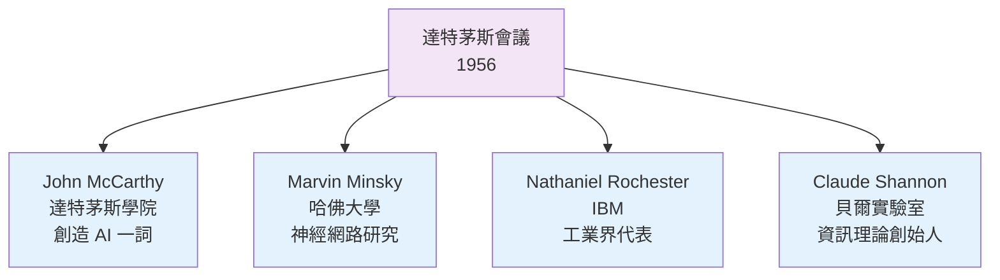
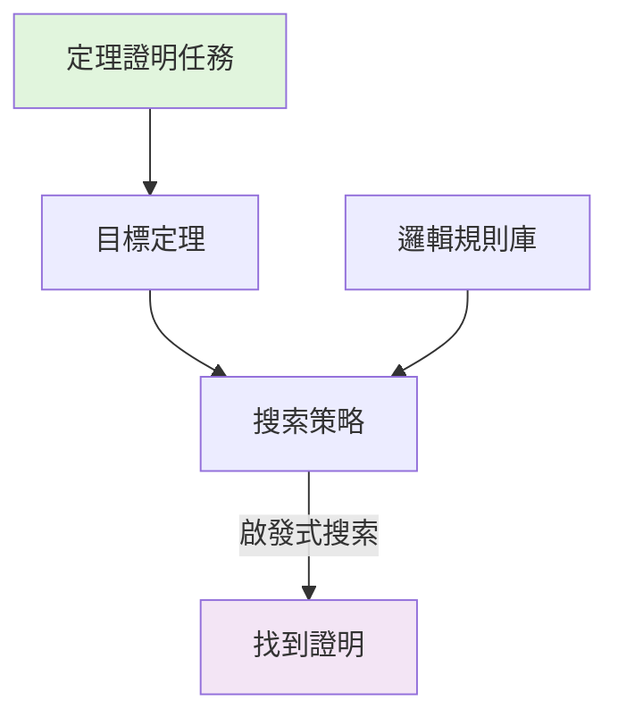
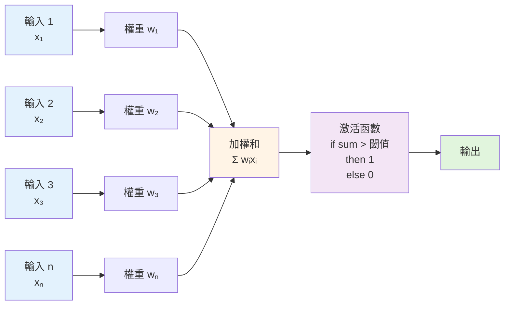
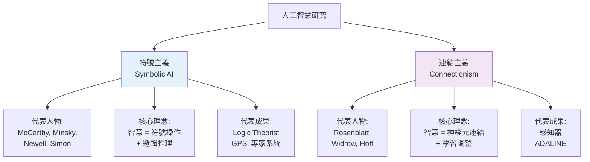

<!-- Path: 114A_AI_intro/History | Timestamp: 2025-10-26 10:47:00 | Version: b05 -->
# 第 V 章：經典時期 (1956-1970s)

[← 上一章：早期理論基礎](./Chapter_04_EarlyFoundations_b02.md) | [返回目錄](./README_b06.md) | [下一章：寒冬與復甦 →](./Chapter_06_WinterAndRevival_b05.md)

---

## 5.1 AI 的正式誕生

### 5.1.1 達特茅斯會議 (1956) — AI 的誕生地

**The Dartmouth Summer Research Project on Artificial Intelligence**

**時間**：1956 年夏天（6-8月）
**地點**：美國新罕布什爾州達特茅斯學院
**時長**：原計劃 6-8 週

這場會議被公認為 **AI 作為一門獨立學科的誕生標誌**。

---

### 5.1.2 會議發起人與參與者

**四位發起人**：



**其他重要參與者**：
- **Allen Newell** & **Herbert Simon**（卡內基理工學院）
  - 帶來了 Logic Theorist 程式
- **Ray Solomonoff**（麻省理工學院）
  - 機率推理與機器學習
- **Oliver Selfridge**（麻省理工學院）
  - 模式識別

---

### 5.1.3 會議提案的核心內容

**提案開頭的著名定義**：

> "我們提議在 1956 年夏天於達特茅斯學院進行為期 2 個月、由 10 人參與的人工智慧研究。研究將基於以下猜想：學習或智慧的任何其他特徵，原則上都可以被如此精確地描述，以至於可以製造一台機器來模擬它。"

**研究議題**：
1. **自動電腦** (Automatic Computers)
2. **如何讓電腦使用語言**
3. **神經網路** (Neuron Nets)
4. **計算複雜度理論**
5. **自我改進** (Self-improvement)
6. **抽象概念形成**
7. **隨機性與創造力**

**核心假設**：
- ✅ 智慧可以被精確描述
- ✅ 機器可以模擬智慧
- ✅ 這個目標可以在短期內實現（❌ 後來證明過於樂觀）

---

### 5.1.4 「人工智慧」一詞的誕生

**John McCarthy** 創造了 "Artificial Intelligence" 這個詞：

- **為什麼選這個名字？**
  - 需要一個吸引人的名字來申請資金
  - 區別於已有的「控制論」、「自動機理論」
  - 強調「智慧」而非「計算」

- **其他候選名字**：
  - Complex Information Processing（複雜資訊處理）
  - Machine Intelligence（機器智慧）
  - Thinking Machines（思考機器）

**影響**：
這個名字既是 AI 的成功，也是負擔：
- ✅ 成功吸引了關注與資金
- ❌ 帶來了過高的期望（"智慧"一詞太強）

---

### 5.1.5 會議的歷史意義

**實際成果有限**：
- 並非所有受邀者都全程參與
- 沒有產生革命性的技術突破
- 沒有正式的會議記錄或論文集

**深遠影響**：
- ✅ **確立了 AI 作為獨立研究領域**
- ✅ **建立了研究社群**：參與者成為 AI 先驅
- ✅ **吸引了資金**：政府與企業開始投資
- ✅ **定義了研究議程**：影響後續幾十年

**樂觀氛圍**：
當時普遍認為：
- 20 年內將實現人類級別的 AI
- 機器翻譯將在 3-8 年內解決
- 電腦將在 10 年內成為象棋世界冠軍

---

## 5.2 早期的 AI 程式

### 5.2.1 Logic Theorist (邏輯理論家, 1956)

**開發者**：Allen Newell, Herbert Simon, Cliff Shaw
**首次展示**：達特茅斯會議

**成就**：
- 證明了《數學原理》(Principia Mathematica) 中的 38 個定理
- 其中一個證明比原書更優雅

**工作原理**：



**啟發式方法**：
1. **手段-目的分析** (Means-Ends Analysis)
   - 識別當前狀態與目標的差距
   - 選擇能縮小差距的規則

2. **逆向推理**：
   - 從目標倒推需要什麼前提
   - 再證明這些前提

**範例（簡化）**：
```
目標：證明 A → C
逆向推理：如果有 A → B 和 B → C，則證明完成
搜索：尋找 A → B 和 B → C
找到後：證明成功
```

**意義**：
- ✅ 第一個真正的 AI 程式
- ✅ 展現了機器的「推理能力」
- ✅ 證明了符號操作的可行性

---

### 5.2.2 General Problem Solver (GPS, 1957)

**開發者**：Allen Newell & Herbert Simon

**野心**：
創造一個**通用**問題解決程式，能處理任何可形式化的問題。

**核心方法：手段-目的分析**

```
while 當前狀態 ≠ 目標狀態:
    1. 比較當前狀態與目標狀態
    2. 識別最大的差異
    3. 選擇能縮小該差異的操作
    4. 如果無法直接應用該操作：
       → 設立子目標：讓操作可被應用
       → 遞迴解決子目標
    5. 應用操作，更新當前狀態
```

**範例問題：河內塔 (Tower of Hanoi)**

```
問題：將3個盤子從柱A移到柱C，規則：
- 每次只能移動一個盤子
- 大盤不能放在小盤上

GPS 的解決過程：
目標：將3個盤子移到C
差異：所有盤子都在A
手段：需要先移走上面的盤子

子目標1：將小盤移到B（為了移中盤）
子目標2：將中盤移到C
子目標3：將小盤移到C
...
```

**局限性**：
- ❌ 只能解決簡單、良定義的問題
- ❌ 組合爆炸：問題稍複雜就無法處理
- ❌ 缺乏領域知識：純通用方法效率低
- ❌ 遠未達到「通用」的目標

**歷史地位**：
- 第一個嘗試通用問題解決的程式
- 啟發式搜索的經典案例
- 揭示了「通用 AI」的困難

---

### 5.2.3 LISP 語言 (1958)

**發明者**：John McCarthy

**LISP = LISt Processing（串列處理）**

**為什麼需要新語言？**
當時主流語言（FORTRAN）專為數值計算設計，不適合符號操作。

**LISP 的革命性特性**：

1. **符號處理**：
```lisp
; 直接操作符號，而非僅數字
(define person 'John)
(if (equal? person 'John)
    (print "Hello John")
    (print "Hello stranger"))
```

2. **串列作為基礎結構**：
```lisp
; 一切都是串列
(+ 1 2 3)        ; 函數呼叫是串列
(list 'a 'b 'c)  ; 數據是串列
'(1 2 (3 4) 5)   ; 可嵌套

; 代碼即數據（同構性）
```

3. **遞迴**：
```lisp
; 計算階乘
(define (factorial n)
  (if (= n 0)
      1
      (* n (factorial (- n 1)))))
```

4. **高階函數**：
```lisp
; 函數可以作為參數傳遞
(define (apply-twice f x)
  (f (f x)))

(apply-twice (lambda (x) (* x 2)) 5)  ; 結果：20
```

5. **垃圾回收**：
- 自動記憶體管理
- 程式設計師無需手動釋放記憶體

**影響**：
- ✅ 成為 AI 研究的主要語言（直到 1980s）
- ✅ 影響了後來的函數式程式語言（Scheme, Haskell, Clojure）
- ✅ 「代碼即數據」啟發了後來的元程式設計
- ✅ 許多現代語言特性源自 LISP（垃圾回收、lambda 表達式）

---

## 5.3 神經網路的早期探索

### 5.3.1 感知器 (Perceptron, 1958)

**發明者**：Frank Rosenblatt（康奈爾航空實驗室）

**歷史意義**：
第一個**可以從數據中學習**的人工神經網路。

**結構**：



**數學表示**：
```
輸出 = 激活(Σ wᵢ × xᵢ - θ)

其中：
- xᵢ：輸入
- wᵢ：權重（可學習）
- θ：閾值
- 激活函數：階躍函數（> 閾值則 1，否則 0）
```

**學習規則（感知器學習演算法）**：

```python
for each 訓練樣本 (x, y_true):
    y_pred = 感知器預測(x)
    誤差 = y_true - y_pred

    if 誤差 != 0:
        for each 權重 wᵢ:
            wᵢ = wᵢ + 學習率 × 誤差 × xᵢ
```

**能解決的問題**：
✅ 線性可分問題

**範例：AND 邏輯閘**
```
輸入1  輸入2  → 輸出
0      0     → 0
0      1     → 0
1      0     → 0
1      1     → 1

感知器可以學習到：
如果 w₁×x₁ + w₂×x₂ > 閾值，輸出 1
```

---

### 5.3.2 感知器的局限 — XOR 問題

**1969 年，Minsky & Papert 出版《感知器》一書**

**關鍵發現**：
單層感知器**無法解決 XOR（互斥或）問題**。

**XOR 真值表**：
```
輸入1  輸入2  → 輸出
0      0     → 0
0      1     → 1
1      0     → 1
1      1     → 0
```

**為什麼無法解決？**

視覺化：
```
XOR 問題的數據分布：

  輸入2
    ↑
  1 | ●     ○    (● = 輸出1, ○ = 輸出0)
    |
  0 | ○     ●
    +--------→ 輸入1
      0     1

問題：無法用一條直線分開 ● 和 ○
（這叫「線性不可分」）
```

**數學證明**：
```
假設存在權重 w₁, w₂ 和閾值 θ：

對 (0,1) → 1： w₂ > θ         ... (1)
對 (1,0) → 1： w₁ > θ         ... (2)
對 (1,1) → 0： w₁ + w₂ ≤ θ    ... (3)

從 (1)(2)： w₁ + w₂ > 2θ
與 (3) 矛盾！
證明：不存在這樣的權重
```

**歷史影響**：
這個發現導致：
- ❌ 神經網路研究資金大幅削減
- ❌ 研究重心轉向符號 AI
- ❌ 開啟了第一次「AI 寒冬」的序幕

**後來的解決**：
- ✅ 多層感知器（MLP）可以解決 XOR
- ✅ 但當時缺乏有效的訓練方法
- ✅ 直到 1986 年反向傳播演算法才解決

---

## 5.4 兩條研究路線的分野

### 5.4.1 符號主義 vs 連結主義

經典時期確立了 AI 的兩大研究流派：



**對比**：

| 維度 | 符號主義 | 連結主義 |
|------|----------|----------|
| **靈感來源** | 邏輯學、語言學 | 神經科學、生物學 |
| **知識表示** | 符號、規則、邏輯 | 權重、連接 |
| **學習方式** | 專家編寫規則 | 從數據自動學習 |
| **推理過程** | 邏輯推導 | 前向傳播計算 |
| **可解釋性** | 強（規則清晰） | 弱（權重難解釋） |
| **優勢領域** | 邏輯推理、規劃 | 模式識別、分類 |
| **1960s 地位** | 主導地位 | 邊緣地位 |

---

### 5.4.2 為何符號主義占主導？

**1960-1970s，符號 AI 主導的原因**：

1. **早期成功**：
   - Logic Theorist 證明定理
   - GPS 解決問題
   - 符號方法「看起來更像智慧」

2. **符合直覺**：
   - 人類思考似乎涉及符號和邏輯
   - 數學、語言都是符號系統

3. **資源與影響力**：
   - 符號派學者在學術界影響力大
   - 獲得更多研究資金

4. **神經網路的挫折**：
   - 感知器局限被揭示
   - 缺乏訓練深層網路的方法

---

## 5.5 經典時期的挑戰與局限

### 5.5.1 樂觀預測的落空

**1960s 的樂觀預測**：

❌ **Herbert Simon (1965)**：
> "20 年內，機器將能完成人類能做的任何工作。"

❌ **Marvin Minsky (1967)**：
> "一代人的時間內，創造人工智慧的問題將基本解決。"

❌ **機器翻譯 (1954-1966)**：
- 1954年，Georgetown-IBM 展示自動俄英翻譯
- 預測 3-5 年內解決機器翻譯
- 1966年，ALPAC 報告：翻譯品質差、不實用
- 結果：資金大幅削減

---

### 5.5.2 根本性挑戰

**組合爆炸 (Combinatorial Explosion)**：

```
問題：下象棋
搜索空間：每步約 35 種走法
10 步後：35^10 ≈ 2.8 × 10^15 種可能

即使每秒搜索 1 億種可能，
需要 325 天才能搜索 10 步！

圍棋更誇張：
每步約 250 種走法
19×19 棋盤，約 10^170 種可能局面
（超過宇宙原子總數！）
```

**常識推理困難**：

```
人類：「杯子可以裝水」（常識）

AI 需要知道：
- 杯子是容器
- 容器有內部空間
- 水是液體
- 液體需要容器盛裝
- 杯子材質通常防水
- 杯子開口朝上才能裝
- ...（無窮無盡的隱含知識）

如何將這些常識形式化？
```

**框架問題 (Frame Problem)**：

```
情境：機器人需要拿桌上的書

需要推理：
- 拿書後，桌子還在嗎？（是）
- 拿書後，窗外的樹還在嗎？（是）
- 拿書後，地球還在轉嗎？（是）
- ...（需要推理無數「不變」的事實）

問題：如何高效表示「大部分東西不變」？
```

---

## 5.6 本章小結

### 核心要點

1. **AI 的正式誕生**：
   - 1956 年達特茅斯會議標誌 AI 學科成立
   - "Artificial Intelligence" 一詞誕生
   - 建立了研究社群與議程

2. **早期程式成就**：
   - Logic Theorist：證明數學定理
   - GPS：通用問題解決（雖未真正通用）
   - LISP：成為 AI 的主要語言

3. **兩大流派確立**：
   - 符號主義：主導地位，基於邏輯與規則
   - 連結主義：邊緣地位，基於神經網路

4. **感知器的榮耀與挫折**：
   - 第一個學習演算法
   - XOR 問題揭示根本局限
   - 導致神經網路研究進入低谷

5. **挑戰與局限**：
   - 樂觀預測紛紛落空
   - 組合爆炸、常識推理、框架問題
   - 為即將到來的「AI 寒冬」埋下伏筆

### 時代特徵

**樂觀與天真**：
- 相信很快實現人類級 AI
- 低估了智慧的複雜性
- 過度承諾導致後續失望

**奠基意義**：
- 儘管目標未達成，但奠定了基礎
- 確立了研究方向與方法
- 培養了第一代 AI 研究者

### 思考問題

1. **樂觀主義的雙刃劍**：
   - 為何早期研究者如此樂觀？
   - 過度樂觀帶來了什麼後果？
   - 對當代 AI 有何啟示？

2. **符號 vs 連結**：
   - 為何符號主義當時占主導？
   - 今天的情況如何逆轉？
   - 兩種方法能否結合？

3. **XOR 問題的教訓**：
   - 一個簡單問題為何導致領域低谷？
   - 理論限制 vs 工程限制的區別
   - 如何看待技術的局限性？

---

## 延伸閱讀

**原始文獻**：
- McCarthy et al. (1956). "A Proposal for the Dartmouth Summer Research Project on Artificial Intelligence"
- Minsky & Papert (1969). "Perceptrons: An Introduction to Computational Geometry"

**下一章預告**：
第 VI 章將探討這些挑戰如何導致 AI 寒冬，以及領域如何透過專家系統與機器學習實現復甦。

---

[← 上一章：早期理論基礎](./Chapter_04_EarlyFoundations_b02.md) | [返回目錄](./README_b06.md) | [下一章：寒冬與復甦 →](./Chapter_06_WinterAndRevival_b05.md)
