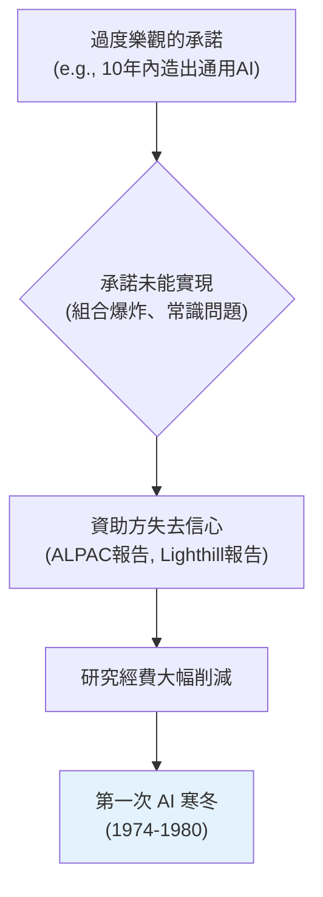
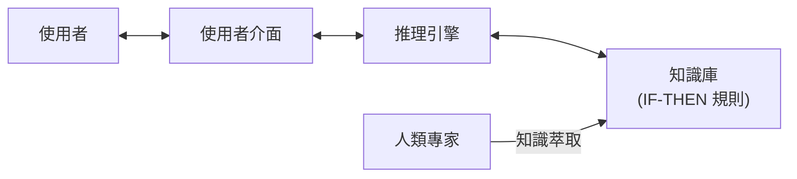
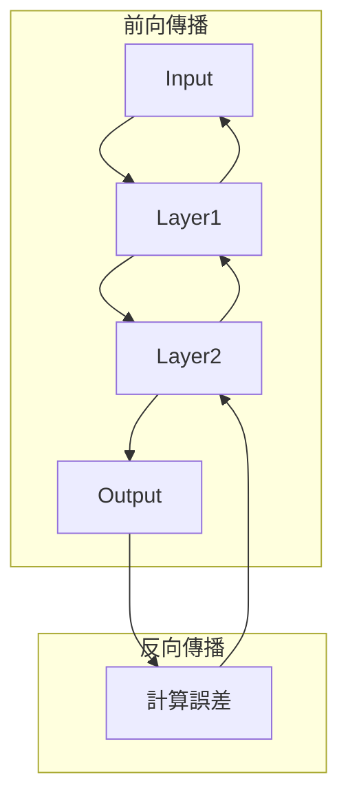

<!-- Path: 114A_AI_intro/History | Timestamp: 2025-10-26 10:45:00 | Version: b05 -->
# 第 VI 章：寒冬與復甦 (1970s-1990s)

[← 上一章：經典時期](./Chapter_05_ClassicalPeriod_b05.md) | [返回目錄](./README_b06.md) | [下一章：深度學習革命 →](./Chapter_07_DeepLearning_b05.md)

---

## 6.1 時代背景：從樂觀到幻滅

1970 年代初，AI 領域的氛圍從達特茅斯會議以來的極度樂觀，轉為普遍的質疑與失望。早期研究者們的宏偉承諾，在現實的複雜性面前顯得不堪一擊。

### 6.1.1 承諾未能兌現

- **通用智慧的落空**：像 GPS 這樣的通用問題解決器，被證明只能處理簡單的、良定義的「玩具問題」。
- **機器翻譯的失敗**：ALPAC 委員會在 1966 年發布報告，指出耗費巨資的機器翻譯研究，其成果遠不如人類譯者，且沒有短期內突破的希望。
- **組合爆炸**：隨著問題規模的擴大，搜索空間呈指數級增長，即使是當時最快的電腦也無法應付，這在象棋、路徑規劃等問題上尤為明顯。
- **常識與框架問題**：AI 系統缺乏人類的基礎常識，無法理解符號背後的真實世界意義，也難以處理行動對環境的影響。

### 6.1.2 資金的枯竭

由於研究成果遠未達到預期，主要的資助機構（如美國的 DARPA）開始大幅削減對 AI 基礎研究的投入，轉而支持目標更明確、更具應用性的專案。這直接導致了第一次「AI 寒冬」的到來。



---

## 6.2 第一次 AI 寒冬 (1974-1980)

「AI 寒冬」指的是 AI 研究的資金和公眾興趣都急劇下降的時期。研究人員為了獲得經費，甚至避免在提案中使用 "Artificial Intelligence" 這個詞。

**主要影響**：
- **研究方向轉變**：從追求通用智慧，轉向更專注、更實際的應用領域。
- **實驗室裁撤**：許多大學的 AI 實驗室規模縮減或關閉。
- **典範反思**：研究者開始反思純符號主義方法的根本局限性。

---

## 6.3 專家系統的短暫復興 (1980s)

在寒冬中，一個更務實的 AI 分支——**專家系統 (Expert Systems)**——異軍突起，帶來了短暫的春天。

### 6.3.1 什麼是專家系統？

專家系統是一種模擬特定領域人類專家決策能力的電腦程式。它將專家的知識編碼成一系列「IF-THEN」規則，並透過推理引擎來解決問題。

**核心架構**：


### 6.3.2 經典案例：MYCIN

- **開發時間**：1970 年代於史丹佛大學開發。
- **功能**：診斷和推薦治療血液感染疾病的方案。
- **知識庫**：包含約 600 條規則。
- **推理方式**：採用「後向鏈」推理，從假設出發，尋找支持該假設的證據。
- **成就**：在一項評估中，MYCIN 的診斷準確率達到 69%，高於未經專業訓練的醫生，與專家水平相當。

**規則範例**：
```
IF: 
  1) 細菌是革蘭氏陰性菌, AND
  2) 細菌形態是桿狀, AND
  3) 病人是免疫功能低下的
THEN: 
  有強烈證據 (0.8) 表明細菌是大腸桿菌。
```

### 6.3.3 商業成功與泡沫

專家系統的成功引發了 1980 年代的投資熱潮。

- **R1/XCON**：DEC 公司開發的專家系統，用於配置 VAX 電腦訂單，每年為公司節省約 2500 萬美元。
- **LISP 機器**：專為運行 LISP 語言（當時 AI 的主流語言）而設計的專用電腦興起，Symbolics、LMI 等公司應運而生。

然而，這股熱潮很快就消退了。

### 6.3.4 專家系統的衰落

- **知識工程瓶頸**：從專家腦中提取、整理並形式化知識是一個極其困難、耗時且昂貴的過程。
- **維護困難**：當規則庫變得龐大（數千條規則），新增或修改規則可能引發意想不到的衝突，系統變得難以維護。
- **脆弱性 (Brittle)**：專家系統只能處理其知識庫中明確定義的情況，遇到任何預設外的問題就會崩潰。
- **缺乏學習能力**：系統無法從新的案例或數據中自動學習和改進。

---

## 6.4 第二次 AI 寒冬 (1987-1993)

1987 年，隨著 LISP 機器市場的崩潰和專家系統的局限性日益明顯，AI 領域迎來了第二次寒冬。

**導火索**：
- **硬體變革**：通用工作站（如 Sun、Apollo）的性能迅速提升，使得昂貴的 LISP 專用機失去市場。
- **專家系統泡沫破滅**：企業發現維護專家系統的成本高昂，且難以擴展，投資熱情迅速消退。
- **政府計畫失敗**：日本雄心勃勃的「第五代計算機」計畫未能實現其目標。

這次寒冬讓學術界和產業界意識到，**基於規則的符號主義可能不是通往真正智慧的唯一路徑**。

---

## 6.5 典範轉移：從符號到學習

在第二次寒冬的背景下，一種新的思潮逐漸興起：與其讓人類專家辛苦地編寫規則，不如讓機器**從數據中自動學習**。這就是**機器學習 (Machine Learning)** 的核心思想。

### 6.5.1 反向傳播演算法的復興 (1986)

雖然早在 1970 年代就已提出，但直到 1986 年，David Rumelhart、Geoffrey Hinton 和 Ronald Williams 的論文才使其廣為人知。

**核心貢獻**：
提供了一種有效訓練**多層神經網路 (Multi-Layer Perceptrons, MLP)** 的方法，從而克服了單層感知器無法解決 XOR 問題的局限。

**運作原理**：
1.  **前向傳播**：輸入信號通過網路，產生輸出。
2.  **計算誤差**：比較網路輸出與真實標籤的差距。
3.  **反向傳播**：將誤差從輸出層逐層向後傳播，並根據每個神經元對總誤差的「貢獻度」來調整其連接權重。



**歷史意義**：
- 重新點燃了對連結主義（神經網路）研究的興趣。
- 為 20 年後的深度學習革命埋下了最重要的伏筆。

### 6.5.2 其他機器學習演算法的興起

除了神經網路，其他非符號主義的機器學習方法也在這一時期發展成熟。

- **決策樹 (Decision Trees)**：
  - **代表**: ID3 (1986), C4.5 (1993) by Ross Quinlan。
  - **優點**: 模型直觀，可解釋性強，類似人類的決策過程。

- **支持向量機 (Support Vector Machines, SVM)**：
  - **代表**: Vladimir Vapnik 等人在 1990 年代提出。
  - **優點**: 理論基礎堅實（統計學習理論），在小樣本、高維度數據上表現出色，成為 2000 年代初最主流的監督學習演算法之一。

---

## 6.6 本章小結

### 核心要點

1.  **AI 寒冬的教訓**：過度承諾和忽視基礎難題（如組合爆炸、常識推理）會導致信任危機和資金斷絕。
2.  **專家系統的興衰**：證明了 AI 在特定領域的商業價值，但也暴露了知識工程瓶頸和基於規則系統的脆弱性。
3.  **典範轉移**：AI 的研究重心從「知識工程」（由人編寫規則）轉向「機器學習」（從數據中學習模式）。
4.  **關鍵技術的鋪墊**：反向傳播演算法的復興，為神經網路的再次崛起和未來的深度學習革命奠定了基礎。

### 歷史地位

這個時期是 AI 發展的「反思與轉型期」。經歷了兩次寒冬的洗禮，AI 研究變得更加務實，從對通用智慧的幻想，轉向發展可解決實際問題的機器學習技術。符號主義的黃金時代結束，連結主義和統計學習的種子開始萌芽，並將在下一個時代開花結果。

### 思考問題

1.  **歷史的循環**：你認為當前生成式 AI 的熱潮與 1980 年代的專家系統熱潮有何相似之處與不同之處？我們能從專家系統的泡沫中學到什麼教訓？
2.  **典範的價值**：符號主義（專家系統）真的「失敗」了嗎？或者它只是在當時的技術條件下走到了極限？在今天的 AI 系統中，是否仍有符號推理的位置？
3.  **潛伏的技術**：反向傳播演算法在被「重新發現」前沉寂了十多年。這對我們理解技術發展有何啟示？當下是否有被低估的「潛伏技術」？

---

## 延伸閱讀

- **書籍**：《人工智慧的現代方法》第 1 章，關於 AI 歷史的精彩概述。
- **論文**：Rumelhart, D. E., Hinton, G. E., & Williams, R. J. (1986). "Learning representations by back-propagating errors". Nature.
- **下一章預告**：第 VII 章將探討大數據、GPU 和演算法如何共同引爆了「深度學習革命」。

---

[← 上一章：經典時期](./Chapter_05_ClassicalPeriod_b05.md) | [返回目錄](./README_b06.md) | [下一章：深度學習革命 →](./Chapter_07_DeepLearning_b05.md)
