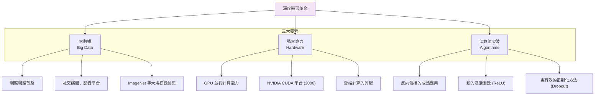

<!-- Path: 114A_AI_intro/History | Timestamp: 2025-10-26 10:46:00 | Version: b05 -->
# 第 VII 章：深度學習革命 (2000s-2010s)

[← 上一章：寒冬與復甦](./Chapter_06_WinterAndRevival_b05.md) | [返回目錄](./README_b06.md) | [下一章：生成式 AI 時代 →](./Chapter_08_GenerativeAI_b05.md)

---

## 7.1 時代背景：革命前夜

進入 21 世紀，儘管 AI 領域在第二次寒冬後顯得相對平靜，但一場即將到來的革命正在悄然醞釀。三個關鍵要素的發展與匯聚，為深度學習的爆發鋪平了道路。

### 7.1.1 三大要素的匯聚

1.  **大數據 (Big Data)**：網際網路的普及產生了前所未有的海量數據。Flickr、Facebook 等平台上的數十億張用戶上傳的圖片，以及 Google Books 的海量文本，為訓練複雜模型提供了充足的「燃料」。其中，**ImageNet** 數據集的建立（2009年，由李飛飛團隊發起）尤為關鍵，它包含超過 1400 萬張手動標註的圖像，為電腦視覺研究提供了一個標準化的、極具挑戰性的競技場。

2.  **強大算力 (Hardware)**：傳統的 CPU 在處理神經網路所需的大規模矩陣運算時效率低下。研究者發現，專為圖形渲染設計的 **GPU (圖形處理器)**，其大規模並行架構恰好非常適合神經網路的計算模式。2009 年，吳恩達 (Andrew Ng) 的團隊證明，使用 GPU 進行深度學習訓練可以比 CPU 快數十倍甚至上百倍，這使得訓練更深、更複雜的網路成為可能。

3.  **演算法突破 (Algorithms)**：除了 1986 年復興的反向傳播演算法，研究者們還發現了一系列關鍵技巧來解決訓練深層網路的難題，例如：
    - **ReLU (Rectified Linear Unit)** 激活函數：相比傳統的 Sigmoid 函數，它能有效緩解梯度消失問題，大幅加快訓練速度。
    - **Dropout**：一種簡單而有效的正則化技術，在訓練時隨機「丟棄」一部分神經元，防止模型過擬合。

---

## 7.2 AlexNet 的歷史性勝利 (2012)

2012 年的 ImageNet 大規模視覺辨識挑戰賽 (ILSVRC) 是 AI 歷史上的一個決定性時刻。

**參賽者**：Geoffrey Hinton 和他的兩位學生 Alex Krizhevsky、Ilya Sutskever。
**模型**：一個名為 **AlexNet** 的深度卷積神經網路 (CNN)。

**歷史性成果**：
- AlexNet 的 Top-5 錯誤率為 **15.3%**。
- 當年的第二名（使用傳統電腦視覺方法）錯誤率為 **26.2%**。

**11% 的巨大領先優勢** 震驚了整個電腦視覺乃至 AI 學界。這不再是微小的性能提升，而是一次壓倒性的勝利，無可辯駁地證明了深度學習方法的優越性。

`[建議此處插入 AlexNet 的詳細架構圖]`

**AlexNet 的關鍵創新**：
- **第一個成功的大規模深度 CNN**：包含 5 個卷積層和 3 個全連接層。
- **系統性地使用 GPU 進行訓練**：利用兩塊 NVIDIA GTX 580 GPU 加速訓練。
- **採用 ReLU 激活函數**：首次在大型網路上證明其巨大優勢。
- **應用 Dropout 技術**：有效解決了過擬合問題。

**影響**：
AlexNet 的成功標誌著**深度學習時代的正式開啟**。從 2012 年起，幾乎所有的電腦視覺研究都轉向了深度學習，AI 領域迎來了第三次浪潮。

---

## 7.3 深度學習的全面爆發

AlexNet 之後，深度學習模型在各個領域取得了飛速發展。

### 7.3.1 電腦視覺 (Computer Vision)

在 ImageNet 競賽上，模型變得越來越深，性能越來越強：
- **VGGNet (2014)**：證明了網路的深度是關鍵，使用非常小的 3x3 卷積核，將網路加深到 16-19 層。
- **GoogLeNet (2014)**：引入「Inception 模組」，在同一層內使用不同尺寸的卷積核，並行提取特徵，有效減少了參數數量。
- **ResNet (2015)**：由何凱明團隊提出的「殘差連接 (Residual Connection)」，巧妙地解決了超深網路的梯度消失和網路退化問題，成功將網路深度推向了 152 層甚至更深。ResNet 的 Top-5 錯誤率降至 3.57%，首次超越了人類水平（約 5%）。

### 7.3.2 自然語言處理 (Natural Language Processing)

深度學習同樣革新了 NLP 領域。

- **詞向量 (Word Embeddings)**：
  - **Word2Vec (2013, Google)** 和 **GloVe (2014, Stanford)** 等技術將單詞表示為低維、稠密的向量。這些向量能夠捕捉單詞之間的語義關係，例如 `vector('King') - vector('Man') + vector('Woman')` 約等於 `vector('Queen')`。

- **遞迴神經網路 (RNN) 與 LSTM**：
  - RNN 及其變體 **LSTM (長短期記憶網路, 1997)** 和 **GRU (門控循環單元, 2014)** 成為處理序列數據（如文本、語音）的主流模型，在機器翻譯、情感分析等任務上取得了巨大成功。

---

## 7.4 Transformer 架構革命 (2017)

2017 年，Google 的一篇名為 **《Attention Is All You Need》** 的論文，提出了一種全新的架構——**Transformer**，徹底改變了 NLP 乃至整個 AI 領域。

### 7.4.1 RNN 的瓶頸

儘管 LSTM 很成功，但 RNN 固有的**序列化計算**使其存在兩個根本瓶頸：
1.  **無法並行計算**：必須處理完前一個詞才能處理下一個，限制了訓練速度和可擴展性。
2.  **長距離依賴問題**：雖然 LSTM 有所緩解，但捕捉超長序列（如整篇文章）的依賴關係仍然非常困難。

### 7.4.2 Transformer 的核心：自注意力機制 (Self-Attention)

Transformer 完全拋棄了遞迴結構，其核心是**自注意力機制**。

**核心思想**：
在處理序列中的某個單詞時，自注意力機制允許該單詞直接「關注」序列中的所有其他單詞，並根據相關性計算其表示。這意味著序列中任意兩個位置之間的距離都變成了 1，從根本上解決了長距離依賴問題。

`[建議此處插入 Transformer 的自注意力機制運作示意動圖]`

**優勢**：
- **完全並行化**：序列中的所有單詞可以同時計算，極大地提升了訓練效率。
- **強大的上下文建模能力**：能夠捕捉複雜的長距離語義依賴。

### 7.4.3 預訓練-微調範式

Transformer 的強大能力催生了新的訓練範式：

1.  **預訓練 (Pre-training)**：在海量的無標註文本數據（如整個網際網路）上訓練一個巨大的 Transformer 模型。任務通常是自我監督的，例如預測被遮蓋的單詞（如 BERT）或預測下一個單詞（如 GPT）。
2.  **微調 (Fine-tuning)**：將預訓練好的模型，在特定任務的少量標註數據上進行微調，使其適應該任務。

**代表模型**：
- **BERT (2018, Google)**：雙向 Transformer 編碼器，在 11 項 NLP 任務上刷新了記錄，證明了預訓練範式的威力。
- **GPT (2018, OpenAI)**：單向自迴歸 Transformer 解碼器，專注於文本生成，其後續版本 GPT-2 (2019) 和 GPT-3 (2020) 展示了驚人的生成能力。

**影響**：
Transformer 不僅統一了 NLP 領域，其思想還被擴展到電腦視覺 (Vision Transformer, ViT)、語音處理等多個領域，成為當代 AI 的基石。

---

## 7.5 本章小結

### 核心要點

1.  **革命的三要素**：深度學習革命的爆發，是**大數據、強大算力 (GPU) 和演算法突破**三者共同作用的結果。
2.  **AlexNet 的里程碑意義**：2012 年，AlexNet 在 ImageNet 競賽上的壓倒性勝利，是深度學習時代開啟的標誌性事件。
3.  **CNN 的統治**：卷積神經網路 (CNN) 及其變體 (VGG, ResNet) 成為電腦視覺領域的標準架構，並在多項任務上超越人類。
4.  **Transformer 的誕生**：2017 年提出的 Transformer 架構，以其並行計算能力和強大的上下文建模能力，取代 RNN 成為序列處理的主流，並催生了預訓練-微調範式。

### 歷史地位

2010 年代是 AI 發展史上最激動人心的十年。深度學習從一個相對邊緣的領域，一躍成為 AI 的絕對核心。AI 不再僅僅是實驗室裡的玩具，而是開始在語音助理、自動駕駛、醫療影像等領域展現出巨大的商業和社會價值。這一時期的技術積累，特別是 Transformer 架構的誕生，直接為下一個時代——生成式 AI 的爆發奠定了堅實的基礎。

### 思考問題

1.  **三要素的重要性**：在大數據、算力、演算法這三個要素中，你認為哪個是深度學習革命最關鍵的催化劑？如果缺少其中一個，歷史會如何不同？
2.  **從 ResNet 到 Transformer**：ResNet 將網路做「深」，而 Transformer 則另闢蹊徑。這兩種不同的創新思路對我們有何啟示？
3.  **預訓練的威力**：為什麼「預訓練-微調」範式會如此成功？它如何改變了我們開發 AI 模型的方式？

---

## 延伸閱讀

- **論文**：Krizhevsky, A., Sutskever, I., & Hinton, G. E. (2012). "ImageNet classification with deep convolutional neural networks".
- **論文**：Vaswani, A., et al. (2017). "Attention is all you need".
- **影片**：李宏毅教授關於 CNN 和 Transformer 的教學影片。
- **下一章預告**：第 VIII 章將探討 Transformer 和大規模預訓練如何將 AI 帶入「生成式 AI」的新紀元。

---

[← 上一章：寒冬與復甦](./Chapter_06_WinterAndRevival_b05.md) | [返回目錄](./README_b06.md) | [下一章：生成式 AI 時代 →](./Chapter_08_GenerativeAI_b05.md)
