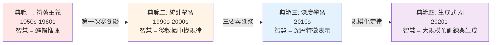

<!-- Path: 114A_AI_intro/History | Timestamp: 2025-10-26 10:27:00 | Version: b01 -->
# 第 IX 章：總結與反思

[← 上一章：生成式 AI 時代](./Chapter_08_GenerativeAI_b01.md) | [返回目錄](./README_b02.md)

---

## 9.1 AI 發展的四次典範轉移

回顧從 1940 年代至今的漫長旅程，AI 的發展並非一條直線，而是經歷了至少四次重大的**典範轉移 (Paradigm Shifts)**。每一次轉移都代表了對「智慧」核心問題理解的深化和實現路徑的根本變革。

- **典範一：符號主義 (Symbolic AI)**
  - **核心思想**：智慧可以透過操作符號和應用邏輯規則來實現。
  - **方法**：專家系統、邏輯編程。
  - **局限**：脆弱，難以處理常識和不確定性。

- **典範二：統計學習 (Machine Learning)**
  - **核心思想**：智慧是從數據中學習統計規律和模式的能力。
  - **方法**：決策樹、SVM、貝葉斯網路。
  - **局限**：高度依賴人工的「特徵工程」。

- **典範三：深度學習 (Deep Learning)**
  - **核心思想**：智慧是透過深層神經網路自動學習數據的層次化特徵表示。
  - **方法**：CNN、RNN、Transformer。
  - **局限**：需要海量標註數據和巨大算力，模型是「黑盒子」。

- **典範四：生成式 AI (Generative AI)**
  - **核心思想**：智慧可以透過在海量數據上進行大規模預訓練，從而學會生成全新的、連貫的內容。
  - **方法**：大型語言模型 (LLM)、擴散模型。
  - **挑戰**：可控性、對齊問題、倫理風險。

---

## 9.2 驅動 AI 發展的多重因素

AI 的每一次飛躍都不是單一因素的結果，而是多重因素在特定時間點交織共振的產物。

- **理論與演算法**：從圖靈機到 Transformer，理論的突破為實踐指明了方向。
- **數據**：從小型數據集到網際網路規模的大數據，數據是 AI 模型的「養料」。
- **算力**：從真空管到 CPU 再到 GPU、TPU，算力的增長是 AI 模型規模擴大的物理基礎。
- **開源與社群**：從 LISP 到 Python，從 TensorFlow/PyTorch 到 Hugging Face，開源工具和社群極大地加速了創新的普及和迭代。
- **資金與產業**：從政府的早期資助到科技巨頭的軍備競賽，再到風險投資的湧入，資本的力量在每個時代都扮演了關鍵角色。

---

## 9.3 關鍵啟示與歷史教訓

這段跨越近一個世紀的歷史，給我們帶來了深刻的啟示。

1.  **進步是非線性的**
    AI 的發展充滿了「熱潮」與「寒冬」的循環。過度的樂觀和承諾往往會導致失望和資金斷絕。這提醒我們對當前的技術熱潮保持理性，認識到真正的突破需要時間積累。

2.  **沒有「銀彈」**
    從符號主義到生成式 AI，沒有任何一種方法是解決所有問題的「銀彈」。每個典範都有其適用的場景和固有的局限性。未來的 AI 很可能是多種方法的混合體。

3.  **理論與工程相輔相成**
    理論的突破（如反向傳播、注意力機制）為工程實現提供了可能，而工程上的成功（如 AlexNet、ChatGPT）反過來又驗證並推動了理論的發展。

4.  **失敗是成功之母**
    感知器的失敗、專家系統的泡沫、LISP 機器的崩潰……這些看似的「失敗」暴露了當時方法的局限，迫使研究者尋找新的方向，從而催生了下一次的突破。

5.  **倫理與技術同等重要**
    隨著 AI 能力的指數級增長，其潛在的社會影響也越來越大。歷史告訴我們，不能等到技術成熟後再考慮倫理問題，而必須在技術發展的每一步都將其置於核心位置。

---

## 9.4 未來展望：機遇與挑戰

站在當前的時間點，我們正處於 AI 發展最激動人心的時刻之一。未來充滿了無限的機遇，也伴隨著巨大的挑戰。

### 9.4.1 技術前沿

- **通用人工智慧 (AGI)**：AGI 仍然是 AI 領域的「聖杯」。當前的 LLM 是否是通往 AGI 的正確道路，學界仍有巨大爭議。
- **多模態與具身智慧 (Embodied AI)**：讓 AI 不僅能理解文本和圖像，還能理解並與物理世界進行交互（例如，透過機器人），這是 AI 從虛擬走向現實的關鍵一步。
- **高效 AI (Efficient AI)**：當前大型模型的巨大能耗和計算成本是不可持續的。研究更小、更高效的模型是未來的關鍵方向。
- **可解釋性與可信 AI (XAI & Trustworthy AI)**：打開 AI 的「黑盒子」，使其決策過程透明、可被理解和信任，這在醫療、金融、司法等高風險領域至關重要。

### 9.4.2 社會與個人層面

- **教育的變革**：AI 正在顛覆傳統的教育模式。死記硬背的價值迅速降低，而提出好問題、批判性思維、創造力以及與 AI 協作的能力變得前所未有的重要。
- **工作的轉型**：AI 將自動化許多重複性工作，同時也將創造新的工作崗位。終身學習和適應變化將成為每個人的必修課。
- **人機協作的新範式**：未來，AI 將更多地作為人類的「副駕駛 (Copilot)」、「思考夥伴」和「創意催化劑」，增強而非取代人類的能力。

### 9.4.3 終極哲學思考

AI 的發展最終迫使我們反思關於人類自身的最根本問題：

- **什麼是智慧？** 當機器在越來越多的智力任務上超越人類，我們該如何重新定義人類智慧的獨特性？
- **什麼是創造力？** AI 生成的藝術、音樂和文學，挑戰了我們對創造力本質的理解。
- **什麼是意識？** 一個行為上無法與人類區分的 AI，是否擁有內在的主觀體驗？
- **人類的價值是什麼？** 如果 AI 能完成大部分工作，人類存在的意義和價值將體現在何處？情感、同理心、價值判斷和建立深刻的人際關係，或許是我們永遠的避風港。

---

## 9.5 結語

從 1950 年圖靈在《計算機器與智能》中提出的那個簡單問題——「機器能思考嗎？」——開始，AI 的發展歷程本身就是一部人類智慧探索自身邊界的史詩。

這段歷史告訴我們，AI 的故事不僅僅是關於演算法、數據和算力，更是關於夢想、挫折、堅韌與反思。它融合了數學的優雅、工程的務實、哲學的深邃和人文的關懷。

作為這個時代的見證者和參與者，了解過去的道路，能幫助我們更清醒地看待現在的成就，更審慎地思考未來的方向。未來的 AI 將走向何方尚無定論，但塑造這個未來的責任，正掌握在我們每一個人手中。

---

[← 上一章：生成式 AI 時代](./Chapter_08_GenerativeAI_b01.md) | [返回目錄](./README_b02.md)
