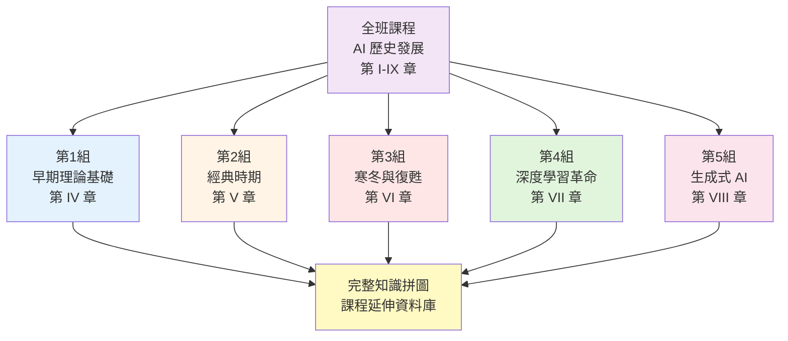
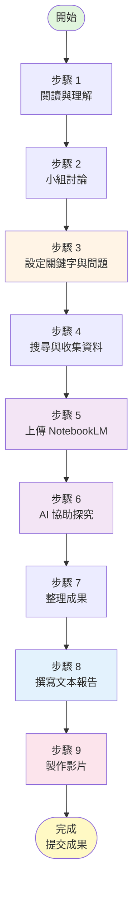
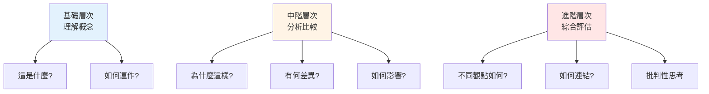

<!-- Path: 114A_AI_intro/History | Timestamp: 2025-10-26 10:23:00 | Version: b06 -->
# Jigsaw Inquiry with NotebookLM — AI 歷史探究教學活動

---

## 📚 教學活動概述

本教學活動採用 **Jigsaw（拼圖式）探究學習**，結合 **NotebookLM AI 工具**，讓各小組深入探究 AI 歷史發展的不同章節，最終各組成果將拼接成完整的課程延伸知識庫。

### 🎯 核心理念

**Jigsaw 的「拼圖」概念**：


**與傳統 Jigsaw 的差異**：
- ❌ 不是「專家小組→拼圖小組」的兩階段分組
- ✅ 而是「各組探究不同章節→匯集成完整延伸資料」
- 🎯 **每組貢獻一塊拼圖，共同完成課程知識地圖**

---

## 🚀 學生快速上手指南 (Quick Start Guide)

1.  **閱讀與組隊**: 仔細閱讀分配到的章節，與 2-3 位組員討論。
2.  **設定問題**: 共同設定 3 個以上有深度的探究問題。
3.  **收集資料**: 搜尋並收集 5-8 個相關的資料來源（論文、影片、文章）。
4.  **上傳 NotebookLM**: 將所有資料上傳至 NotebookLM。
5.  **AI 輔助探究**: 與 NotebookLM 對話，深入探討你的問題。
6.  **整理與寫作**: 將探究發現整理成一份結構完整的 Markdown 報告。
7.  **製作影片**: 將報告內容製作成 5-8 分鐘的解說影片。
8.  **提交成果**: 提交報告、影片和 NotebookLM 專案連結。

---

## 🎯 學習目標

學生將能夠：
1. **深度探究** 特定 AI 歷史時期的發展脈絡
2. **運用 AI 工具** (NotebookLM) 進行資料整理與知識建構
3. **設定關鍵字與問題** 引導深入探究
4. **協作學習** 與組員共同研究
5. **多媒體表達** 產出文本報告與影片

---

## 📋 作業規範

### 基本要求

| 項目 | 規範 |
|------|------|
| **小組人數** | 2-3 人/組 |
| **資料來源數量** | 至少 5-8 個，並保留來源連結 |
| **探究問題** | 至少 3 個深度問題 |
| **文本報告** | Markdown 格式，結構完整 |
| **影片長度** | 5-8 分鐘 |
| **影片內容** | 探討問題、資料來源、探究結果、反思心得 |

### 章節選擇

各組從以下章節中選擇一個作為探究主題（不重複）：

| 章節 | 主題 | 時期 | 核心問題範例 |
|------|------|------|--------------|
| **第 I 章** | 導論 — AI 的起源與意義 | 哲學基礎 | AI 的定義如何演變？哲學根源對當代有何影響？ |
| **第 II 章** | 關鍵字地圖 | 全時期概覽 | 如何透過關鍵字理解 AI 演進脈絡？ |
| **第 III 章** | 兩大典範對比 | 概念框架 | 傳統 AI 與生成式 AI 的本質差異為何？ |
| **第 IV 章** | 早期理論基礎 | 1940s-1950s | 圖靈測試的當代意義？控制論如何影響 AI？ |
| **第 V 章** | 經典時期 | 1956-1970s | AI 為何誕生？為何早期如此樂觀？ |
| **第 VI 章** | 寒冬與復甦 | 1970s-1990s | AI 寒冬的教訓？專家系統為何興衰？ |
| **第 VII 章** | 深度學習革命 | 2000s-2010s | 三大要素如何引爆革命？Transformer 為何關鍵？ |
| **第 VIII 章** | 生成式 AI 時代 | 2020s- | ChatGPT 如何運作？有哪些倫理挑戰？ |
| **第 IX 章** | 總結與反思 | 整體回顧 | AI 發展的關鍵啟示？未來可能走向？ |

---

## 🔄 完整探究流程



---

## 📖 步驟詳解

### 步驟 1：閱讀與理解

**任務**：
- 📖 仔細閱讀指定章節（課程教材）
- 🖍️ 標記重點、疑問、感興趣的部分
- 📝 每人做個人筆記

**輸出**：
- 個人閱讀筆記
- 初步疑問清單

---

### 步驟 2：小組討論

**任務**：
- 💬 分享各自的閱讀心得與疑問
- 🤝 討論章節的核心概念
- 🎯 找出最想深入探究的主題

**討論引導問題**：
1. 這章最重要的概念是什麼？
2. 哪些部分我們還不夠理解？
3. 哪些內容可以延伸探討？
4. 對當代 AI 發展有何啟示？

---

### 步驟 3：設定關鍵字與探究問題 ⭐

**這是探究的核心步驟！**

#### 3.1 提煉關鍵字（5-10 個）

**目的**：建立探究的知識地圖

**範例**（第 VII 章：深度學習革命）：
```markdown
## 核心關鍵字

### 技術關鍵字
1. AlexNet
2. GPU 加速
3. 卷積神經網路 (CNN)
4. Transformer
5. 注意力機制 (Attention Mechanism)

### 概念關鍵字
6. 大數據 (Big Data)
7. ImageNet 競賽
8. 預訓練-微調 (Pre-training & Fine-tuning)

### 人物關鍵字
9. Geoffrey Hinton
10. Yoshua Bengio

### 事件關鍵字
11. 2012 ImageNet 突破
12. 深度學習復興
```

#### 3.2 設定探究問題（至少 3 個）

**好問題的特徵**：
- ✅ **開放性**：不是簡單的是非題
- ✅ **有深度**：需要分析、比較、評估
- ✅ **可探究**：有資料可查，能找到答案
- ✅ **有意義**：對理解主題有幫助

**問題類型參考**：

| 類型 | 範例問題 |
|------|----------|
| **因果分析** | 為什麼 AlexNet 的成功能引爆深度學習革命？ |
| **比較對比** | Transformer 與 RNN 的核心差異是什麼？ |
| **影響評估** | GPU 加速對 AI 發展有哪些深遠影響？ |
| **歷史脈絡** | 深度學習在 2012 年前為何沒有成功？ |
| **當代連結** | 深度學習革命如何影響今天的生成式 AI？ |
| **預測未來** | 下一個 AI 典範轉移可能是什麼？ |
| **倫理思考** | 深度學習的「黑盒問題」如何影響信任？ |

**範例問題設定**（第 VII 章）：
```markdown
## 我們的探究問題

### 問題 1（因果分析）
**為什麼 AlexNet 的成功能引爆深度學習革命？**
- 探究方向：技術創新、時機因素、社會心理
- 關鍵字：AlexNet, ImageNet, GPU, 2012

### 問題 2（比較對比）
**Transformer 為何能取代 RNN 成為主流架構？**
- 探究方向：技術原理、優勢比較、應用影響
- 關鍵字：Transformer, RNN, 注意力機制, 平行計算

### 問題 3（當代連結）
**深度學習革命如何為生成式 AI 奠定基礎？**
- 探究方向：技術承繼、發展脈絡、關鍵突破
- 關鍵字：CNN, Transformer, GPT, 預訓練

### 問題 4（批判思考）
**如果沒有 GPU 的發展，AI 會如何演變？**
- 探究方向：反事實推理、硬體重要性、替代方案
- 關鍵字：GPU, 計算能力, 硬體限制
```

---

### 步驟 4：搜尋與收集資料

**任務**：
- 🔍 根據關鍵字與問題搜尋資料
- 📚 收集至少 5-8 個不同來源
- 🏷️ 記錄每個來源的資訊

**資料來源類型**：

| 類型 | 範例 | 優點 | 注意事項 |
|------|------|------|----------|
| 📄 **學術論文** | Google Scholar, arXiv | 權威、深入 | 可能較難理解 |
| 📺 **教學影片** | YouTube（李宏毅、Andrew Ng） | 易懂、視覺化 | 需記錄時間軸 |
| 📰 **科技報導** | Wired, MIT Tech Review | 背景故事、影響分析 | 注意發布日期 |
| 📝 **技術部落格** | Medium, Towards Data Science | 實務經驗、案例 | 確認作者可信度 |
| 🎙️ **專家訪談** | Podcast, 訪談文章 | 第一手觀點 | 注意個人偏見 |
| 📚 **課程教材** | 本課程章節、參考資料 | 結構化、可信 | 作為基礎 |

**資料記錄格式**：
```markdown
## 資料來源清單

### 來源 1
- **標題**：ImageNet Classification with Deep Convolutional Neural Networks
- **類型**：學術論文
- **作者**：Alex Krizhevsky, Ilya Sutskever, Geoffrey E. Hinton
- **年份**：2012
- **連結**：https://papers.nips.cc/paper/...
- **相關問題**：問題 1
- **重點摘要**：提出 AlexNet 架構，使用 ReLU、Dropout、GPU 訓練
- **關鍵引用**：第 3 節技術創新、第 5 節實驗結果

### 來源 2
- **標題**：李宏毅機器學習 2023 - CNN 講解
- **類型**：教學影片
- **來源**：YouTube
- **連結**：https://youtube.com/watch?v=...
- **相關問題**：問題 1, 問題 2
- **重點時間軸**：
  - 12:30-18:00 — CNN 基本原理
  - 25:00-35:00 — AlexNet 創新點
  - 40:00-50:00 — 與傳統方法比較
- **重點摘要**：深入淺出解釋 CNN 如何運作

### 來源 3
- **標題**：The AI Revolution Started with This Moment
- **類型**：科技報導
- **來源**：Wired 雜誌
- **年份**：2022
- **連結**：https://wired.com/story/...
- **相關問題**：問題 1, 問題 3
- **重點摘要**：回顧 2012 ImageNet 競賽的歷史意義
- **關鍵引用**：Hinton 訪談內容

（繼續列出其他來源...）

### 來源統計
- 學術論文：2 篇
- 教學影片：3 個
- 科技報導：2 篇
- 技術部落格：1 篇
- 課程教材：1 份
- **總計：9 個來源**
```

---

### 步驟 5：上傳至 NotebookLM

**任務**：
- 📤 將所有資料上傳到 NotebookLM
- 🏷️ 為每個來源加上標籤
- 📝 寫下簡短摘要

**操作步驟**：

#### 5.1 建立 NotebookLM 專案

1. **前往** https://notebooklm.google.com
2. **登入** Google 帳號
3. **建立新筆記本**
   - 點擊「+ 新筆記本」
   - 命名格式：`[組別] - [章節名稱] - AI 歷史探究`
   - 例如：`第4組 - 深度學習革命 - AI 歷史探究`

#### 5.2 上傳資料來源

**支援的格式**：
- 📄 PDF 檔案（論文、報告）
- 🔗 網頁連結（文章、部落格）
- 📺 YouTube 影片連結
- 📝 複製貼上文字
- 📂 Google Drive 文件

**上傳方法**：
```
1. 點擊「+ 新增來源」
2. 選擇來源類型：
   - 「上傳」→ PDF 檔案
   - 「貼上連結」→ 網頁或影片網址
   - 「貼上文字」→ 直接貼上內容
3. 等待處理完成（顯示「已新增」）
4. 為來源加上標籤（例如：#問題1、#論文、#關鍵來源）
```

**組織技巧**：
- 使用 **標籤** 分類資料（#問題1、#問題2、#論文、#影片）
- 為每個來源寫 **1-2 句摘要**
- 標記 **核心來源**（最重要的 2-3 個）

---

### 步驟 6：使用 NotebookLM 協助探究 ⭐

**這是深度學習的關鍵階段！**

#### 6.1 有效提問的技巧

**問題層次**：



**提問策略**：

1. **從廣到深**：
```
第一問：「請總結上傳資料中關於 AlexNet 的核心內容。」
       （建立整體理解）

第二問：「AlexNet 有哪些技術創新？這些創新為何重要？」
       （深入技術細節）

第三問：「比較不同資料來源，對 AlexNet 成功原因的看法有何異同？」
       （交叉分析）

第四問：「根據所有資料，如果沒有 GPU 發展，AlexNet 還能成功嗎？」
       （批判性思考）
```

2. **針對問題探究**：
```
針對問題 1：為什麼 AlexNet 能引爆革命？

第一輪提問：
- 「AlexNet 在技術上有哪些創新？」
- 「2012 年的時代背景是什麼？」
- 「ImageNet 競賽扮演什麼角色？」

第二輪提問（深化）：
- 「為什麼這些創新在當時是突破性的？」
- 「為什麼是 2012 年而非更早？」
- 「11% 的領先優勢為何如此重要？」

第三輪提問（綜合）：
- 「整合所有因素，AlexNet 成功的關鍵是什麼？」
- 「不同來源強調的重點有何不同？」
- 「這對我們理解 AI 突破有何啟示？」
```

3. **交叉驗證**：
```
- 「論文中提到的創新，在其他資料中如何被評價？」
- 「專家訪談的觀點，與學術分析有何異同？」
- 「不同時期的報導，對 AlexNet 的評價是否改變？」
```

#### 6.2 對話範例（完整流程）

```markdown
## NotebookLM 探究對話記錄

### 探究問題 1：為什麼 AlexNet 能引爆深度學習革命？

---

#### 第一輪：建立整體理解

👤 **我的提問**：
請根據上傳的資料，總結 AlexNet 的背景、技術特點和歷史意義。

🤖 **NotebookLM 回應**：
根據上傳的資料，我可以提供以下總結：

**背景**（來源：Wired 報導、課程教材第 VII 章）
- 2012 年，深度學習尚未被主流接受
- ImageNet 競賽提供了展示平台
- GPU 技術剛開始應用於 AI

**技術特點**（來源：AlexNet 論文）
1. 使用 ReLU 激活函數，訓練速度比 sigmoid 快 6 倍
2. Dropout 正則化，防止過擬合
3. 雙 GPU 並行訓練
4. 數據增強技術
5. 8 層深度架構（5 卷積 + 3 全連接）

**歷史意義**（來源：多個來源綜合）
- ImageNet 錯誤率：15.3%（第二名 26.2%）
- 11% 的巨大領先震驚學界
- 證明了深度學習的實用價值
- 引發研究熱潮和產業投資

---

#### 第二輪：深入技術細節

👤 **我的提問**：
這些技術創新為什麼在當時是突破性的？之前為何沒有人這樣做？

🤖 **NotebookLM 回應**：
根據論文和歷史回顧資料：

**ReLU 的突破性**（來源：論文第 3.1 節）
- 之前主要使用 sigmoid/tanh 激活函數
- 這些函數在深層網路中會梯度消失
- ReLU 的簡單形式（max(0,x)）解決了這個問題
- 當時這是相對新的想法（2010 年左右開始流行）

**Dropout 的創新**（來源：論文第 4.2 節）
- 隨機丟棄神經元的想法在當時很新穎
- 有效防止過擬合而不需要大量數據
- 類似「集成學習」的效果

**GPU 的關鍵作用**（來源：Hinton 訪談）
- Hinton 團隊是最早系統性使用 GPU 訓練的
- 2009 年 Andrew Ng 證明 GPU 可加速神經網路
- 但當時多數研究者仍使用 CPU
- 雙 GPU 並行是大膽的嘗試

**為何之前沒有**（來源：歷史分析文章）
1. 硬體限制：GPU 剛開始應用於 AI
2. 數據匱乏：ImageNet（2009）才提供大規模數據
3. 理論不完善：ReLU 等技巧逐步發展
4. 信心不足：1990-2000s SVM 主導，神經網路被冷落

---

#### 第三輪：時代背景分析

👤 **我的提問**：
為什麼是 2012 年？更早或更晚會如何？

🤖 **NotebookLM 回應**：
根據多個資料來源的分析：

**2012 年的「完美時機」**（來源：課程教材、技術報導）

**技術成熟度**：
- GPU 技術發展（2006: CUDA 發布 → 2009: AI 應用 → 2012: 成熟）
- ImageNet 建立（2009）→ 社群熟悉（2010-2011）→ 2012 展示
- 深度學習理論積累（反向傳播 1986 → CNN 1998 → 優化技巧 2000s）

**如果更早**（假設 2008 年）：
- GPU 性能不足，訓練可能需數月
- ImageNet 尚未建立，缺乏大規模數據
- 社群對深度學習信心更低
- **可能**：嘗試失敗，進一步延後革命

**如果更晚**（假設 2015 年）：
- 其他團隊可能捷足先登
- 但基礎條件已成熟，革命不可避免
- **可能**：延遲 2-3 年，但最終會發生

**Hinton 的觀點**（來源：訪談）：
「我們運氣很好，剛好在技術成熟的時刻抓住機會。
如果早兩年，硬體不夠；晚兩年，別人可能做出來了。」

---

#### 第四輪：社會心理因素

👤 **我的提問**：
11% 的領先為何如此重要？為何能改變整個學界的看法？

🤖 **NotebookLM 回應**：
這是非常有洞察力的問題。根據資料分析：

**量變到質變**（來源：Wired 報導、專家分析）

**不只是數字的意義**：
- 5% 領先：可能被視為偶然或調參技巧
- 11% 領先：無法用偶然解釋，證明方法論的優越
- 這是「壓倒性優勢」的心理閾值

**公開競賽的展示效果**（來源：歷史分析）：
- ImageNet 是公開、透明的競賽
- 所有人使用相同數據集
- 結果無法質疑
- **相比論文發表，競賽勝利更有說服力**

**改變認知的過程**（來源：研究者訪談）：
1. **震驚**：「深度學習居然這麼強？」
2. **好奇**：「他們到底做了什麼？」
3. **驗證**：「我們也試試看」
4. **接受**：「這確實是未來方向」
5. **投入**：大量資源湧入

**社會學解釋**（來源：科技社會學文章）：
- **範式轉移**需要「不可否認的證據」
- AlexNet 提供了這個證據
- 類似歷史上的科學革命（例如：愛因斯坦的光電效應實驗）

---

#### 第五輪：綜合分析

👤 **我的提問**：
整合所有資料，AlexNet 成功的核心因素是什麼？不同來源的觀點有何異同？

🤖 **NotebookLM 回應**：
讓我整合所有來源進行綜合分析：

**核心因素（多來源共識）**：

**1. 技術創新 + 工程實踐**（所有來源都強調）
- 不是單一創新，而是多項技術的巧妙結合
- ReLU, Dropout, GPU, 數據增強缺一不可

**2. 時機成熟（天時地利）**（歷史分析強調）
- 硬體、數據、理論三者匯聚
- 2012 年是「臨界點」

**3. 展示平台（ImageNet）**（媒體報導強調）
- 公開競賽的說服力
- 戲劇性的展示效果

**不同觀點的差異**：

| 來源類型 | 強調重點 | 視角 |
|----------|----------|------|
| **學術論文** | 技術創新細節 | 方法論 |
| **技術報導** | 歷史轉折意義 | 宏觀影響 |
| **專家訪談** | 研究過程與決策 | 個人經驗 |
| **歷史分析** | 多重因素交織 | 系統觀點 |

**有趣的分歧**：

**技術派 vs 時機派**：
- 技術派（論文作者）：強調創新的重要性
- 時機派（歷史學者）：強調條件成熟的必然性
- **我們的看法**：兩者缺一不可

**個人英雄 vs 集體智慧**：
- 媒體報導：傾向強調 Hinton 團隊的貢獻
- 學術分析：強調整個社群的累積
- **實際情況**：團隊抓住了集體智慧成熟的時機

---

#### 第六輪：批判性思考

👤 **我的提問**：
如果沒有 GPU 的發展，深度學習革命還會發生嗎？會如何延遲？

🤖 **NotebookLM 回應**：
這是一個很好的反事實思考。讓我基於資料進行推測：

**GPU 的關鍵作用**（來源：技術分析）：
- 將訓練時間從「數月」縮短到「數週」
- 使實驗迭代成為可能
- 讓深度網路訓練從「理論上可行」變為「實際可行」

**沒有 GPU 的情境推測**：

**情境 A：使用 CPU 集群**
- 可能延遲 3-5 年
- 需要更大的資金投入（大型計算中心）
- 可能限制在少數有資源的機構

**情境 B：等待其他硬體突破**
- 可能等待 TPU 或其他專用晶片
- 延遲 5-10 年
- 可能由不同的技術路徑達成

**情境 C：採用不同方法**
- 可能發展更高效的演算法（減少計算需求）
- 可能採用其他機器學習方法（如 SVM 的改進）
- AI 發展可能走上不同軌跡

**專家觀點**（來源：Hinton 訪談）：
「GPU 不是唯一可能，但它恰好出現在對的時間。
如果沒有 GPU，我們會找其他方法，但會慢很多。」

**我們的思考**：
GPU 是「加速器」而非「必要條件」，但它將革命從
「可能在 2020 年」提前到「2012 年」。硬體突破往往
是 AI 進步的關鍵催化劑。

---

### 探究小結

透過與 NotebookLM 的多輪對話，我們深入理解了：

✅ **技術層面**：AlexNet 的創新及其突破性
✅ **歷史脈絡**：為何是 2012 年的完美時機
✅ **社會因素**：展示平台與心理閾值的重要性
✅ **多元觀點**：不同來源的側重與共識
✅ **批判思考**：反事實推理與深層理解

**核心洞察**：
AlexNet 的成功不是單一因素，而是「技術創新 + 時機成熟 +
展示平台」的三位一體。這給我們的啟示是：AI 的突破往往
需要多重條件的匯聚，而非單一的技術躍進。
```

#### 6.3 記錄與整理

**重要**：在探究過程中，隨時記錄：
- 💡 重要發現
- 📌 關鍵引用（來源 + 頁碼/時間軸）
- 🤔 新的問題
- 💬 有趣的觀點

---

### 步驟 7：整理探究成果

**任務**：
- 📊 將對話中的發現結構化
- 🔗 連結不同問題的答案
- 💎 提煉核心洞察

**成果整理格式**：
```markdown
## 探究成果整理

### 問題 1：為什麼 AlexNet 能引爆深度學習革命？

#### 核心答案（一句話）
AlexNet 的成功是「技術創新 + 時機成熟 + 展示效果」三者匯聚的結果。

#### 詳細發現

##### 發現 1：多項技術的巧妙結合
**內容**：
- ReLU 激活函數：解決梯度消失，加速訓練 6 倍
- Dropout：有效防止過擬合
- GPU 訓練：速度提升 10 倍
- 數據增強：最大化有限數據的價值

**來源**：
- [來源 1] AlexNet 論文第 3-4 節
- [來源 2] 李宏毅影片 25:00-35:00

**重要性**：
這些創新單獨存在已久，但 AlexNet 首次將它們有效整合，
展現了「工程整合」的重要性。

##### 發現 2：2012 年的完美時機
**內容**：
- GPU 技術成熟（CUDA 2006 → AI 應用 2009 → 成熟 2012）
- ImageNet 數據集建立（2009）並被社群接受
- 理論與技巧逐步積累

**來源**：
- [來源 3] Wired 歷史報導
- [來源 4] 課程教材第 VII 章

**重要性**：
如果早 2 年，硬體不足；晚 2 年，別人可能捷足先登。
時機的把握是成功的關鍵。

##### 發現 3：公開競賽的展示效果
**內容**：
- 11% 的巨大領先（15.3% vs 26.2%）
- ImageNet 公開、透明的競賽平台
- 結果無法質疑，改變了整個學界的認知

**來源**：
- [來源 5] Hinton 訪談
- [來源 6] 科技社會學分析

**重要性**：
技術突破需要「舞台」。沒有 ImageNet 競賽的戲劇性展示，
說服學界可能需要更長時間。

#### 不同觀點比較

| 觀點 | 強調因素 | 代表來源 |
|------|----------|----------|
| **技術派** | 創新的突破性 | 學術論文、技術部落格 |
| **時機派** | 條件成熟的必然性 | 歷史分析文章 |
| **社會派** | 展示與說服的重要性 | 媒體報導、專家訪談 |

**我們的綜合觀點**：
三者缺一不可。技術提供可能，時機提供條件，展示提供說服力。

#### 引發的新思考

1. **硬體的催化作用**：GPU 將革命從 2020 年提前到 2012 年
2. **展示平台的重要性**：為何其他領域的突破較少引起轟動？
3. **典範轉移的心理機制**：11% 為何是心理閾值？
4. **對當代的啟示**：下一次革命需要什麼「舞台」？

#### 與當代的連結

**發展脈絡**：
```
AlexNet → 深度學習成熟 → Transformer → GPT → 生成式 AI
```

2012 年的突破為今天的 ChatGPT 奠定了基礎：
- CNN 成功 → 證明深度學習可行
- 吸引資源 → 加速研究
- Transformer 發展 → 最終導致 LLM

沒有 AlexNet，可能沒有今天的生成式 AI 熱潮。

---

### 問題 2：Transformer 為何能取代 RNN？
（同樣格式整理...）

---

### 問題 3：深度學習革命如何影響生成式 AI？
（同樣格式整理...）
```

---

### 步驟 8：撰寫文本報告

**任務**：
- 📝 將探究成果整理成正式報告
- 🔗 包含所有必要元素
- 💎 結構清晰、邏輯連貫

**報告結構範本**：

```markdown
# AI 歷史探究報告：深度學習革命 (2000s-2010s)

**課程**：AI 導論
**章節**：第 VII 章
**小組**：第 4 組
**組員**：張三、李四、王五
**日期**：2025-10-25

---

## 一、探究主題與動機

### 1.1 章節概述
本章探討 2000-2010 年代的深度學習革命，這是 AI 發展史上的
關鍵轉折點。三大要素（大數據、GPU、演算法突破）的匯聚，
引爆了 AI 的第三次浪潮。

### 1.2 為何選擇此主題
我們選擇此章節因為：
1. 深度學習直接影響當代 AI（包括 ChatGPT）
2. 想理解「為何是 2012 年」這個歷史轉折
3. 對 Transformer 如何改變 AI 感到好奇

### 1.3 探究範圍
- 時間：2000-2017 年（AlexNet 到 Transformer）
- 核心事件：ImageNet 競賽、AlexNet、Transformer
- 關鍵人物：Hinton, LeCun, Bengio, Vaswani 等

---

## 二、關鍵字地圖

### 2.1 技術關鍵字
- **AlexNet**：開啟深度學習時代的 CNN 架構
- **GPU 加速**：使深度網路訓練成為可能
- **卷積神經網路 (CNN)**：電腦視覺的主流方法
- **Transformer**：徹底改變 NLP 的架構
- **注意力機制**：Transformer 的核心創新

### 2.2 概念關鍵字
- **大數據 (Big Data)**：訓練深度模型的燃料
- **ImageNet 競賽**：展示深度學習潛力的舞台
- **預訓練-微調**：遷移學習的範式

### 2.3 人物關鍵字
- **Geoffrey Hinton**：深度學習先驅，AlexNet 指導教授
- **Yoshua Bengio**：深度學習三巨頭之一
- **Yann LeCun**：CNN 發明者

### 2.4 事件關鍵字
- **2012 ImageNet 突破**：AlexNet 的歷史性勝利
- **深度學習復興**：從邊緣到主流

---

## 三、探究問題

### 問題 1（因果分析）
**為什麼 AlexNet 的成功能引爆深度學習革命？**

### 問題 2（比較對比）
**Transformer 為何能取代 RNN 成為主流架構？**

### 問題 3（當代連結）
**深度學習革命如何為生成式 AI 奠定基礎？**

---

## 四、資料來源

### 4.1 來源統計
- 📄 學術論文：3 篇
- 📺 教學影片：3 個
- 📰 科技報導：2 篇
- 📝 技術部落格：2 篇
- 📚 課程教材：1 份
- **總計：11 個來源**

### 4.2 核心來源清單

#### 來源 1 ⭐ 核心來源
- **標題**：ImageNet Classification with Deep Convolutional Neural Networks
- **類型**：學術論文
- **作者**：Krizhevsky, Sutskever, Hinton
- **年份**：2012
- **連結**：https://papers.nips.cc/paper/4824-imagenet-classification-with-deep-convolutional-neural-networks.pdf
- **為何重要**：AlexNet 原始論文，第一手技術資料

#### 來源 2 ⭐ 核心來源
- **標題**：Attention Is All You Need
- **類型**：學術論文
- **作者**：Vaswani et al.
- **年份**：2017
- **連結**：https://arxiv.org/abs/1706.03762
- **為何重要**：Transformer 原始論文

#### 來源 3
- **標題**：李宏毅機器學習 2023 - CNN 與 Transformer 講解
- **類型**：教學影片
- **連結**：https://youtube.com/watch?v=...
- **重點時間軸**：
  - 12:30-35:00 — CNN 原理與 AlexNet
  - 45:00-70:00 — Transformer 架構詳解

（其他來源省略...）

### 4.3 來源可信度評估

| 來源類型 | 可信度 | 原因 |
|----------|--------|------|
| 學術論文 | ⭐⭐⭐⭐⭐ | 同行評審、第一手資料 |
| 教學影片 | ⭐⭐⭐⭐ | 專家講解、易於理解 |
| 科技報導 | ⭐⭐⭐ | 背景故事，但需交叉驗證 |
| 技術部落格 | ⭐⭐⭐ | 實務經驗，注意作者背景 |

---

## 五、探究過程與發現

### 5.1 使用 NotebookLM 的過程

我們將 11 個資料來源上傳到 NotebookLM，並透過 6 輪對話
深入探究每個問題。對話過程讓我們能夠：
- 快速整合大量資料
- 交叉驗證不同觀點
- 發現資料間的連結
- 進行批判性思考

### 5.2 問題 1 探究結果

**問題**：為什麼 AlexNet 的成功能引爆深度學習革命？

#### 核心答案
AlexNet 的成功是「技術創新 + 時機成熟 + 展示效果」的三位一體。

#### 詳細分析

##### 技術創新層面
**發現的關鍵創新**：
1. **ReLU 激活函數**
   - 解決梯度消失問題
   - 訓練速度提升 6 倍
   - 來源：[論文第 3.1 節]

2. **Dropout 正則化**
   - 隨機丟棄神經元
   - 有效防止過擬合
   - 來源：[論文第 4.2 節]

3. **GPU 並行訓練**
   - 使用兩塊 NVIDIA GTX 580
   - 訓練時間從數月縮短到 5-6 天
   - 來源：[論文第 5 節、Hinton 訪談]

4. **數據增強**
   - 圖像平移、翻轉、顏色調整
   - 有效擴大訓練集
   - 來源：[論文第 4.1 節]

**為何是突破**：
這些技術單獨來看並非全新，但 AlexNet 首次成功整合，
展現了「系統整合」的重要性。

##### 時機成熟層面

**2012 年的完美匯聚**：

```
2006: CUDA 發布（GPU 可用於通用計算）
  ↓
2009: Andrew Ng 證明 GPU 可加速 AI
  ↓
2009: ImageNet 數據集建立
  ↓
2010-2011: 社群逐漸熟悉 ImageNet
  ↓
2012: AlexNet 在成熟的條件下展示突破
```

**反事實思考**：
- 如果是 2008 年：GPU 性能不足，ImageNet 未建立
- 如果是 2015 年：其他團隊可能捷足先登

**來源**：[Wired 報導、課程教材、歷史分析文章]

##### 展示效果層面
**11% 領先的心理閾值**：

| 領先幅度 | 可能反應 |
|----------|----------|
| 2-3% | 可能是調參技巧或運氣 |
| 5-7% | 值得注意，但尚不足以改變認知 |
| 11% | **壓倒性優勢，無法用偶然解釋** |

**ImageNet 競賽的舞台效果**：
- 公開、透明、結果無法質疑
- 所有人使用相同數據
- 比論文發表更有說服力
- 來源：[科技社會學分析、專家訪談]

**改變認知的過程**：
```
震驚 → 好奇 → 驗證 → 接受 → 投入資源
```

#### 不同觀點的比較

我們發現不同類型的資料來源強調不同面向：

| 來源類型 | 強調重點 | 典型觀點 |
|----------|----------|----------|
| **學術論文** | 技術創新細節 | "關鍵是 ReLU 和 Dropout 的結合" |
| **媒體報導** | 歷史轉折意義 | "這改變了整個 AI 的命運" |
| **專家訪談** | 研究決策過程 | "我們運氣好，抓住了時機" |
| **歷史分析** | 多重因素交織 | "技術、時機、展示缺一不可" |

**我們的綜合觀點**：
技術提供了「可能性」，時機提供了「條件」，展示提供了「說服力」。
三者缺一不可，這是 AI 突破的典型模式。

#### 引發的深層思考

1. **硬體的催化作用**
   - GPU 將革命從「2020 年代」提前到「2012 年」
   - 硬體突破往往是 AI 進步的關鍵催化劑
   - 思考：下一個硬體突破會是什麼？量子計算？

2. **展示平台的重要性**
   - 為何有些技術突破默默無聞？
   - 公開競賽提供了「無可辯駁的證據」
   - 思考：學術界是否應建立更多這樣的平台？

3. **典範轉移的心理機制**
   - 為何需要「11%」這樣的閾值？
   - 人類認知的保守性與突破的困難
   - 思考：我們如何識別正在發生的典範轉移？

### 5.3 問題 2 探究結果

**問題**：Transformer 為何能取代 RNN 成為主流架構？

#### 核心答案
Transformer 透過「注意力機制 + 平行計算 + 更好的長距離建模」
徹底解決了 RNN 的核心限制。

#### RNN 的根本問題

**序列依賴性**：
```
RNN 處理序列的方式：
t1 → t2 → t3 → t4 → ...

問題：
- 必須按順序處理，無法平行
- 訓練速度慢
- 梯度消失/爆炸
```

**長距離依賴困難**：
即使使用 LSTM，處理長序列時：
- 前面的資訊逐漸被「遺忘」
- 難以捕捉跨越數百個詞的依賴關係

**來源**：[Transformer 論文 Introduction、李宏毅影片 45:00-55:00]

#### Transformer 的革命性創新

##### 創新 1：自注意力機制 (Self-Attention)

**核心思想**：
每個詞可以「看到」序列中的所有其他詞，並決定關注哪些。

**數學原理**（簡化）：
```
對於序列中的每個詞：
1. 生成 Query（我想找什麼）
2. 生成 Key（我是什麼）
3. 生成 Value（我的內容）

注意力分數 = Query · Key^T
輸出 = softmax(注意力分數) · Value
```

**視覺化範例**：
```
句子："The cat sat on the mat"

處理 "sat" 時，注意力分布：
The  cat  sat  on  the  mat
0.1  0.6  0.1  0.05 0.05 0.1

→ 模型自動學會關注 "cat"（主語）
```

**來源**：[Transformer 論文第 3.2 節、教學影片]

##### 創新 2：平行計算

**RNN vs Transformer**：
```
RNN：
step1 → step2 → step3 → ... (序列)
訓練時間 ∝ 序列長度

Transformer：
step1
step2  } 同時計算
step3
...
訓練時間 = 常數（不隨序列長度增長）
```

**實際影響**：
- 訓練速度提升 10-100 倍
- 使大規模預訓練成為可能
- 開啟了 BERT、GPT 等大模型時代

**來源**：[論文第 1 節、技術分析文章]

##### 創新 3：更好的長距離建模

**注意力機制的優勢**：
- 任意兩個詞之間的「距離」都是 1
- 不存在「遺忘」問題
- 可以直接建立跨越整個序列的依賴

**實驗證明**：
在需要長距離依賴的任務上（如翻譯長句），
Transformer 大幅超越 LSTM。

**來源**：[論文第 5 節實驗結果]

#### 從質疑到接受

**2017 年論文發表時**：
- 部分研究者質疑：「沒有遞迴結構，真的能理解序列嗎？」
- 標題 "Attention Is All You Need" 有挑釁意味

**2018-2019 年的驗證**：
- BERT (Google, 2018)：11 項 NLP 任務創紀錄
- GPT-2 (OpenAI, 2019)：驚人的文本生成能力
- 質疑消失，Transformer 成為主流

**2020 年後的擴展**：
- 不僅 NLP，連電腦視覺也採用（Vision Transformer）
- 多模態模型的基礎
- 真正成為「All You Need」

**來源**：[歷史回顧文章、研究趨勢分析]

#### 對當代的深遠影響

**Transformer → GPT → ChatGPT**：
```
2017: Transformer 論文
  ↓
2018: BERT, GPT-1
  ↓
2019: GPT-2
  ↓
2020: GPT-3（1750 億參數）
  ↓
2022: ChatGPT
  ↓
2023: GPT-4
```

沒有 Transformer，就沒有今天的生成式 AI 革命。

### 5.4 問題 3 探究結果

**問題**：深度學習革命如何為生成式 AI 奠定基礎？

（同樣格式整理...）

---

## 六、核心洞察與反思

### 6.1 探究過程的洞察

#### 關於 NotebookLM 的使用

**優勢**：
- ✅ 快速整合大量資料
- ✅ 提供多角度分析
- ✅ 協助發現資料間的連結
- ✅ 支持批判性對話

**限制**：
- ⚠️ 仍需人工判斷與綜合
- ⚠️ 對複雜推理有局限
- ⚠️ 需要提出好問題才能得到好答案

**我們的心得**：
NotebookLM 是強大的「思考夥伴」，但不能取代人的批判思考。
它幫助我們更有效率地處理資料，但最終的洞察來自我們自己的思考。

### 6.2 關於 AI 發展的洞察

#### 洞察 1：突破需要多重因素匯聚
**發現**：
AlexNet 和 Transformer 的成功都不是單一因素，而是：
- 技術創新
- 時機成熟（硬體、數據、理論）
- 展示平台
- 社群氛圍

**啟示**：
預測下一次 AI 革命，不能只看技術，要看「生態系統」是否成熟。

#### 洞察 2：硬體是關鍵催化劑
**發現**：
- GPU 將深度學習革命提前約 5-8 年
- 沒有足夠的計算力，再好的想法也無法實現

**啟示**：
關注硬體發展（量子計算、神經形態晶片）可能比關注演算法更重要。

#### 洞察 3：展示的重要性
**發現**：
ImageNet 競賽提供了「無可辯駁的證據」，改變了整個學界的認知。

**啟示**：
技術突破需要適當的「舞台」。如何展示、何時展示同樣重要。

#### 洞察 4：典範轉移的心理閾值
**發現**：
11% 的領先是「心理閾值」，超過此閾值才能改變認知。

**啟示**：
理解人類心理對技術發展的影響，不只是技術問題，也是社會學問題。

### 6.3 個人反思

#### 組員 A 的反思
「這次探究讓我理解到，AI 的發展不是『線性進步』，而是
『臨界點突破』。當多重因素匯聚到某個點，突然就爆發了。
這讓我更理解為何 AI 歷史有『寒冬』與『熱潮』的交替。」

#### 組員 B 的反思
「使用 NotebookLM 的經驗很特別。它讓我看到 AI 可以如何
輔助學習，但同時也讓我意識到，提出好問題比得到答案更重要。
這呼應了陳宜欣教授說的：在 AI 時代，『定義問題』比『解決問題』
更關鍵。」

#### 組員 C 的反思
「了解深度學習的歷史，讓我對今天的 ChatGPT 有了全新的認識。
原來它的每個組件都有幾十年的發展歷史。這讓我更敬畏技術，
也更謙卑地看待當前的 AI 熱潮。」

### 6.4 與當代的連結

#### 從歷史看當代
**2012 深度學習革命 vs 2022 生成式 AI 熱潮**：

| 維度 | 2012 | 2022 |
|------|------|------|
| **突破** | AlexNet 視覺突破 | ChatGPT 語言突破 |
| **關鍵技術** | CNN + GPU | Transformer + 規模化 |
| **展示平台** | ImageNet 競賽 | 公開產品（ChatGPT） |
| **社會反應** | 學界震驚 | 全民熱議 |
| **後續影響** | 深度學習主流化 | 生成式 AI 普及化 |

**相似模式**：
```
技術醞釀 → 臨界突破 → 展示驚艷 → 資源湧入 → 快速發展
```

#### 對未來的思考
**下一次革命會是什麼？**

可能的方向：
1. **通用人工智慧 (AGI)**：從專用到通用
2. **具身智慧 (Embodied AI)**：從虛擬到物理世界
3. **腦機介面 + AI**：從外部工具到內部增強
4. **量子 AI**：從經典計算到量子計算

需要的條件：
- 硬體突破（量子電腦？新型晶片？）
- 理論創新（新的學習範式？）
- 數據質變（更多模態？更高質量？）
- 展示平台（如何證明 AGI？）

---

## 七、結論

### 7.1 探究問題的答案總結

1. **AlexNet 為何引爆革命？**
   → 技術創新 + 時機成熟 + 展示效果的三位一體

2. **Transformer 為何取代 RNN？**
   → 注意力機制 + 平行計算 + 長距離建模的全面優勢

3. **如何影響生成式 AI？**
   → 提供技術基礎（Transformer）、證明大規模可行性、
     吸引資源投入

### 7.2 關鍵學習收穫

1. **歷史理解**：深入理解 2012-2017 年的 AI 突破
2. **批判思考**：學會從多角度分析歷史事件
3. **工具運用**：掌握使用 AI 工具輔助探究的方法
4. **洞察能力**：發現歷史模式，連結當代現象

### 7.3 對課程的貢獻

本報告深入探究第 VII 章（深度學習革命），可作為課程的
延伸閱讀材料，提供：
- 更詳細的技術分析
- 多元的資料來源
- 批判性的觀點比較
- 與當代 AI 的連結

我們的探究是課程知識拼圖的一塊，與其他組的成果結合，
將形成完整的 AI 歷史知識地圖。

---

## 八、附錄

### 附錄 A：完整資料來源清單
（包含所有 11 個來源的詳細資訊）

### 附錄 B：NotebookLM 對話記錄
（完整的問答記錄，供查閱）

### 附錄 C：關鍵術語解釋
（技術術語的詳細解釋）

### 附錄 D：參考圖表
（重要的視覺化圖表）

---

**報告完成日期**：2025-10-25
**字數統計**：約 8,000 字
**NotebookLM 專案連結**：[分享連結]
```

---

### 步驟 9：製作探究影片

**任務**：
- 🎬 將文本報告轉化為 5-8 分鐘影片
- 🎨 使用視覺化輔助說明
- 🎤 清晰表達探究成果

**影片規格**：
- ⏱️ **長度**：5-8 分鐘
- 📹 **解析度**：1080p (1920×1080)
- 🎞️ **格式**：MP4
- 🎤 **語言**：中文
- 📝 **字幕**：建議加上（提升可及性）

**影片必要內容**：
1. ✅ 探討問題介紹
2. ✅ 資料來源說明
3. ✅ 探究結果呈現
4. ✅ 發現與洞察
5. ✅ 反思與心得

#### 影片結構範本

**時間分配建議**：
```
00:00-00:30  開場（30秒）
00:30-01:30  探究問題與方法（1分鐘）
01:30-05:00  探究結果呈現（3.5分鐘）
05:00-06:30  反思與洞察（1.5分鐘）
06:30-07:00  結尾（30秒）
```

**完整腳本範例**：

```markdown
# 影片腳本：深度學習革命探究

---

## 場景 1：開場（00:00-00:30）

【畫面】
- 小組成員照片或頭像
- 文字：「第 4 組 AI 歷史探究」
- 背景：深度學習相關視覺元素（神經網路圖示、AlexNet 架構等）

【旁白】
大家好，我們是第 4 組。
今天要分享我們對「深度學習革命」的探究成果。

我們探究的是第 VII 章：2010 年代，
AI 如何從低谷走向巔峰？

讓我們一起回顧這段改變 AI 命運的歷史。

---

## 場景 2：探究問題介紹（00:30-01:30）

【畫面】
- 三個探究問題依次出現（動畫效果）
- 每個問題配一個相關圖示

【旁白】
在深入閱讀章節後，我們設定了三個探究問題：

【畫面：問題 1 放大】
第一，為什麼 AlexNet 的成功能引爆深度學習革命？

【畫面：問題 2 放大】
第二，Transformer 為何能取代 RNN 成為主流架構？

【畫面：問題 3 放大】
第三，深度學習革命如何為生成式 AI 奠定基礎？

【畫面：NotebookLM 介面截圖】
為了回答這些問題，我們收集了 11 個資料來源，
包括學術論文、教學影片、科技報導等，
並使用 NotebookLM 進行深入探究。

---

## 場景 3：問題 1 探究（01:30-03:30）

### 場景 3.1：問題陳述（01:30-01:45）

【畫面】
- 問題 1 標題
- 2012 ImageNet 競賽畫面

【旁白】
讓我們從第一個問題開始：
為什麼 AlexNet 能引爆深度學習革命？

### 場景 3.2：核心發現（01:45-02:45）

【畫面：分三個部分呈現】

#### Part A：技術創新（20秒）
【畫面】
- AlexNet 架構圖
- 關鍵創新列表動畫

【旁白】
我們發現，AlexNet 整合了多項技術創新：
ReLU 激活函數、Dropout、GPU 訓練、數據增強。

【畫面：對比圖】
單獨來看，這些技術並非全新，
但 AlexNet 首次成功整合，展現了「系統工程」的力量。

#### Part B：時機成熟（20秒）
【畫面】
- 時間軸動畫：2006→2009→2012
- GPU、ImageNet、理論積累的圖示

【旁白】
更關鍵的是時機。
2012 年，GPU 技術成熟、ImageNet 數據集建立、
理論逐步積累，三者完美匯聚。

【畫面：引用】
Hinton 說：「如果早兩年，硬體不夠；晚兩年，別人可能做出來了。」

#### Part C：展示效果（20秒）
【畫面】
- ImageNet 競賽結果圖表
- 15.3% vs 26.2% 對比

【旁白】
11% 的巨大領先，在公開透明的競賽中展示，
這個「壓倒性優勢」改變了整個學界的認知。

【畫面：認知轉變動畫】
震驚 → 好奇 → 驗證 → 接受 → 資源湧入

### 場景 3.3：洞察（02:45-03:00）

【畫面】
- 三個要素拼圖動畫：技術、時機、展示

【旁白】
我們的核心洞察是：
AlexNet 的成功是「技術、時機、展示」的三位一體。
技術提供可能，時機提供條件，展示提供說服力。

### 場景 3.4：資料來源（03:00-03:30）

【畫面】
- 資料來源清單滾動
- 標示核心來源

【旁白】
這個結論來自我們對多個來源的交叉分析：
包括 AlexNet 原始論文、Hinton 的訪談、
歷史報導，以及社會學視角的分析。

【畫面：觀點對比表】
我們發現，技術派強調創新，時機派強調條件，
社會派強調展示。我們認為三者缺一不可。

---

## 場景 4：問題 2 探究（03:30-04:30）

【使用類似結構，但更精簡】

### 場景 4.1：問題與背景（03:30-03:45）
【旁白】
第二個問題：Transformer 為何能取代 RNN？

### 場景 4.2：核心創新（03:45-04:15）
【畫面】
- RNN vs Transformer 對比動畫
- 注意力機制視覺化

【旁白】
Transformer 透過注意力機制，解決了 RNN 的根本限制：
序列依賴性和長距離建模困難。

【畫面：平行計算示意】
它可以平行處理整個序列，訓練速度提升 10-100 倍。

### 場景 4.3：影響（04:15-04:30）
【畫面】
- 發展鏈：Transformer → BERT → GPT → ChatGPT

【旁白】
Transformer 成為當代所有 LLM 的基礎。
沒有它，就沒有今天的 ChatGPT。

---

## 場景 5：問題 3 與連結（04:30-05:00）

【畫面】
- 歷史時間軸：2012 → 2017 → 2020 → 2022

【旁白】
最後，我們探究了深度學習革命如何影響生成式 AI。

【畫面：因果鏈動畫】
```
2012 AlexNet 證明深度學習可行
  ↓
吸引資源投入
  ↓
2017 Transformer 誕生
  ↓
大規模預訓練成為可能
  ↓
2020 GPT-3 展現規模化威力
  ↓
2022 ChatGPT 引爆生成式 AI
```

【旁白】
深度學習革命不只是一次突破，
而是一條通向生成式 AI 的道路。

---

## 場景 6：反思與洞察（05:00-06:30）

### 場景 6.1：使用 NotebookLM 的心得（05:00-05:30）

【畫面】
- NotebookLM 使用過程截圖
- 對話框動畫

【旁白】
這次探究，我們深度使用了 NotebookLM。
它幫助我們快速整合 11 個資料來源，
進行交叉驗證和批判性對話。

【畫面：組員頭像 + 反思文字】
組員 A：「NotebookLM 是強大的思考夥伴，
但最終的洞察來自我們自己的思考。」

組員 B：「我學到，提出好問題比得到答案更重要。」

### 場景 6.2：關於 AI 發展的洞察（05:30-06:15）

【畫面】
- 四個洞察卡片依次翻轉

【旁白】
透過探究，我們得到四個關鍵洞察：

【洞察 1】
突破需要多重因素匯聚，不只是技術。

【洞察 2】
硬體是催化劑。GPU 將革命提前了 5-8 年。

【洞察 3】
展示的重要性。技術需要適當的「舞台」。

【洞察 4】
典範轉移有心理閾值。11% 的領先是關鍵。

### 場景 6.3：與當代的連結（06:15-06:30）

【畫面】
- 2012 vs 2022 對比表

【旁白】
回顧 2012 年的深度學習革命，
我們看到與今天生成式 AI 熱潮的相似模式。

這讓我們更客觀地看待當前的 AI 浪潮，
也更期待下一次的突破。

---

## 場景 7：結尾（06:30-07:00）

【畫面】
- 核心訊息文字動畫

【旁白】
深度學習革命告訴我們：

AI 的突破不是線性的，而是臨界點的爆發。
技術、時機、展示，三者缺一不可。
歷史的模式，幫助我們理解現在，預測未來。

【畫面】
- 引發思考的問題

【旁白】
最後，留給大家一個問題：
下一次 AI 革命會是什麼？需要哪些條件？

【畫面】
- 小組成員照片
- 感謝文字
- 完整資料來源列表（快速滾動）

【旁白】
感謝觀看！這是我們對第 VII 章的探究成果，
希望能為課程知識拼圖貢獻一塊。

---

## 技術規格

### 視覺設計
- **色系**：藍色主調（科技感）+ 橙色強調
- **字體**：無襯線字體（易讀）
- **動畫**：簡潔、專業（避免花俏）
- **圖表**：清晰、數據可視化

### 音訊
- **旁白**：清晰、節奏適中
- **背景音樂**：輕柔、不搶戲（YouTube Audio Library）
- **音量平衡**：旁白 > 背景音樂

### 字幕
- **建議加上中文字幕**
- **字體大小**：易讀
- **位置**：畫面下方

### 檔案
- **命名**：第4組_深度學習革命_AI歷史探究_20251025.mp4
- **長度**：實際約 7 分鐘
- **檔案大小**：建議 < 500MB（便於上傳）
```

#### 製作工具建議

| 工具 | 用途 | 難度 | 推薦度 |
|------|------|------|--------|
| **Canva** | 簡報式影片 | ⭐ 易 | ⭐⭐⭐⭐⭐ 最推薦新手 |
| **CapCut** | 影片剪輯 | ⭐⭐ 中 | ⭐⭐⭐⭐ |
| **PowerPoint + 錄製** | 簡報錄製 | ⭐ 易 | ⭐⭐⭐ 最簡單但效果較陽春 |
| **iMovie** | 影片剪輯 (Mac) | ⭐⭐ 中 | ⭐⭐⭐⭐ |
| **DaVinci Resolve** | 專業剪輯 | ⭐⭐⭐ 難 | ⭐⭐⭐ 功能強但學習曲線陡 |

**推薦流程**：
```
1. 用 PowerPoint/Keynote 製作視覺內容
2. 匯出為圖片或影片
3. 用 Canva 或 CapCut 組合、加音訊
4. 加字幕、調整音量
5. 匯出最終影片
```

---

## 📊 評量標準

### 文本報告評分 (50%)

| 項目 | 比重 | 評分標準 |
|------|------|----------|
| **探究深度** | 20% | 問題品質、分析深度、批判思考 |
| **資料運用** | 10% | 來源多元性、可信度、引用規範 |
| **論述邏輯** | 10% | 結構清晰、論證嚴謹、因果關係 |
| **洞察品質** | 10% | 發現的獨特性、與當代連結、反思深度 |

### 影片評分 (50%)

| 項目 | 比重 | 評分標準 |
|------|------|----------|
| **內容完整性** | 15% | 包含所有必要元素 |
| **表達清晰度** | 15% | 邏輯流暢、易於理解 |
| **視覺呈現** | 10% | 設計美觀、輔助說明 |
| **創意與吸引力** | 10% | 敘事方式、觀看體驗 |

---

## 🎓 教師使用指引

### 課程時間安排建議

```
第 1 週：活動說明、分組、章節分配
第 2-3 週：學生閱讀、討論、設定問題
第 4-5 週：搜尋資料、使用 NotebookLM
第 6 週：整理成果、撰寫報告
第 7 週：製作影片
第 8 週：影片觀賞與反思
```

（彈性調整，依實際課程節奏）

### 分組建議

**小組人數**：2-3 人/組

**章節分配原則**：
- 確保每個章節都有組別選擇
- 避免重複（各組不同章節）
- 考慮章節難度平衡分配

**範例分配**（20 人班級）：
```
第 1 組 (3人): 第 IV 章 - 早期理論基礎
第 2 組 (3人): 第 V 章 - 經典時期
第 3 組 (2人): 第 VI 章 - 寒冬與復甦
第 4 組 (3人): 第 VII 章 - 深度學習革命
第 5 組 (3人): 第 VIII 章 - 生成式 AI
第 6 組 (3人): 第 III 章 - 兩大典範
第 7 組 (3人): 第 IX 章 - 總結與反思
```

### 檢核點設置

建議設置以下檢核點：

| 時間點 | 檢核內容 | 形式 |
|--------|----------|------|
| **第 2 週** | 完成閱讀、初步疑問 | 書面簡報 |
| **第 3 週** | 關鍵字與探究問題 | 口頭報告（5分鐘）|
| **第 5 週** | 資料來源清單 | 書面提交 |
| **第 6 週** | 文本報告初稿 | 草稿提交 |
| **第 7 週** | 影片腳本 | 腳本審閱 |

### 常見問題處理

**Q1: 學生找不到足夠資料來源？**
- 提供參考資料清單（課程 References 文件）
- 教導更有效的搜尋技巧
- 允許使用教材內容作為來源之一

**Q2: NotebookLM 使用困難？**
- 提供操作教學影片
- 課堂示範使用過程
- 建立學生互助小組

**Q3: 問題設定太淺或太廣？**
- 提供問題範例清單
- 一對一指導修改
- 同儕互評問題品質

**Q4: 小組合作困難？**
- 明確分工表格
- 定期檢核個人貢獻
- 必要時調整分組

**Q5: 影片製作能力不足？**
- 提供製作工具教學
- 簡化要求（PPT + 旁白也可）
- 允許聲音檔 + 簡報形式

---

## 💡 學生使用提示

### 時間管理建議

```
📅 建議時程規劃

週次 1：閱讀章節（2-3 小時）
週次 2：小組討論、設定問題（2 小時）
週次 3-4：搜尋資料（3-4 小時）
週次 5：NotebookLM 探究（3-4 小時）
週次 6：撰寫報告（4-5 小時）
週次 7：製作影片（4-6 小時）

總計：約 20-25 小時（分散在 7 週）
```

### 分工建議（3 人小組）

| 組員 | 主要負責 | 次要支援 |
|------|----------|----------|
| **A** | 問題 1 探究 + 影片製作 | 文本報告統整 |
| **B** | 問題 2 探究 + 資料搜尋協調 | 影片腳本撰寫 |
| **C** | 問題 3 探究 + 文本報告撰寫 | 視覺設計 |

**共同負責**：
- 閱讀與討論
- 設定關鍵字與問題
- 最終成果審閱

### 品質自我檢核

提交前，請檢查：

**文本報告**：
- [ ] 包含所有必要章節
- [ ] 至少 3 個探究問題
- [ ] 至少 5-8 個資料來源，並清楚標註
- [ ] 每個問題都有詳細探究過程
- [ ] 包含不同觀點的比較
- [ ] 有個人反思與洞察
- [ ] 引用來源正確
- [ ] 文字通順、無明顯錯誤

**影片**：
- [ ] 長度 5-8 分鐘
- [ ] 畫面清晰（1080p）
- [ ] 聲音清楚
- [ ] 包含探究問題、資料、發現、反思
- [ ] 視覺輔助清楚
- [ ] 邏輯流暢
- [ ] 有開場與結尾
- [ ] 檔案命名正確

---

## 🎯 期望成果

### 個人層面

完成本活動後，學生應能：
- ✅ 深入理解特定 AI 歷史時期
- ✅ 運用 AI 工具進行知識探究
- ✅ 批判性分析歷史事件
- ✅ 連結歷史與當代
- ✅ 多媒體表達能力

### 班級層面

全班各組成果將拼接成：
- 📚 完整的 AI 歷史延伸知識庫
- 🎬 9 支深度探究影片（對應 9 章）
- 💎 多元的觀點與洞察
- 🌐 豐富的資料來源庫

### 課程價值

本活動的「拼圖」價值：
```
各組深度探究不同章節
    ↓
匯集成完整知識地圖
    ↓
作為課程延伸資料
    ↓
幫助未來學習者
```

---

## 📚 補充資源

### NotebookLM 相關
- 官方教學：https://notebooklm.google.com/help
- 使用技巧影片（建議教師錄製）
- 常見問題 FAQ

### 影片製作資源
- Canva 教學：https://www.canva.com/learn/
- CapCut 教學（YouTube 中文教學很多）
- 免費音樂：YouTube Audio Library
- 免費素材：Unsplash, Pexels

### 參考範例
（教師可提供前一屆優秀作品作為參考）

---

## ✅ 提交清單

### 提交內容

1. **文本報告**
   - 格式：Markdown (.md) 或 PDF
   - 檔名：組別_章節_文本報告_日期.md
   - 例如：第4組_深度學習革命_文本報告_20251025.md

2. **影片檔案**
   - 格式：MP4
   - 解析度：1080p
   - 檔名：組別_章節_探究影片_日期.mp4

3. **NotebookLM 專案**
   - 提供分享連結（設定為「任何人都可檢視」）

4. **資料來源清單**
   - 包含所有來源的完整連結
   - 可整合在文本報告中，或獨立檔案

### 提交方式

（依教師指定平台，例如：）
- 課程網站上傳
- Google Drive 資料夾
- 課堂簡報展示

### 提交截止

（依教師規劃，建議給予充足時間）

---

**祝各位同學探究順利！期待看到精彩的 AI 歷史拼圖！** 🧩🚀

---

[返回課程目錄](./README_b02.md)
