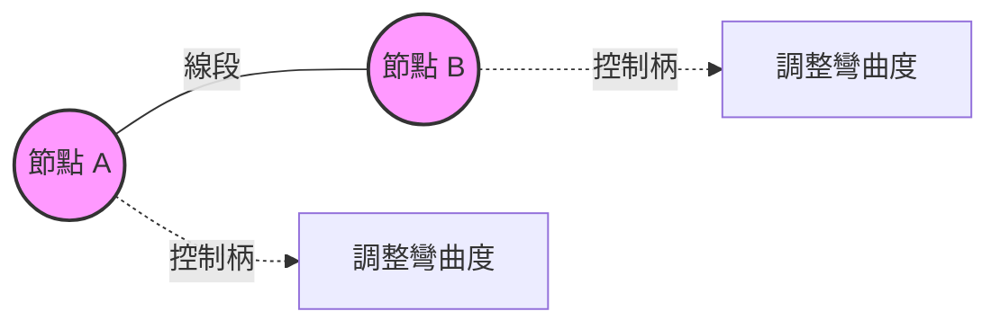

<!-- Path: 114A_lifetech/CorelDraw | Timestamp: 2026-02-28 10:00:00 | Version: b03 -->
# CorelDRAW 向量繪圖核心：從曲線到封閉形狀 (Shape)

## 1. 發展歷程與背景 (Why)

在電腦繪圖的世界裡，主要分為「點陣圖 (Bitmap)」與「向量圖 (Vector)」。
*   **點陣圖**：像是馬賽克拼圖，由一個個像素（方塊）組成，放大後會看到鋸齒狀（失真），例如照片。
*   **向量圖**：CorelDRAW 的核心。它是利用數學公式來記錄點與點之間的位置、方向與曲率。因為是數學運算，所以**無論放大多少倍，邊緣永遠保持平滑清晰**。

掌握「向量曲線」是學習 CorelDRAW 的第一步，因為所有的圖形（常見的路徑、形狀，甚至文字），拆解到最後，都是由一條條的曲線所構成的。

> **💡 思考：如果用「純文字」來檢視向量圖會是什麼樣子？**
> 
> 實際上，向量圖在電腦底層就是一堆數學公式與程式碼！這就是為什麼向量圖可以無限放大且檔案很小，因為它不記錄每一個像素的顏色，而是記錄「畫出這個圖形的指令」。
> 
> 以網頁常用的 SVG (Scalable Vector Graphics) 格式為例，我們來看看不同曲線與形狀在純文字程式碼中是如何被描述的：
> 
> 1. **基本形狀 (圓形)**：
>    只需要記錄圓心座標 `(cx, cy)`、半徑 `r`，以及外框和填色。
>    ```xml
>    <circle cx="50" cy="50" r="40" stroke="black" fill="red" />
>    ```
> 
> 2. **開放曲線 (直線路徑)**：
>    使用 `<path>` 標籤。`d` 代表 data。`M` 表示移動畫筆到起點 (Move to)，`L` 表示畫直線到終點 (Line to)。
>    ```xml
>    <path d="M 10 10 L 90 90" stroke="blue" fill="none" />
>    ```
> 
> 3. **複雜曲線 (貝茲曲線)**：
>    這是最能體現 CorelDRAW 中「控制柄」概念的例子。`C` 表示貝茲曲線 (Curve to)。它後面跟著三組座標：**控制點 1**、**控制點 2**、以及**終點**。
>    ```xml
>    <!-- 從 (10,50) 出發，受到控制點 (10,10) 和 (90,10) 的拉扯，最後到達 (90,50) -->
>    <path d="M 10 50 C 10 10, 90 10, 90 50" stroke="green" fill="none" />
>    ```
>    *說明：電腦只要知道這幾個「關鍵節點與控制柄」的座標，就能在每次畫面縮放時，重新「計算」出那條平滑的完美曲線，完全不會產生馬賽克格子。*

## 2. 核心理論與架構 (What)

在 CorelDRAW 中，曲線是由一系列的**節點 (Nodes)** 和**控制柄 (Handles)** 組成的。這些節點和控制柄定義了曲線的形狀和方向。當你使用工具繪製曲線時，CorelDRAW 會自動生成這些節點和控制柄，讓你可以進一步編輯和調整曲線。

### 2.1 曲線的三大要素

*   **節點 (Node)**：曲線上的駐點，用來固定線段的位置。
*   **控制柄 (Handle)**：從節點延伸出來的虛擬線條與箭頭，讓你進一步編輯、決定曲線的「彎曲方向」與「彎曲程度」。
*   **線段 (Segment)**：連接兩個節點之間的線條。



### 2.2 從曲線到形狀物件 (開放 vs. 封閉)

我們暫時下一個定義：
*   **開放曲線 (路徑 Path)**：起點與終點沒有連接在一起。它只有線條屬性（寬度、顏色、樣式），**無法**填滿內部顏色。
*   **封閉曲線 (形狀物件 Shape)**：起點與終點完美連接，形成一個無縫的區域。當你將一條曲線封閉起來時，它就成為一個「形狀物件」，可以填充顏色、套用效果等。

## 3. 封閉曲線的物件屬性有哪些？

一旦成為封閉的形狀物件，它將具備比開放路徑更豐富的屬性：

1.  **填充顏色**：你可以為封閉的曲線選擇內部填充顏色，這樣它就會成為一個有顏色的形狀物件。
2.  **線條屬性**：封閉的曲線仍然保留線條屬性，你可以調整線條的顏色、寬度和樣式（如虛線）。
3.  **效果應用**：封閉的曲線可以套用各種效果，如陰影、漸層、透明度等，讓你的設計更加豐富和有層次感。
4.  **群組與排列**：封閉的曲線可以與其他物件群組在一起，並且可以進行排列和對齊，這樣你就可以更方便地管理和編輯你的設計。
5.  **轉換為其他格式**：封閉的曲線可以轉換為其他格式，如位圖或向量圖，這樣你就可以在不同的軟體中使用你的設計。

## 4. 實作方法與技術：繪製各種不同形狀的封閉曲線 (How)

要產生一個封閉的形狀物件，CorelDRAW 提供了多元的方法。**對於初學者來說，強烈建議從「B-Spline (B-雲形線) 工具」開始練習**，因為它比傳統的貝茲曲線更容易操作且平滑。

1.  **使用基本形狀工具**：最快的方式。CorelDRAW 提供了多種基本形狀工具，如矩形、圓形、多邊形等，你可以直接使用這些工具來繪製封閉的曲線。
2.  **✨ 使用 B-Spline (B-雲形線) 工具**：**（最推薦的自訂曲線工具）**。B-Spline 允許你繪製更複雜的封閉曲線，你可以通過點擊和拖動來創建你想要的形狀。系統會自動在點與點之間運算出極度平滑的曲線。
3.  **由其他物件構成**：你可以將多個物件組合在一起，形成一個封閉的曲線。
    *   **A.** 利用物件的排列與群組功能，將多個物件組合成一個整體。
    *   **B.** 使用布林運算工具（如聯集、交集、差集）— 對應（交叉、焊接、修剪與建立界線）。
4.  **使用路徑工具**：你可以使用路徑工具（如貝茲線）來繪製開放的曲線，然後將其封閉起來，這樣它就成為一個形狀物件。
5.  **使用文字工具**：你可以使用文字工具輸入文字後，將文字轉換為形狀物件（轉換成曲線），並且進行進一步的編輯和調整。
6.  **使用匯入功能**：你可以從其他軟體中匯入封閉的曲線，這樣你就可以在 CorelDRAW 中進行編輯和調整。
7.  **特殊用法**：將點陣圖描繪成物件，或是使用影像追蹤功能（Trace Bitmap）將位圖轉換為向量圖，這樣你就可以得到封閉的曲線物件。

## 5. 實作練習 (Practice)

### 任務一：使用 B-Spline 工具描繪一片葉子 (推薦做法)
1.  **工具準備**：在左側工具列找到「B-Spline (B-雲形線)」工具（通常藏在「手繪」或「貝茲線」工具的群組選單裡）。
2.  **點擊描繪**：在畫布上點擊第一點（起點），接著移動滑鼠點擊第二點、第三點... 繞出葉子的輪廓。你會發現曲線會自動跟著點的位置變得非常平滑圓潤。
3.  **封閉曲線**：繞完一圈後，將游標移動回「第一點」，當游標旁邊出現一個小圓圈的提示時，點擊滑鼠左鍵。這時曲線就成功封閉了。
4.  **填色與編輯**：為封閉好的葉子填上綠色。如果形狀不夠完美，切換到「形狀工具 (F10)」，微調剛才點擊的控制點。

### 任務二：將文字轉換為形狀 (文字設計基礎)
1.  **輸入文字**：使用「文字工具 (F8)」，輸入你的英文名字，字體選粗一點。
2.  **轉換曲線**：選取文字，按下快捷鍵 `Ctrl + Q`（或右鍵 > 轉換成曲線）。此時文字不再能用鍵盤修改錯字，因為它已經變成圖形了。
3.  **玩轉節點**：使用「形狀工具 (F10)」，隨意拉長某個字母的節點（例如把 L 的尾巴拉長），嘗試做出有個人風格的文字 Logo！

## 6. 常見問題與解決方案 (Q&A / Troubleshooting)

*   **Q: 為什麼我用 B-Spline 工具畫到一半想畫直線，但它一直是彎的？**
    *   **A:** B-Spline 預設會畫出平滑曲線。如果要在某個點產生銳角的折角（或直線段），請在點擊時**按住鍵盤的 `V` 鍵**，這樣就可以畫出尖角。
*   **Q: 為什麼我畫完一個複雜的圖形卻無法填色？**
    *   **A:** 這是新手最常遇到的問題。表示你的圖形是「開放曲線」，起點和終點沒有確實「接合」。請用「形狀工具 (F10)」框選靠近起點與終點的區域，點擊上方屬性列的「接合兩個節點」，確實封閉後就能填色了。

## 7. 學習總結 (Summary)

完成本章節後，你已經具備以下能力：

*   **知識**：理解所有向量圖案（包含路徑、形狀與文字）的本質都是由曲線與節點所組成，並清楚知道封閉物件具備的五大屬性（填色、外框、效果、群組、格式轉換）。了解向量圖底層運作原理（如 SVG 程式碼與貝茲曲線控制點）。
*   **技能**：能熟練使用最推薦的「B-Spline 工具」輕鬆畫出平滑的封閉曲線，並了解 7 種在 CorelDRAW 中產生形狀物件的方法（包含文字轉曲線與點陣圖描繪），作為日後設計創作的強大基礎。