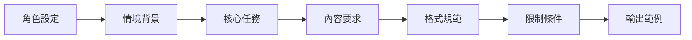
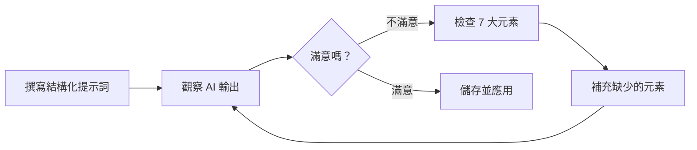

<!-- Path: AI_in_Education | Timestamp: 2025-10-15 15:15:00 | Version: b02 -->
# 單元一補充教材：觀念暖身與初體驗 - 我的第一個 AI 生成教材

## 單元目標

- 理解 AI 的基本運作原理與定位
- 學會撰寫有效的提示詞 (Prompt)
- 能夠使用 Google AI Studio 生成教學素材
- 掌握從模糊問題到精準指令的優化技巧
- 理解完整教材設計提示詞的結構

---

## 核心概念詳解

### 1. AI 是什麼？

**核心比喻**：AI 就像一位「讀過萬卷書的超級大腦」，它透過學習海量的文字資料，理解語言的模式和知識的脈絡。但它不會「思考」，而是根據您的提問，從它學過的知識中，找出最有可能符合需求的回答。

**重要觀念**：
- AI **不是萬能的**：它可能會出錯、產生不存在的資訊（稱為「幻覺」hallucination）
- AI **是工具，不是老師**：您才是課程的設計師，AI 是協助您的助理
- AI **需要明確指引**：提示詞越精準，結果越理想

### 2. 什麼是提示詞 (Prompt)？

**定義**：提示詞是您與 AI 溝通的「指令」或「問題」。就像您對助理下達工作指示一樣，清楚的指令能得到更好的結果。

**好的提示詞三要素**：
1. **明確的角色**：告訴 AI 它應扮演什麼角色（例如：小學自然老師、數學家教）
2. **具體的任務**：清楚說明您要它做什麼
3. **必要的限制**：設定格式、長度、語氣、對象等條件

### 3. 提示詞優化策略

#### 從模糊到精準的四個層次

| 層次 | 特徵 | 範例 |
|------|------|------|
| **❌ 層次 0：太模糊** | 沒有明確方向 | 「講講光合作用」 |
| **⚠️ 層次 1：有方向但不具體** | 有主題但缺細節 | 「用簡單的方式說明光合作用」 |
| **✅ 層次 2：具體且有限制** | 包含對象、方式、重點 | 「請用國小三年級學生能懂的比喻，說明什麼是光合作用，並列出它的三要素。」 |
| **🌟 層次 3：完整且結構化** | 包含角色、任務、格式、範例 | 「你是一位小學自然科老師。請用國小三年級學生能懂的比喻（例如：工廠製造產品），說明什麼是光合作用。請包含：1. 一句話定義 2. 三要素說明（陽光、水、二氧化碳）3. 一個生活化的比喻。輸出長度約 150 字。」 |

---

## 詳細操作步驟

### 步驟一：進入 Google AI Studio

1. 開啟瀏覽器，前往 [https://aistudio.google.com/](https://aistudio.google.com/)
2. 使用您的 Google 帳號登入
3. 點選「Create new prompt」或「新增提示」
4. 開始在對話框中輸入您的提示詞

**操作提示**：
- 新版 AI Studio 提供直接對話介面，無需選擇特定模式
- 支援多輪對話，可持續追問與優化
- 右側可選擇不同的 Gemini 模型

### 步驟二：撰寫您的第一個提示詞

**建議流程**：
1. 先簡單試試看（層次 0-1）
2. 觀察 AI 的回應
3. 根據結果調整，加入更多限制（層次 2-3）
4. 反覆優化直到滿意

### 步驟三：儲存與重複使用

- 點選右上角的「Save」儲存提示詞
- 可為提示詞命名（例如：「自然科_光合作用_國小三年級」）
- 下次可直接重複使用或修改

---

## 跨學科 Prompt 範例庫

### 📐 數學科

#### 範例 1：基礎概念解釋
```
你是一位國小數學老師。請用生活中常見的例子，向小學五年級學生解釋「平均數」的概念。

請包含：
1. 一句話定義
2. 一個生活化的例子（例如：分糖果、分數計算）
3. 一個簡單的練習題

輸出長度約 200 字，使用親切、鼓勵的語氣。
```

#### 範例 2：課堂活動設計
```
你是一位創意數學教師。請為國中七年級設計一個 15 分鐘的「比例」教學活動。

要求：
- 活動名稱要吸引人
- 需要的材料簡單易取得
- 包含 3-5 個步驟
- 最後要有一個檢核問題，確認學生理解

請以條列式輸出。
```

---

### 🌱 自然科

#### 範例 1：現象說明
```
你是一位小學自然科老師。請向國小四年級學生說明「水循環」的過程。

要求：
- 使用故事化的方式（可以把水分子擬人化）
- 說明「蒸發→凝結→降雨→回到大地」的完整循環
- 長度約 250 字
- 語氣活潑、容易理解
```

#### 範例 2：實驗設計
```
請為國小五年級設計一個簡單的「植物需要陽光」實驗。

要求：
- 實驗目的明確
- 材料容易取得（學校或家中常見）
- 實驗步驟清楚（3-5 步驟）
- 預期結果與結論
- 安全注意事項

請用條列式輸出，每個步驟用一句話說明。
```

---

### 🌍 社會科

#### 範例 1：歷史事件簡介
```
你是一位國中歷史老師。請用說故事的方式，向國中學生介紹「鄭成功來台」的歷史背景。

要求：
- 說明時代背景（明末清初）
- 鄭成功的身份與動機
- 來台的過程與影響
- 長度約 300 字
- 語氣客觀、敘事流暢
```

#### 範例 2：地理概念應用
```
你是一位創意社會科老師。請設計一個「認識台灣地形」的記憶口訣或順口溜。

要求：
- 包含山脈、平原、河流等主要地形特徵
- 口訣要押韻、好記
- 可搭配簡單的動作或手勢提示
- 提供口訣及其對應的地形知識說明
```

---

### 📖 國語科

#### 範例 1：課文導讀
```
你是一位國小國語老師。請為國小三年級學生設計一段「課文導讀」，課文主題是「我的家人」。

要求：
- 用 3 個提問引導學生思考（例如：你最喜歡家人的哪一點？）
- 介紹課文可能會學到的重點（親情、感恩）
- 提供一個暖身活動建議
- 長度約 200 字，語氣溫暖親切
```

#### 範例 2：寫作引導
```
請為國小五年級學生設計一個「我的一天」寫作引導框架。

要求：
- 提供寫作大綱（開頭、經過、結尾）
- 每個段落給予 2-3 個提示問題
- 提供 5 個可用的優美詞彙或成語
- 鼓勵學生加入感受與想法
```

---

### 🌐 英語科

#### 範例 1：單字教學設計
```
你是一位國中英語老師。請為「food（食物）」主題設計一個單字教學活動。

要求：
- 列出 10 個常見的食物英文單字
- 每個單字附上一句簡單例句
- 設計一個互動遊戲（例如：單字接龍、賓果）
- 提供記憶技巧（諧音、圖像聯想等）
```

#### 範例 2：對話練習
```
請設計一段國小英語課適用的「購物對話」劇本。

要求：
- 角色：顧客與店員
- 對話輪次：6-8 輪
- 包含基本句型：How much is it? / I want... / Here you are.
- 難度適合小學五年級
- 對話情境生活化、有趣
```

---

### 🎨 藝術與人文

#### 範例 1：藝術鑑賞引導
```
你是一位美術老師。請為國小學生設計一段「梵谷的星夜」作品鑑賞引導。

要求：
- 簡介畫家背景（用孩子能懂的語言）
- 描述畫作特色（色彩、筆觸、構圖）
- 提供 3 個觀察提問（例如：你在畫中看到什麼？）
- 引導情感連結（這幅畫讓你有什麼感覺？）
- 長度約 250 字
```

---

## 完整教材設計提示詞的結構總結

### 📌 黃金公式：完整教材設計/教學活動提示詞架構

一個高品質的教材設計或教學活動提示詞，通常包含以下 **7 大結構元素**：



---

### 結構元素詳解

#### 1️⃣ 角色設定 (Who)
**定義 AI 的身份與專業**

```
你是一位 [專業角色]，擅長 [專長領域]。
```

**範例**：
- 你是一位經驗豐富的國小數學老師，擅長用生活化情境教學。
- 你是一位充滿創意的自然科教師，專長於實驗設計與探究教學。

---

#### 2️⃣ 情境背景 (Context)
**說明教學場景與對象**

```
教學對象：[年級/程度]
課程主題：[單元名稱]
教學時間：[分鐘數]
特殊考量：[班級特性/學習目標]
```

**範例**：
```
教學對象：國小五年級學生
課程主題：分數的加減運算
教學時間：40 分鐘
特殊考量：班上有 3 位學習較慢的學生需要差異化設計
```

---

#### 3️⃣ 核心任務 (Task)
**明確說明要 AI 產出什麼**

```
請設計 [具體產出]。
```

**範例**：
- 請設計一份完整的教案（包含教學目標、流程、評量）
- 請設計一個 15 分鐘的課堂活動
- 請設計一份學習單（包含練習題與延伸思考）

---

#### 4️⃣ 內容要求 (Content)
**具體說明應包含哪些元素**

```
請包含：
1. [元素 1]
2. [元素 2]
3. [元素 3]
...
```

**範例（教案設計）**：
```
請包含：
1. 教學目標（知識、技能、態度）
2. 引起動機（3-5 分鐘）
3. 發展活動（分段說明，含時間）
4. 綜合活動（總結與評量）
5. 教學資源（器材、教具）
6. 差異化策略（針對不同程度學生）
```

**範例（教學活動設計）**：
```
請包含：
1. 活動名稱（吸引人的標題）
2. 活動目標
3. 所需材料
4. 活動步驟（3-5 個明確步驟）
5. 檢核問題（確認學習成效）
6. 延伸活動（選用）
```

---

#### 5️⃣ 格式規範 (Format)
**指定輸出的呈現方式**

```
輸出格式：
- [格式要求 1]
- [格式要求 2]
- [格式要求 3]
```

**範例**：
```
輸出格式：
- 使用清楚的標題與分段
- 活動步驟請編號（步驟 1、步驟 2...）
- 重點用 **粗體** 標示
- 時間分配用 [時間] 標註
- 材料清單用條列式呈現
```

---

#### 6️⃣ 限制條件 (Constraints)
**設定語氣、長度、難度等限制**

```
限制條件：
- 語氣：[親切/正式/活潑]
- 長度：[字數範圍]
- 難度：[適合的年級程度]
- 避免：[不該出現的內容]
```

**範例**：
```
限制條件：
- 語氣親切鼓勵，避免說教
- 活動步驟說明每步不超過 50 字
- 材料限定學校常見物品
- 避免使用專業術語，用學生能懂的語言
- 時間分配要務實（考慮實際操作時間）
```

---

#### 7️⃣ 輸出範例 (Example) 【選用】
**提供參考範例，讓 AI 模仿風格**

```
參考範例：
[貼上一小段您期望的輸出風格]
```

**為何需要範例？**
- 讓 AI 理解您期望的「語氣」與「風格」
- 確保格式符合您的需求
- 特別適合需要特定排版的情況

---

### 完整提示詞範例：教學活動設計

```
【1. 角色設定】
你是一位創意十足的國小自然科教師，擅長設計動手做的探究活動。

【2. 情境背景】
教學對象：國小四年級學生
課程主題：磁鐵的特性
教學時間：20 分鐘
特殊考量：學生已學過磁鐵的基本概念（同極相斥、異極相吸）

【3. 核心任務】
請設計一個「探索磁力強弱」的課堂實驗活動。

【4. 內容要求】
請包含：
1. 活動名稱（有趣且點出主題）
2. 活動目標（學生能學到什麼）
3. 所需材料（每組需要的物品清單）
4. 活動步驟（4-5 個明確步驟）
5. 觀察重點（學生應該注意什麼）
6. 討論問題（2-3 個引導思考的問題）
7. 安全提醒（如有必要）

【5. 格式規範】
輸出格式：
- 使用清楚的標題區分各部分
- 活動步驟用「步驟 1、步驟 2...」編號
- 材料清單用「・」符號條列
- 討論問題用「Q1:」、「Q2:」標示

【6. 限制條件】
- 語氣活潑、鼓勵探索
- 材料限定教室或家中常見物品（迴紋針、磁鐵、紙張等）
- 每個步驟說明不超過 40 字
- 活動要能在 20 分鐘內完成（含討論）
- 避免複雜的科學術語

【7. 輸出範例參考】
活動名稱：磁力大考驗

活動目標：
學生能透過實驗比較不同距離下磁力的強弱，並記錄觀察結果。

所需材料：（每組）
・條形磁鐵 1 個
・迴紋針 10 個
・尺 1 把
・記錄紙 1 張
...
```

---

### 簡化版提示詞架構（適合快速使用）

如果時間有限，可使用**精簡版 4 元素**：

```
【角色】你是 [角色設定]
【任務】請設計 [具體產出]
【要求】包含 [3-5 個關鍵要求]
【限制】[語氣/長度/難度]
```

**精簡範例**：
```
【角色】你是一位國小數學老師
【任務】請設計一個「分數比大小」的 10 分鐘練習活動
【要求】包含：1. 活動步驟 2. 3 個練習題 3. 檢核答案
【限制】語氣親切、材料簡單、適合五年級
```

---

### 常見錯誤 vs 正確範例對照

| 錯誤提示詞 | 問題分析 | 正確提示詞 |
|-----------|---------|-----------|
| 「設計一個數學活動」 | ❌ 太籠統，缺乏具體資訊 | ✅ 「你是國小數學老師，請為五年級設計一個 15 分鐘的『分數加減』小組活動，包含步驟、材料、檢核問題」 |
| 「寫教案」 | ❌ 沒有主題、對象、格式 | ✅ 「請為國小三年級『植物的生長』單元設計 40 分鐘教案，包含目標、引起動機、教學流程、評量方式」 |
| 「做學習單」 | ❌ 沒有內容範圍、題型、數量 | ✅ 「根據『水循環』概念，設計一份 A4 學習單，包含：填空 3 題、選擇 5 題、簡答 2 題，附答案」 |

---

### 提示詞自我檢核表

完成提示詞後，用這個檢核表確認品質：

- [ ] ✅ 有設定明確角色嗎？
- [ ] ✅ 有說明教學對象與情境嗎？
- [ ] ✅ 任務夠具體嗎？（不是「設計活動」而是「設計 OO 活動，包含 ABC」）
- [ ] ✅ 有列出必須包含的內容元素嗎？
- [ ] ✅ 有指定輸出格式嗎？
- [ ] ✅ 有設定語氣、長度、難度等限制嗎？
- [ ] ✅ 如果需要特定風格，有提供範例嗎？

---

## 實用技巧與注意事項

### ✅ 實用技巧

1. **善用「角色設定」**：開頭加上「你是一位 OOO 老師」，讓 AI 更貼近教學情境
2. **分段式提問**：如果一次問太複雜，可以拆成多個小問題，逐步深入
3. **要求格式化輸出**：明確要求「條列式」、「表格」、「分段說明」等格式
4. **提供範例**：在提示詞中給 AI 一個參考範例，它會模仿風格
5. **設定限制**：字數、語氣、難度、對象都可以明確設定
6. **使用結構化提示詞**：按照「角色→情境→任務→要求→格式→限制」的順序組織

### ⚠️ 常見錯誤

1. **問題太籠統**：「教我數學」→ 應改為「請說明分數加法的概念」
2. **沒有設定對象**：AI 不知道要用國小還是國中的語言
3. **一次要求太多**：把多個問題混在一起，AI 容易遺漏
4. **沒有檢查結果**：AI 可能出錯，務必自行檢視內容是否正確
5. **忽略格式說明**：沒有指定格式，AI 可能用不符需求的方式呈現

### 🎯 優化循環建議



---

## 延伸應用

### 應用 1：快速生成課堂問答題

**情境**：您教完一個單元，需要幾道檢核題目。

**結構化 Prompt**：
```
【角色】你是一位國小自然老師
【情境】我剛教完「昆蟲的身體構造」單元（國小四年級）
【任務】請為我出 5 道題目
【要求】
- 3 道選擇題（四個選項）
- 2 道簡答題
- 測驗學生是否理解「昆蟲有三對腳、身體分三部分」等核心概念
- 附上標準答案與簡要解析
【限制】
- 難度適合四年級
- 選項不要太相似（避免混淆）
```

---

### 應用 2：改寫教材難度

**情境**：您有一份國中程度的教材，想改寫給國小學生。

**結構化 Prompt**：
```
【角色】你是一位擅長差異化教學的老師
【任務】請將以下關於「地球自轉」的說明，改寫成國小四年級學生能理解的版本

[貼上原文]

【要求】
- 用詞簡單、句子短
- 加入生活化比喻
- 保留核心概念（自轉、一天 24 小時）
【格式】分成 2-3 段
【限制】長度約 150 字，語氣親切
```

---

### 應用 3：生成課程開場白

**情境**：您想要一個吸引學生注意的課堂開場。

**結構化 Prompt**：
```
【角色】你是一位充滿創意的國中數學老師
【情境】今天要教「一元一次方程式」（國中七年級）
【任務】請設計一段 2 分鐘的課堂開場白
【要求】
- 用一個生活情境引入（例如：買東西找錢）
- 引發學生好奇心
- 預告今天會學到什麼
【限制】
- 語氣活潑、鼓勵參與
- 約 150-200 字
- 避免直接講解數學，要先引起興趣
```

---

## 練習任務

### 初階任務
1. 使用「簡化版 4 元素」架構，生成一段課程簡介
2. 使用「完整 7 元素」架構，設計一個課堂小活動
3. 比較兩種架構的輸出差異

### 進階任務
1. 為您下週要教的單元，撰寫一份完整結構化提示詞，生成教案
2. 使用相同主題，嘗試調整「限制條件」，觀察輸出變化
3. 建立您的「常用提示詞範本庫」（儲存 3-5 個常用架構）

---

## 常見問題 Q&A

**Q1：AI 生成的內容有錯怎麼辦？**
A1：務必自行檢查！AI 是輔助工具，最終的專業判斷還是要由您來做。如果發現錯誤，可以在提示詞中明確指正，或直接修改結果。

**Q2：AI 的回答太長或太短？**
A2：在提示詞的「限制條件」中加入字數限制，例如「約 200 字」、「不超過 150 字」。

**Q3：AI 的語氣不適合我的學生？**
A3：在提示詞的「限制條件」中明確設定語氣，例如「親切溫暖」、「活潑有趣」、「嚴謹專業」。

**Q4：每次問同樣的問題，答案都不一樣？**
A4：這是 AI 的特性！如果需要穩定的結果，可以在提示詞中加入更多限制，或直接儲存滿意的版本。

**Q5：我可以把 AI 的內容直接用在課堂上嗎？**
A5：可以，但建議先檢查內容正確性，並根據班級特性微調。AI 是起點,不是終點。

**Q6：結構化提示詞會不會太複雜？**
A6：初期可能需要時間適應，但熟悉後反而更快！因為結構清楚，AI 理解更精準，減少反覆修改的時間。建議先從「簡化版 4 元素」開始練習。

**Q7：是否每次都要用完整的 7 元素？**
A7：不一定。簡單任務用「精簡版」即可，複雜任務（如完整教案、教學活動）才需要「完整版」。依需求彈性調整。

---

**小結**：本單元著重於建立正確的 AI 使用觀念，以及掌握提示詞的基本技巧與完整結構。透過反覆練習與優化，您將能更精準地讓 AI 成為您的教學助理！記住：**好的提示詞 = 明確的結構 + 具體的要求 + 適當的限制**
