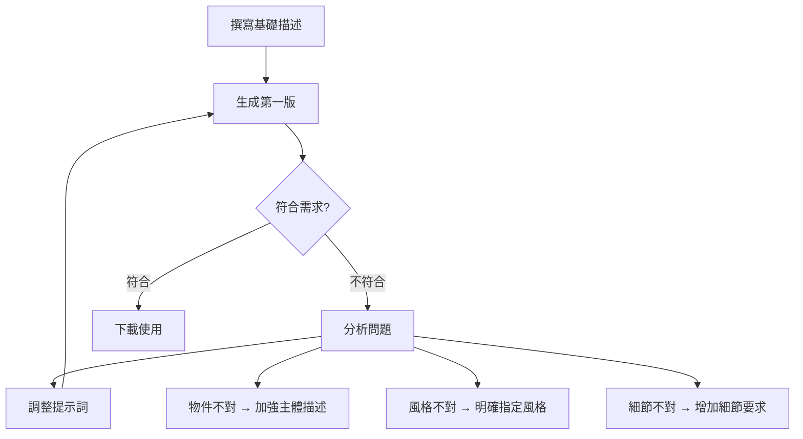

<!-- Path: AI_in_Education | Timestamp: 2025-10-15 15:25:00 | Version: b02 -->
# 單元二補充教材：讓教材更生動 - AI 圖片詠唱師

## 單元目標

- 理解 AI 圖片生成的基本原理
- 學會撰寫圖片生成提示詞 (Image Prompt)
- 能夠使用 AI Studio 生成教學用圖片
- 掌握不同類型圖片的描述技巧

---

## 核心概念詳解

### 1. AI 如何「畫圖」？

**核心比喻**：AI 就像一位「看過數百萬張圖片的畫家」，它學習了各種物體的外觀、風格、構圖方式。當您用文字描述一個畫面，AI 會根據它的「視覺記憶」，重新組合出符合您描述的圖片。

**重要觀念**：
- AI 圖片生成是「文字 → 圖像」的轉換過程
- 提示詞越具體，圖片越符合預期
- AI 擅長具體物件，抽象概念需要更多引導
- 可能需要多次嘗試才能得到理想結果

### 2. 圖片提示詞的五大要素

#### 📋 完整的圖片提示詞結構

```
[主體] + [動作/狀態] + [環境/背景] + [風格] + [細節要求]
```

**範例解析**：
```
一隻可愛的橘貓 (主體)
正在睡覺 (動作)
在溫暖的陽光下 (環境)
水彩畫風格 (風格)
柔和的色調，簡約背景 (細節)
```

### 3. 教學圖片的三大類型

| 類型 | 用途 | 特點 | 適用學科 |
|------|------|------|---------|
| **說明型圖片** | 解釋概念、展示結構 | 清晰、簡潔、標示明確 | 自然、數學、社會 |
| **情境型圖片** | 創造情境、引發討論 | 生動、有故事性 | 國語、英語、社會 |
| **裝飾型圖片** | 美化教材、吸引注意 | 美觀、風格統一 | 所有學科 |

---

## 詳細操作步驟

### 步驟一：在 AI Studio 中使用圖片生成

1. 登入 [Google AI Studio](https://aistudio.google.com/)
2. 選擇支援圖片生成的模型（新版 Imagen 3，代號 **nano banana**）
3. 在提示詞輸入框中輸入圖片描述
4. 點選「生成」(Generate)
5. 等待 10-30 秒
6. 查看結果，必要時調整提示詞重新生成

**模型說明**：
- **nano banana** 是 Google 最新的圖片生成模型代號
- 相較前代，生成速度更快、圖片品質更佳
- 支援繁體中文提示詞，但英文提示詞仍較精準

### 步驟二：優化提示詞的流程



### 步驟三：下載與使用

1. 點選滿意的圖片
2. 點選下載按鈕
3. 儲存到您的教材資料夾
4. 插入 Word、PPT 或學習單中

---

## 跨學科圖片 Prompt 範例庫

### 📐 數學科

#### 範例 1：幾何圖形教學
```
A simple, clean diagram of a right-angled triangle on white background.
Clearly labeled with sides a, b, c and the 90-degree angle marked with a small square.
Educational style, minimalist, high contrast black lines.

(一個簡潔的直角三角形圖示,白色背景。清楚標示邊長 a、b、c 及用小正方形標示的 90 度角。教學風格,極簡,高對比黑色線條。)
```

**使用情境**：教學簡報、學習單插圖

#### 範例 2：數學概念視覺化
```
A colorful, cartoon-style illustration showing the concept of fractions.
A pizza divided into 8 slices, with 3 slices highlighted in red.
Clean, simple style suitable for elementary school students.

(一個色彩豐富的卡通風格插圖,展示分數概念。一個披薩切成 8 片,其中 3 片用紅色標示。簡潔明瞭的風格,適合小學生。)
```

**使用情境**：課堂投影片、概念說明

#### 範例 3：生活情境應用
```
A warm, friendly illustration of a fruit market stall.
Display shows apples (¥50 per kg), oranges (¥40 per kg), and bananas (¥30 per kg).
Cartoon style, bright colors, suitable for math word problems.

(一個溫馨友善的水果攤插圖。展示蘋果(每公斤 50 元)、柳橙(每公斤 40 元)、香蕉(每公斤 30 元)。卡通風格,明亮色彩,適合數學應用題。)
```

---

### 🌱 自然科

#### 範例 1：科學過程圖解
```
A clear, educational diagram showing the water cycle.
Include labeled arrows showing evaporation, condensation, precipitation, and collection.
Simple shapes: sun, clouds, rain, ocean, and land.
Pastel colors, easy to understand for grade 4 students.

(一個清晰的教學圖解,展示水循環。包含標示的箭頭,顯示蒸發、凝結、降雨和蓄積。簡單形狀:太陽、雲、雨、海洋和陸地。柔和色彩,適合四年級學生理解。)
```

#### 範例 2：生物結構圖
```
A clean, detailed illustration of a butterfly's body parts.
Clearly labeled: head, thorax, abdomen, antennae, and wings.
Side view, bright colors, educational poster style, white background.

(一個清晰詳細的蝴蝶身體結構插圖。清楚標示:頭、胸、腹、觸角、翅膀。側面視角,明亮色彩,教學海報風格,白色背景。)
```

#### 範例 3：自然現象觀察
```
A realistic but gentle illustration of plant photosynthesis.
Show a green leaf with sun rays, water droplets, CO2 bubbles, and O2 bubbles.
Use arrows to show the process. Soft, natural colors, scientific illustration style.

(一個寫實但柔和的植物光合作用插圖。展示綠色葉片、陽光、水滴、二氧化碳氣泡和氧氣氣泡。用箭頭顯示過程。柔和自然色彩,科學插畫風格。)
```

---

### 🌍 社會科

#### 範例 1：歷史場景重現
```
A warm, historical illustration of a traditional Taiwanese market in the 1960s.
Show vendors selling vegetables, fish, and daily goods.
People wearing clothing from that era. Nostalgic, warm colors, slightly faded look.

(一個溫暖的歷史插圖,呈現 1960 年代台灣傳統市場。展示攤販販售蔬菜、魚類和日用品。人們穿著那個年代的服裝。懷舊感、溫暖色調、略微褪色效果。)
```

#### 範例 2：地理景觀
```
A clean, educational illustration of Taiwan's five major landform types.
Show mountains, hills, plateaus, basins, and plains in one simple cross-section view.
Label each type clearly. Textbook style, clear colors, easy to understand.

(一個清晰的教學插圖,展示台灣五大地形類型。在一個簡單的剖面視圖中展示山地、丘陵、台地、盆地和平原。清楚標示每種類型。教科書風格,清晰色彩,易於理解。)
```

#### 範例 3：文化主題圖
```
A vibrant, respectful illustration showing traditional festivals around the world.
Include Chinese New Year lanterns, Japanese cherry blossoms, Indian Diwali lamps.
Arranged in a circular composition, colorful, celebratory mood.

(一個生動且尊重的插圖,展示世界各地的傳統節日。包含中國新年燈籠、日本櫻花、印度排燈節燈飾。圓形構圖,色彩豐富,慶祝氛圍。)
```

---

### 📖 國語科

#### 範例 1：情境故事配圖
```
A warm, children's book style illustration of a child reading under a big tree.
Golden afternoon sunlight, peaceful atmosphere, soft watercolor style.
Suitable for elementary school Chinese textbook.

(一個溫暖的兒童繪本風格插圖,一個孩子在大樹下閱讀。金色午後陽光,寧靜氛圍,柔和水彩風格。適合小學國語課本。)
```

#### 範例 2：成語視覺化
```
A creative illustration for the idiom "井底之蛙" (frog in a well).
Show a small frog at the bottom of a deep well, looking up at a tiny circle of sky.
Metaphorical, thought-provoking, suitable for teaching Chinese idioms.

(一個創意插圖,表現成語「井底之蛙」。展示一隻小青蛙在深井底部,向上看著一小圈天空。隱喻性、發人深省,適合教授中文成語。)
```

#### 範例 3：寫作情境啟發
```
A inspiring illustration of "My Dream".
Show a child looking at a starry night sky with thought bubbles containing various dreams:
scientist, teacher, artist, astronaut. Dreamy, hopeful mood, soft colors.

(一個啟發性的插圖,主題「我的夢想」。展示一個孩子望著星空,思考氣泡中包含各種夢想:科學家、教師、藝術家、太空人。夢幻、充滿希望的氛圍,柔和色彩。)
```

---

### 🌐 英語科

#### 範例 1：單字主題圖
```
A colorful, educational illustration showing "Family Members".
Include cartoon-style characters: father, mother, brother, sister, grandfather, grandmother.
Each character labeled in English. Friendly, clear, suitable for elementary ESL teaching.

(一個色彩豐富的教學插圖,展示「家庭成員」。包含卡通風格角色:父親、母親、兄弟、姊妹、祖父、祖母。每個角色用英文標示。友善、清晰,適合小學英語教學。)
```

#### 範例 2：情境對話場景
```
A friendly illustration of a school cafeteria scene.
Two students talking at lunch. Speech bubbles showing: "What would you like?" "I'd like a sandwich, please."
Bright, cheerful, cartoon style, suitable for English conversation practice.

(一個友善的學校餐廳場景插圖。兩個學生在午餐時對話。對話框顯示:「你想要什麼?」「我想要一個三明治,謝謝。」明亮、歡樂、卡通風格,適合英語會話練習。)
```

#### 範例 3：節慶主題
```
A festive illustration of Halloween decorations.
Include pumpkins, ghosts, bats, candy, and a haunted house.
Fun, not scary, suitable for children. Label each item in English.

(一個節慶插圖,展示萬聖節裝飾。包含南瓜、幽靈、蝙蝠、糖果和鬼屋。有趣但不嚇人,適合兒童。每個物品用英文標示。)
```

---

### 🎨 藝術與綜合活動

#### 範例 1：情緒表達
```
A series of 6 cartoon faces showing different emotions:
happy, sad, angry, surprised, scared, excited.
Simple, clear expressions, colorful, suitable for emotional education.

(一系列 6 個卡通臉孔,展示不同情緒:開心、悲傷、生氣、驚訝、害怕、興奮。簡單清晰的表情,色彩豐富,適合情緒教育。)
```

#### 範例 2：環境教育
```
A meaningful illustration showing "Reduce, Reuse, Recycle".
Three sections: reducing waste, reusing items, recycling bins.
Green and blue tones, eco-friendly style, inspiring and educational.

(一個有意義的插圖,展示「減少、重複使用、回收」。三個部分:減少浪費、物品再利用、回收桶。綠色和藍色調,環保風格,啟發性和教育性。)
```

---

## 進階技巧

### 技巧 1：風格關鍵字大全

| 風格類型 | 英文關鍵字 | 適用情境 |
|---------|-----------|---------|
| **卡通風格** | cartoon style, cute, child-friendly | 國小教材、活潑主題 |
| **水彩風格** | watercolor, soft, gentle | 國語、藝術課程 |
| **極簡風格** | minimalist, clean, simple lines | 數學、圖表說明 |
| **寫實風格** | realistic, detailed, photographic | 自然觀察、歷史場景 |
| **科學插圖** | scientific illustration, educational diagram | 自然科、生物結構 |
| **復古風格** | vintage, retro, nostalgic | 歷史課程、懷舊主題 |
| **扁平設計** | flat design, modern, geometric | 資訊圖表、現代主題 |

### 技巧 2：避免常見錯誤

#### ❌ 錯誤範例 1：描述太籠統
```
一張關於數學的圖
```
**問題**：AI 不知道要畫什麼數學概念

#### ✅ 改進版本
```
A clear diagram showing the concept of area.
A rectangle with width and height labeled, and the formula Area = width × height displayed.
Educational style, simple colors.
```

---

#### ❌ 錯誤範例 2：要求太複雜
```
一張圖包含完整的台灣歷史,從史前時代到現代,所有重要事件都要有,還要有人物和地圖
```
**問題**：一張圖無法承載這麼多資訊

#### ✅ 改進版本
```
A simple timeline illustration showing 5 major periods in Taiwan's history.
Use icons and simple labels for each period. Horizontal layout, clear and organized.
```

---

### 技巧 3：中英文提示詞對比

**重要提醒**：目前多數 AI 圖片生成模型對英文提示詞的理解更精準。建議：
- 使用英文撰寫提示詞(可搭配翻譯工具)
- 或使用「中文描述 + 英文關鍵字」混合模式

**範例對比**：

| 中文提示詞 | 英文提示詞 | 效果差異 |
|-----------|-----------|---------|
| 一隻可愛的貓 | A cute cat, fluffy, orange fur, cartoon style | 英文版更精準 |
| 數學圖表 | Mathematical diagram, clean, minimalist, white background | 英文版風格更明確 |

---

## 實用技巧與注意事項

### ✅ 圖片生成最佳實踐

1. **從簡單開始**：先生成基本版本,再逐步加入細節
2. **善用風格關鍵字**：明確指定風格,避免風格混亂
3. **設定背景**：指定白色或透明背景,方便後續使用
4. **檢查版權**：確認 AI 生成圖片的使用授權
5. **多次嘗試**：不滿意就重新生成,每次結果都會不同

### ⚠️ 使用限制與注意事項

1. **文字內容**：AI 圖片中的文字可能錯誤或亂碼,建議後製加入文字
2. **精確度**：複雜的圖表或精確的科學圖示,可能需要專業軟體
3. **人物相似度**：無法生成特定真實人物(如歷史名人的真實樣貌)
4. **文化敏感度**：注意文化適當性,避免刻板印象
5. **學生隱私**：不要生成可辨識特定學生的圖片

### 🎯 圖片後製建議

生成後可用簡單工具優化：
- **去背景**：使用 remove.bg 等線上工具
- **加入文字**：用 Canva、PowerPoint 加入標示
- **調整尺寸**：裁切或縮放至適當大小
- **組合多張**：用簡報軟體組合成教學海報

---

## 延伸應用

### 應用 1：製作視覺化學習單

**情境**：為國小學生製作「認識蔬菜」學習單

**步驟**：
1. 用 AI 分別生成：高麗菜、紅蘿蔔、番茄、青椒等圖片
2. 每張圖片風格統一(例如:全部用 cartoon style)
3. 在 Word 中排版,加上名稱與填空欄位
4. 形成完整學習單

**Prompt 範本**：
```
A cute, simple illustration of [蔬菜名稱].
Cartoon style, bright colors, white background, suitable for children's educational materials.
```

---

### 應用 2：打造主題式簡報背景

**情境**：製作「海洋保育」主題簡報

**Prompt 範例**：
```
A gentle, inspiring background image for ocean conservation presentation.
Show clean ocean water, marine life silhouettes, and rays of sunlight from above.
Soft blue and green tones, peaceful mood, suitable as PowerPoint background.
```

---

### 應用 3：設計班級活動海報

**情境**：製作校慶活動宣傳海報

**Prompt 範例**：
```
A cheerful, festive illustration for school anniversary celebration.
Include balloons, confetti, students celebrating, school building in background.
Bright, energetic colors, positive mood, suitable for poster design.
```

---

## 練習任務

### 初階任務
1. 生成一張適合您學科的「概念說明圖」
2. 生成三張不同風格的「同一主題圖片」,比較差異
3. 為您的下一份講義生成一張封面圖

### 進階任務
1. 製作一套「視覺化單字卡」(5-10 張)
2. 設計一份完整的「圖文並茂學習單」
3. 生成一系列風格統一的「課程插圖包」(至少 5 張)

---

## 常見問題 Q&A

**Q1：為什麼生成的圖片跟我想的不一樣？**
A1：嘗試更具體的描述,加入風格關鍵字,或提供參考範例的描述。

**Q2：圖片中的文字都是亂碼怎麼辦？**
A2：這是目前 AI 的限制。建議生成圖片後,用其他工具加入文字標籤。

**Q3：可以生成真實人物的圖片嗎？**
A3：AI 可生成「一般性的人物」,但不應生成可辨識的特定真人,也不建議生成學生肖像。

**Q4：生成的圖片可以商用嗎？**
A4：需查看各 AI 工具的授權條款。教學用途通常可以,但商業用途需確認。

**Q5：圖片解析度不夠清晰？**
A5：部分 AI 工具支援高解析度選項。或使用 AI 放大工具(如 waifu2x)提升解析度。

**Q6：如何讓多張圖片風格一致？**
A6：在每個提示詞中使用相同的風格關鍵字(例如都加上 "cartoon style, pastel colors")。

---

**小結**：AI 圖片生成能大幅提升教材的視覺吸引力。掌握提示詞技巧後,您將能快速產出符合需求的教學插圖,讓課堂更加生動有趣!
