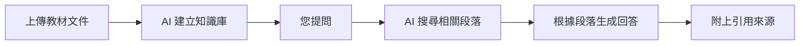
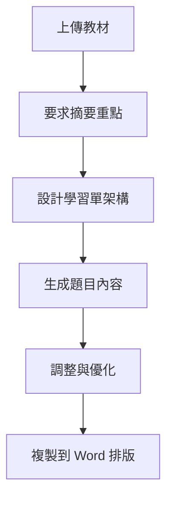
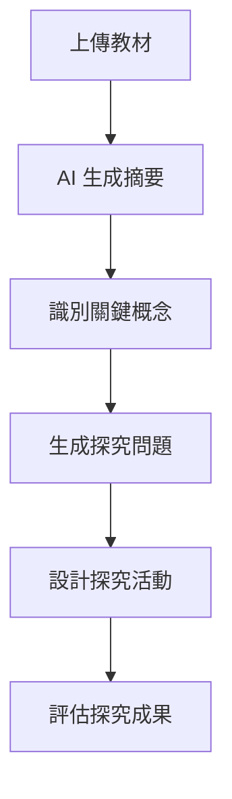

<!-- Path: AI_in_Education | Timestamp: 2025-10-15 15:30:00 | Version: b02 -->
# 單元三補充教材：打造您的專屬知識庫 - 備課神器 NotebookLM

## 單元目標

- 理解 RAG 技術與「有憑有據」的 AI 回答
- 學會使用 NotebookLM 建立知識庫
- 能夠上傳教材並讓 AI 分析內容
- 掌握從資料到題目、活動的生成技巧

---

## 核心概念詳解

### 1. 從「開放式考試」到「開卷考試」

#### 傳統 AI (如 ChatGPT、Gemini)
- **比喻**：像「開放式考試」,AI 憑記憶自由回答
- **優點**：知識廣博、反應快速
- **缺點**：可能產生幻覺(編造不存在的內容)、無法引用來源

#### NotebookLM
- **比喻**：像「開卷考試」,AI 只根據您提供的資料回答
- **優點**：回答有憑有據、可追溯來源、不會天馬行空
- **缺點**：只知道您上傳的內容,無法回答資料外的問題

### 2. 什麼是 RAG 技術？

**RAG = Retrieval-Augmented Generation (檢索增強生成)**

**運作流程**：


**核心價值**：
- 讓 AI 回答「有所本」
- 避免錯誤資訊
- 適合教學情境(需要精準、可信的內容)

### 3. NotebookLM 的三大應用場景

| 應用場景 | 說明 | 適用時機 |
|---------|------|---------|
| **教材分析** | 快速理解長篇文件、抓出重點 | 備課、研讀新教材 |
| **題目生成** | 根據教材出題,確保符合內容 | 準備考卷、學習單 |
| **活動設計** | 根據教材設計教學活動 | 課程規劃、差異化教學 |

---

## 詳細操作步驟

### 步驟一：進入 NotebookLM

1. 開啟瀏覽器,前往 [https://notebooklm.google.com/](https://notebooklm.google.com/)
2. 使用您的 Google 帳號登入
3. 點選「+ New notebook」建立新的筆記本
4. 為筆記本命名(例如：「國小三年級自然科_植物單元」)

### 步驟二：上傳資料來源

NotebookLM 支援多種格式：
- 📄 **PDF 檔案**：課本電子檔、講義、論文
- 📝 **Word/Google Docs**：教案、教學計畫
- 🌐 **網頁連結**：教學網站、資料庫文章
- 📊 **Google Drive 檔案**：雲端資料直接匯入
- ✍️ **純文字**：直接複製貼上

**操作方式**：
1. 點選「Add source」或「新增來源」
2. 選擇檔案類型
3. 上傳或貼上內容
4. 等待 AI 處理(通常 10-30 秒)
5. 處理完成後,右側會顯示自動生成的摘要

### 步驟三：與您的知識庫對話

在下方輸入框中提問,AI 會：
1. 搜尋相關段落
2. 生成回答
3. **附上引用來源**(點選可查看原文段落)

---

## 跨學科應用範例

### 📐 數學科

#### 範例 1：課本內容分析

**情境**：上傳國小五年級數學課本「分數單元」PDF

**Prompt 1 - 內容摘要**：
```
請摘要這份教材的主要教學目標與重點概念。
```

**Prompt 2 - 學習難點分析**：
```
根據這份教材,學生學習分數時可能遇到哪些困難？請列出 3-5 個常見迷思概念。
```

**Prompt 3 - 出題**：
```
請根據這份教材,出 5 道題目：
- 2 道基礎題(測驗基本概念)
- 2 道應用題(生活情境)
- 1 道挑戰題(進階思考)

每道題目請附上標準答案與解題說明。
```

#### 範例 2：數學競賽題目庫

**情境**：上傳歷屆數學競賽題目集

**Prompt**：
```
請分析這些競賽題目,歸納出 5 種常見的解題策略或技巧。
每種策略請舉一個題目為例。
```

---

### 🌱 自然科

#### 範例 1：課文深入探究

**情境**：上傳國小四年級自然課本「昆蟲」單元

**Prompt 1 - 概念圖建構**：
```
請根據這份教材,整理出「昆蟲」的知識架構,包含：
- 身體構造
- 生活習性
- 昆蟲的分類
- 常見的昆蟲種類

請用階層式條列呈現。
```

**Prompt 2 - 實驗設計**：
```
根據這份教材,請設計一個 20 分鐘的課堂觀察活動,讓學生實際觀察昆蟲。

請包含：
- 活動名稱
- 所需材料
- 活動步驟(3-5 步)
- 觀察紀錄表建議
- 安全注意事項
```

**Prompt 3 - 差異化評量**：
```
請根據這份教材,設計三個不同難度的評量題目：
- 基礎版：適合學習較慢的學生
- 標準版：適合一般學生
- 進階版：適合學習快速的學生

每個版本 3 道題目,請附答案。
```

#### 範例 2：科學文章閱讀理解

**情境**：上傳一篇關於「氣候變遷」的科普文章

**Prompt**：
```
我想將這篇文章用於國中自然課。請為我設計：
1. 三個課前思考問題(引發動機)
2. 五個閱讀理解問題(檢核是否讀懂)
3. 兩個延伸討論問題(培養批判思考)
```

---

### 🌍 社會科

#### 範例 1：歷史文本分析

**情境**：上傳「台灣的荷蘭時期」課本章節

**Prompt 1 - 時間軸整理**：
```
請根據這份教材,整理出荷蘭統治台灣時期的重要事件時間軸。

格式：
- 年份：事件名稱(簡短說明)

請按時間順序排列。
```

**Prompt 2 - 角色扮演活動**：
```
根據這份教材,請設計一個「角色扮演」活動：

設定 3-4 個角色(例如：荷蘭商人、原住民、漢人移民、官員)
每個角色給予立場與訴求,讓學生扮演並進行對話。

請提供每個角色的「角色卡」內容。
```

**Prompt 3 - 比較分析**：
```
根據這份教材,請設計一張比較表,比較荷蘭時期與明鄭時期台灣的差異。

比較項目至少包含：
- 統治者
- 主要政策
- 經濟活動
- 對台灣的影響
```

#### 範例 2：地理資料解讀

**情境**：上傳「台灣的河川與水資源」教材

**Prompt**：
```
請根據這份教材,設計一份學習單：

1. 列出台灣三大河川的特色
2. 設計 3 道填空題
3. 設計 1 道開放式問題(例如：我們如何保護水資源？)
4. 提供參考答案
```

---

### 📖 國語科

#### 範例 1：課文深度閱讀

**情境**：上傳國小課文「背影」全文

**Prompt 1 - 文本分析**：
```
請分析這篇課文：
1. 主旨與中心思想
2. 作者想傳達的情感
3. 重要的修辭技巧(舉例說明)
4. 值得討論的主題
```

**Prompt 2 - 提問設計**：
```
請為這篇課文設計 6 個層次性問題：

- 2 個「字面理解」問題(找答案)
- 2 個「推論理解」問題(讀出隱含意義)
- 2 個「評鑑與創造」問題(個人想法與延伸)
```

**Prompt 3 - 仿寫引導**：
```
根據這篇課文的寫作手法,請設計一個「仿寫練習」：

提供寫作架構與引導提問,讓學生也能寫一篇「關於親情」的短文。
```

#### 範例 2：新詩教學

**情境**：上傳現代詩「夏夜」全文

**Prompt**：
```
請為這首詩設計一份教學活動：
1. 詩的意象分析(列出重要意象與象徵意義)
2. 朗讀指導(哪些地方要停頓、重音)
3. 小組討論題目(2-3 題)
4. 創作活動(模仿這首詩的形式,寫一首「冬日」)
```

---

### 🌐 英語科

#### 範例 1：課本對話分析

**情境**：上傳國中英語課本 Unit 3 對話全文

**Prompt 1 - 句型歸納**：
```
請從這段對話中,歸納出 3-5 個重要句型,並各舉一個例句。

格式：
- 句型：說明
- 例句：翻譯
```

**Prompt 2 - 延伸對話創作**：
```
根據這段對話的情境與句型,請再創作一段類似的對話：

- 角色：兩位學生
- 情境：討論週末計畫
- 長度：8-10 句對話
- 使用本課 3 個重要句型
```

**Prompt 3 - 聽力理解題目**：
```
假設我要將這段對話做成聽力測驗,請為我設計：
- 3 道選擇題(測驗理解)
- 2 道填空題(聽寫關鍵字)
- 附上答案
```

#### 範例 2：英語文章閱讀

**情境**：上傳一篇適合國中生的英語短文

**Prompt**：
```
請為這篇文章設計完整的閱讀理解活動：

1. 列出 10 個重要單字(附中文與例句)
2. 設計 5 道閱讀理解選擇題
3. 2 道開放式問題(用英文回答)
4. 提供標準答案
```

---

### 🎨 綜合活動與生活

#### 範例 1：生活技能教材

**情境**：上傳「情緒管理」教材

**Prompt**：
```
請根據這份教材,設計一個 40 分鐘的情緒管理工作坊：

包含：
1. 活動名稱與目標
2. 引起動機(5 分鐘)
3. 主要活動(25 分鐘)
4. 總結與分享(10 分鐘)
5. 所需材料

活動要互動性強,適合國小高年級。
```

#### 範例 2：環境教育

**情境**：上傳「垃圾分類與回收」資料

**Prompt**：
```
請根據這份資料,設計一份「環保小尖兵」學習單：

1. 3 個垃圾分類的選擇題
2. 1 個情境題(遇到不知如何分類的垃圾該怎麼辦)
3. 1 個行動承諾(我可以為環保做什麼)
```

---

## 進階技巧

### 技巧 1：多來源整合

**應用情境**：整合多份教材,建立完整知識庫

**操作步驟**：
1. 上傳課本 PDF
2. 上傳教學指引 Word
3. 加入相關網頁連結(如教育部資源)
4. 上傳學生常見錯誤紀錄

**Prompt 範例**：
```
我上傳了課本、教學指引、網路資源和學生錯誤紀錄。

請綜合這些資料,為我整理：
1. 這個單元的完整教學重點
2. 學生常見的 5 個錯誤概念
3. 針對這些錯誤,建議的教學策略

請在回答中標註資訊來源(來自哪份文件)。
```

---

### 技巧 2：從資料到學習單的完整流程

**情境**：從上傳教材到產出可用的學習單

**流程圖**：


**完整 Prompt 範例**：
```
我想根據這份教材,製作一份學習單。請分三個步驟協助：

步驟一：請先列出這份教材的 3-5 個核心概念
步驟二：為每個核心概念設計 1-2 道題目(選擇、填空、簡答皆可)
步驟三：在學習單最後,加上一道「延伸思考」開放式問題

請直接提供完整學習單內容,我要複製使用。
```

---

### 技巧 3：選擇特定來源進行分析

**應用情境**：當筆記本中有多個來源時，只想針對特定來源提問

**為何需要？**
- 避免 AI 混合多個來源的資訊
- 針對特定章節或文件深入分析
- 比較不同來源的觀點

**操作方式**：

#### 方法 1：在提示詞中明確指定來源

```
請「只根據」[來源名稱]，回答以下問題：
[您的問題]
```

**範例**：
```
請「只根據」課本第三章，列出本章提到的 5 個重要概念。
```

#### 方法 2：使用來源選擇器（介面功能）

1. 在 NotebookLM 的提問區上方，找到「來源」選項
2. 取消勾選不需要的來源
3. 只保留想要分析的來源
4. 進行提問

**實用範例**：

**情境 A：比較不同教材的差異**
```
我上傳了兩份教材：課本 A 和課本 B。

請分別分析：
1. 只根據「課本 A」：本書如何說明「光合作用」？
2. 只根據「課本 B」：本書如何說明「光合作用」？
3. 比較兩者的異同
```

**情境 B：針對特定章節出題**
```
我的筆記本包含整本課本（共 10 章）。

請只根據「第五章：植物的繁殖」，設計 10 道測驗題：
- 5 道選擇題
- 3 道填空題
- 2 道簡答題

請附上答案並註明題目出自哪一頁。
```

---

### 技巧 4：探究問題導向的提問

**核心理念**：從教材總結延伸到「後續探究」，培養學生的批判思考與好奇心

**完整流程**：



#### 階段一：從摘要到問題

**Prompt 範例**：
```
請先摘要這份教材的核心內容（約 200 字）。

然後，根據摘要內容，提出 5 個「值得進一步探究」的問題：
- 這些問題應該超越教材範圍
- 引導學生思考「為什麼」、「如何」、「假如」
- 適合作為專題研究或小組討論的主題

格式：
問題 1: [問題內容]
→ 探究方向：[可以如何深入]
→ 連結概念：[與哪些知識相關]
```

#### 階段二：設計探究活動

**Prompt 範例**：
```
根據這份教材與剛才提出的探究問題，請為國中學生設計一個「探究式學習活動」：

主題：[選擇一個探究問題]

活動設計：
1. 探究目標（學生能學到什麼）
2. 探究步驟（如何進行探究）
   - 提出假設
   - 蒐集資料
   - 分析資料
   - 得出結論
3. 所需資源（書籍、網站、器材等）
4. 評量方式（如何評估探究成果）
5. 預期成果（可能的發現或學習）
```

#### 跨學科探究問題範例

**📐 數學科**：
```
教材：分數的加減運算

探究問題：
1. 為什麼不同的文化發展出不同的分數表示法？
2. 分數在現代科技（如音樂、影像）中如何應用？
3. 如果沒有分數，人類的科技發展會有什麼不同？
```

**🌱 自然科**：
```
教材：植物的光合作用

探究問題：
1. 不同環境的植物（沙漠、深海、極地），光合作用有何差異？
2. 如果地球大氣的氧氣含量改變，植物會如何演化？
3. 人造光合作用是否可能？有哪些科學挑戰？
4. 氣候變遷如何影響全球的光合作用效率？
```

**🌍 社會科**：
```
教材：台灣的荷蘭時期

探究問題：
1. 如果當時荷蘭選擇與原住民合作而非征服，歷史會如何改寫？
2. 荷蘭殖民台灣的經濟模式，對現代台灣有何影響？
3. 比較荷蘭在台灣、印尼、南非的殖民策略，有何異同？
```

#### 進階：問題鏈設計

**Prompt**：
```
請根據這份教材，設計一個「問題鏈」（Question Chain）：

從基礎問題逐步深入到複雜問題，共 5 個層次：
1. 記憶層次：記住教材內容
2. 理解層次：理解概念意義
3. 應用層次：應用到新情境
4. 分析層次：分析因果關係
5. 評鑑/創造層次：評估價值或創造新想法

每個層次 2 個問題，總共 10 個問題。
```

---

### 技巧 5：根據特定來源設計完整試卷

**應用情境**：需要針對特定章節或範圍出一份完整試卷

**完整流程**：

#### 步驟一：指定範圍與題型配置

**Prompt 範例**：
```
我需要根據「課本第三章：水的循環」設計一份段考試卷。

試卷規格：
- 考試時間：40 分鐘
- 總分：100 分
- 難度分布：簡單 40%、中等 40%、困難 20%

題型配置：
1. 選擇題：10 題（每題 4 分，共 40 分）
2. 填空題：5 題（每題 4 分，共 20 分）
3. 簡答題：3 題（每題 8 分，共 24 分）
4. 應用題：1 題（16 分）

請先列出「命題架構」，包含：
- 各題測驗的概念
- 難度等級
- 預計作答時間
```

#### 步驟二：生成試題內容

**Prompt 範例**：
```
根據剛才的命題架構，請生成完整試題內容。

要求：
1. 每道選擇題附上 4 個選項（選項要有誘答力）
2. 填空題提供適當的上下文
3. 簡答題要測驗理解而非死記
4. 應用題要有真實情境

輸出格式：
【選擇題】
1. [題目內容]
   (A) [選項] (B) [選項] (C) [選項] (D) [選項]

【填空題】
1. [題目內容]，請在括號中填入適當答案。
   [含括號的句子]

【簡答題】
1. [題目內容]（約 50 字）

【應用題】
[情境描述]
(1) [子題 1]（4 分）
(2) [子題 2]（6 分）
(3) [子題 3]（6 分）
```

#### 步驟三：生成標準答案與評分標準

**Prompt 範例**：
```
請為上述試卷提供：

1. 標準答案
2. 詳細解析（為何這是正確答案）
3. 評分標準（簡答題、應用題的給分方式）
4. 常見錯誤預測（學生可能的迷思）

格式：
【標準答案】
選擇題：1.(B) 2.(A) ...
填空題：1. [答案] ...

【詳細解析】
1. 答案 (B)，因為...

【評分標準】
簡答題 1：
- 完整答案（8 分）：需包含 A、B、C 三點
- 部分答案（4-6 分）：包含兩點
- 不完整（2 分）：只提到一點

【常見錯誤】
1. 學生可能誤選 (C)，因為混淆了...
```

#### 跨學科試卷設計範例

**數學科試卷**：
```
請根據「第四章：一元一次方程式」設計一份測驗卷（30 分鐘，50 分）。

題型：
- 計算題 5 題（每題 4 分）
- 應用題 3 題（每題 10 分）

重點概念：
- 方程式的建立
- 移項法則
- 生活應用（買賣問題、年齡問題）

請確保應用題有完整的情境描述，不要只是純計算。
```

**自然科試卷**：
```
請根據「昆蟲單元」設計一份實作評量。

評量方式：
1. 觀察記錄（20 分）：提供昆蟲圖片，學生需指認身體部位
2. 分類能力（20 分）：給定 10 種昆蟲，依特徵分類
3. 概念理解（10 分）：2 道簡答題，測驗昆蟲的定義與特徵

請提供評分表與參考答案。
```

---

### 技巧 6：提問層次化

根據布魯姆分類法 (Bloom's Taxonomy),設計不同認知層次的提問：

| 認知層次 | Prompt 關鍵字 | 範例 |
|---------|------------|------|
| **記憶** | 列出、定義、說明 | 請列出這份教材提到的三個重要名詞 |
| **理解** | 解釋、摘要、比較 | 請解釋課文中「光合作用」的過程 |
| **應用** | 應用、舉例、解決 | 請舉一個生活中應用這個概念的例子 |
| **分析** | 分析、歸納、比較 | 請比較 A 方法和 B 方法的優缺點 |
| **評鑑** | 評估、判斷、辯論 | 請評論這個做法是否合理,為什麼？ |
| **創造** | 設計、創作、規劃 | 請設計一個實驗來驗證這個假設 |

---

## 實用技巧與注意事項

### ✅ NotebookLM 最佳實踐

1. **明確命名筆記本**：用「學科_年級_單元」格式,方便管理
2. **上傳高品質資料**：清晰的 PDF、完整的文章,AI 才能準確分析
3. **善用來源引用**：點選引用編號,可查看原文,確認正確性
4. **分段提問**：複雜任務拆成多個小問題,逐步深入
5. **儲存有用回答**：點選「儲存」或複製到筆記,方便重複使用

### ⚠️ 使用限制與注意事項

1. **檔案大小限制**：單一檔案通常有大小限制(約 500 頁或 20MB)
2. **語言限制**：繁體中文支援良好,但複雜排版可能影響辨識
3. **只知道上傳的內容**：無法回答資料外的問題
4. **需檢查正確性**：AI 可能誤讀或誤解,務必確認
5. **隱私考量**：避免上傳包含學生個資的文件

### 🎯 常見錯誤與解決方式

| 問題 | 原因 | 解決方式 |
|------|------|---------|
| AI 回答「文件中沒有提到」 | 提問超出資料範圍 | 調整問題,限定在資料內容 |
| 答案不夠具體 | 提問太籠統 | 加入明確要求(字數、格式、項目數) |
| 引用來源錯誤 | 資料辨識問題 | 檢查原文,必要時重新上傳 |
| 無法生成表格 | NotebookLM 限制 | 要求條列式,再自行轉成表格 |

---

## 延伸應用

### 應用 1：快速備課流程

**傳統備課** vs **AI 輔助備課**：

| 步驟 | 傳統方式 | NotebookLM 輔助 |
|------|---------|----------------|
| 理解教材 | 閱讀全文(30 分鐘) | 要求摘要(2 分鐘) |
| 設計題目 | 手動出題(20 分鐘) | AI 生成初稿(2 分鐘) → 教師調整(5 分鐘) |
| 規劃活動 | 查資料、構思(40 分鐘) | AI 提供建議(3 分鐘) → 教師優化(10 分鐘) |

**總時間節省**：約 70%

---

### 應用 2：差異化教學準備

**情境**：同一份教材,準備不同難度版本

**Prompt**：
```
我需要為同一個單元準備三種版本：

A 版(基礎)：給學習較慢的學生,重點放在核心概念
B 版(標準)：給一般學生,符合課綱要求
C 版(進階)：給學習快速的學生,加入延伸與挑戰

請根據這份教材,為三個版本各設計 5 道題目。
```

---

### 應用 3：建立學科題庫

**長期策略**：
1. 為每個單元建立獨立筆記本
2. 上傳該單元的所有相關資料
3. 定期新增補充資料
4. 建立「常用 Prompt 清單」
5. 每次需要時,直接調用題庫

**範例檔案結構**：
```
📁 國小五年級數學
  📓 單元一：因數與倍數
  📓 單元二：分數加減
  📓 單元三：面積與周長
  ...
```

---

## 練習任務

### 初階任務
1. 上傳一份您的教材,要求 AI 生成摘要
2. 請 AI 根據教材出 5 道測驗題
3. 請 AI 設計一個課堂活動

### 進階任務
1. 上傳 3-5 份相關資料,整合分析
2. 設計一份完整的差異化學習單(三個版本)
3. 建立您的學科「知識庫系統」

---

## 常見問題 Q&A

**Q1：上傳的 PDF 檔案無法辨識怎麼辦？**
A1：確保 PDF 是文字版(非掃描圖片),或使用 OCR 工具轉換後再上傳。

**Q2：AI 的回答有錯誤怎麼辦？**
A2：點選引用來源,檢查原文。如果是 AI 誤讀,可調整提問方式或重新上傳清晰版本。

**Q3：我可以上傳學生作業讓 AI 分析嗎？**
A3：可以,但務必移除學生姓名等個資。適合分析「錯誤類型」、「學習盲點」。

**Q4：NotebookLM 和一般 Gemini 有什麼不同？**
A4：NotebookLM 只回答您上傳的資料,答案有據可查。Gemini 範圍更廣,但可能天馬行空。

**Q5：生成的題目可以直接使用嗎？**
A5：建議當作「初稿」,教師仍需檢查難度、正確性,並根據班級特性調整。

**Q6：可以跟其他老師分享筆記本嗎？**
A6：目前 NotebookLM 主要是個人使用,但您可以匯出內容分享,或提供相同資料讓其他老師建立自己的筆記本。

---

**小結**：NotebookLM 將「有憑有據」帶入 AI 教學應用,讓您的備課更高效、精準。透過建立專屬知識庫,AI 真正成為懂您教材的智慧助教！
