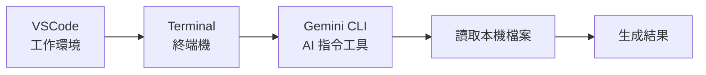
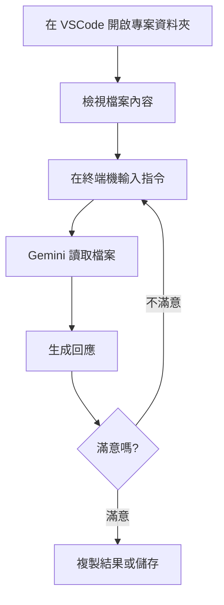

<!-- Path: AI_in_Education | Timestamp: 2025-10-15 15:45:00 | Version: b02 -->
# 單元四補充教材：觀念升級 - 當 AI 遇上你的電腦

## 單元目標

- 理解「雲端 AI」與「本機 AI」的差異
- 學會使用 VSCode 作為工作環境
- 能夠在終端機中執行基本 AI 指令
- 掌握本機 AI 工作流程的優勢與應用

---

## 核心概念詳解

### 1. 從「雲端問診」到「AI 家庭醫生到府服務」

#### 雲端 AI (如 AI Studio、NotebookLM)
**比喻**：就像到醫院看病,您需要攜帶病歷,醫生根據您的描述給建議。

**特點**：
- ✅ 操作簡單,打開瀏覽器就能用
- ✅ 不需安裝,任何電腦都可以
- ⚠️ 需要網路連線
- ⚠️ 無法直接讀取電腦檔案
- ⚠️ 資料會經過網路傳輸

#### 本機 AI (如 Gemini CLI + VSCode)
**比喻**：就像家庭醫生到府服務,醫生來到您家,可以直接查看您的生活環境、飲食記錄,給出更精準的建議。

**特點**：
- ✅ 可直接讀取本機檔案
- ✅ 整合工作流程,效率更高
- ✅ 個人化設定 (gemini.md)
- ⚠️ 需要安裝設定(初次較複雜)
- ⚠️ 需要基本的電腦操作能力

---

### 2. 為什麼要讓 AI 「到府服務」？

#### 情境 1：備課資料分散在多個檔案
**雲端方式**：
- 找到檔案 A → 複製內容 → 貼到 AI Studio
- 找到檔案 B → 複製內容 → 貼到 AI Studio
- 找到檔案 C → ...
- ❌ 繁瑣、容易遺漏

**本機方式**：
- 在包含所有檔案的資料夾中開啟 VSCode
- 告訴 AI:「根據這個資料夾中的所有檔案,整理重點」
- ✅ 一次處理,省時省力

#### 情境 2：需要重複使用的指令
**雲端方式**：
- 每次都要重新輸入完整的提示詞
- 容易遺忘之前好用的指令

**本機方式**：
- 在 `gemini.md` 中設定好「角色」與「預設指令」
- AI 會自動遵循,不需重複設定

---

### 3. 本機 AI 工作環境的三個核心工具



| 工具 | 功能 | 比喻 |
|------|------|------|
| **VSCode** | 整合式編輯器,可檢視檔案、執行指令 | 您的工作桌,所有工具都在這裡 |
| **Terminal (終端機)** | 輸入文字指令的地方 | 對電腦下達命令的「對講機」 |
| **Gemini CLI** | 在終端機中與 AI 對話的工具 | 與 AI 溝通的「魔法棒」 |

---

## 詳細操作步驟

### 步驟一：認識 VSCode 介面

#### 開啟 VSCode
- Windows: 從開始選單找到 Visual Studio Code
- Mac: 從應用程式資料夾或 Spotlight 搜尋

#### 介面導覽

```
┌─────────────────────────────────────────┐
│  檔案 編輯 檢視 ...                      │ ← 選單列
├──────┬──────────────────────────────────┤
│      │                                  │
│ 📁   │  這裡是編輯區域                    │
│ 📄   │  可以檢視與編輯檔案內容              │
│ 📄   │                                  │
│ 📄   │                                  │
│      │                                  │
│檔案  │                                  │
│總管  │                                  │
│      │                                  │
├──────┴──────────────────────────────────┤
│ TERMINAL (終端機)                        │ ← 在這裡輸入指令
│ $ gemini "你好"                         │
│                                         │
└─────────────────────────────────────────┘
```

**重要區域**：
1. **檔案總管 (左側)**：顯示資料夾中的所有檔案
2. **編輯區 (中央)**：查看與編輯檔案內容
3. **終端機 (下方)**：輸入指令與 AI 對話

---

### 步驟二：開啟終端機 (Terminal)

**方法一：選單開啟**
- 點選上方選單：`終端機` → `新增終端機`

**方法二：快捷鍵**
- Mac: `Control + ~`
- Windows: `Ctrl + ~`

**確認終端機已開啟**：
- 下方會出現黑色或白色的視窗
- 顯示游標閃爍,可以輸入文字

---

### 步驟三：執行第一個 AI 指令

#### 基本指令格式
```bash
gemini "您的問題或指令"
```

#### 範例 1：破冰指令
```bash
gemini "你好,請自我介紹"
```

**預期輸出**：
```
您好！我是 Gemini,Google 的大型語言模型。
我可以協助您進行文字創作、回答問題、摘要資訊等任務。
很高興為您服務！
```

✅ **如果成功看到回應,代表環境設定正確！**

---

#### 範例 2：讓 AI 執行簡單任務
```bash
gemini "請列出 3 個適合國小的數學遊戲"
```

---

#### 範例 3：讓 AI 讀取檔案 (進階)
**前提**：資料夾中有一個 `lesson.txt` 檔案

```bash
gemini "請摘要 lesson.txt 這個檔案的內容"
```

✅ AI 會自動找到檔案並分析內容

---

### 步驟四：理解工作流程



---

## 跨學科應用範例

### 📐 數學科

#### 情境：整理一週的教學檔案

**資料夾結構**：
```
math_week1/
  ├── monday_lesson.txt
  ├── wednesday_lesson.txt
  ├── friday_test.txt
  └── student_errors.txt
```

**指令 1 - 全週摘要**：
```bash
gemini "請摘要這個資料夾中所有檔案,整理出本週數學課的教學重點"
```

**指令 2 - 學生錯誤分析**：
```bash
gemini "根據 student_errors.txt,分析學生最常犯的 3 個錯誤,並建議補救教學策略"
```

**指令 3 - 下週規劃**：
```bash
gemini "根據本週教學內容與學生錯誤,建議下週的教學重點與活動"
```

---

### 🌱 自然科

#### 情境：實驗報告批改

**資料夾結構**：
```
science_experiment/
  ├── experiment_guide.txt (實驗說明)
  ├── student_report_1.txt
  ├── student_report_2.txt
  └── rubric.txt (評分標準)
```

**指令 1 - 對照檢查**：
```bash
gemini "根據 experiment_guide.txt 和 rubric.txt,檢查 student_report_1.txt 是否符合要求,列出優點與需改進之處"
```

**指令 2 - 批次分析** (如果有多份報告)：
```bash
gemini "分析所有 student_report 檔案,歸納出學生普遍做得好的地方,以及共同的問題"
```

---

### 🌍 社會科

#### 情境：教材資料整合

**資料夾結構**：
```
history_unit/
  ├── textbook_chapter.txt (課本內容)
  ├── reference_article.txt (參考文章)
  ├── timeline.txt (時間軸)
  └── my_notes.txt (個人筆記)
```

**指令 - 整合摘要**：
```bash
gemini "整合這個資料夾中的所有資料,製作一份完整的教學重點摘要,包含：1. 時間軸 2. 重要事件 3. 關鍵人物 4. 教學重點"
```

---

### 📖 國語科

#### 情境：作文批改輔助

**資料夾結構**：
```
writing_class/
  ├── topic.txt (作文題目與要求)
  ├── essay_A.txt
  ├── essay_B.txt
  └── scoring_guide.txt (評分標準)
```

**指令**：
```bash
gemini "根據 topic.txt 和 scoring_guide.txt,評析 essay_A.txt,提供具體的優點與改進建議,語氣要鼓勵而非批評"
```

---

### 🌐 英語科

#### 情境：課程資料準備

**資料夾結構**：
```
english_unit3/
  ├── vocabulary.txt (單字表)
  ├── dialogue.txt (課文對話)
  └── grammar_points.txt (文法重點)
```

**指令 1 - 學習單生成**：
```bash
gemini "根據這個資料夾的資料,設計一份學習單：包含 5 題單字填空、3 題文法選擇題、1 段對話填空"
```

**指令 2 - 課堂活動**：
```bash
gemini "根據 dialogue.txt,設計一個 15 分鐘的角色扮演活動,包含角色分配、台詞提示、延伸問題"
```

---

## 進階技巧

### 技巧 1：使用相對路徑指定檔案

**情境**：資料夾中檔案很多,只想讓 AI 看特定檔案

**指令格式**：
```bash
gemini "請根據 ./folder_name/file.txt 檔案,進行分析"
```

**範例**：
```bash
gemini "請根據 ./lessons/week1.txt,摘要本週教學重點"
```

---

### 技巧 2：輸出結果存檔

**方法 1：複製貼上**
- 選取終端機中 AI 的回應
- 複製 (Ctrl+C / Cmd+C)
- 貼到 Word 或其他文件

**方法 2：重新導向輸出 (進階)**
```bash
gemini "摘要內容" > output.txt
```
這會將 AI 的回應直接儲存到 `output.txt` 檔案

---

### 技巧 3：多輪對話

Gemini CLI 支援多輪對話，您可以持續追問：

**第一輪**：
```bash
gemini "請摘要 lesson.txt"
```

**第二輪** (承接上文)：
```bash
gemini "根據剛才的摘要,設計 3 道題目"
```

**第三輪**：
```bash
gemini "將這些題目改寫成選擇題格式"
```

---

## 實用技巧與注意事項

### ✅ 本機 AI 最佳實踐

1. **資料夾組織清楚**：用有意義的資料夾名稱與檔案名稱
2. **善用純文字檔**：`.txt` 或 `.md` 檔案,AI 最容易讀取
3. **一次處理一個專案**：在 VSCode 中開啟該專案資料夾
4. **檔案不要太大**：單一檔案建議不超過 1 萬字
5. **確認檔案路徑**：檔案要在開啟的資料夾中,AI 才找得到

---

### ⚠️ 常見問題與排除

| 問題 | 可能原因 | 解決方式 |
|------|---------|---------|
| 輸入 `gemini` 指令無反應 | CLI 未安裝或未設定 | 請檢查安裝步驟,確認指令可用 |
| AI 說找不到檔案 | 檔案不在當前資料夾 | 確認 VSCode 開啟的是正確的資料夾 |
| 回應速度很慢 | 網路問題或檔案太大 | 檢查網路連線,或拆分檔案 |
| 終端機無法輸入中文 | 編碼問題 | 用引號包住中文內容 `gemini "中文指令"` |

---

### 🎯 隱私與安全提醒

1. **避免上傳敏感資料**：不要讓 AI 讀取包含學生個資、成績的檔案
2. **檔案備份**：重要檔案先備份再操作
3. **檢查輸出內容**：AI 生成的內容仍需人工審核
4. **了解資料流向**：Gemini CLI 會將指令與檔案內容送到 Google 伺服器處理

---

## 延伸應用

### 應用 1：建立個人教材庫

**長期規劃**：
1. 建立清晰的資料夾結構
2. 將教材轉成文字檔存放
3. 使用 AI 快速查找與摘要
4. 定期更新與整理

**範例結構**：
```
teaching_materials/
  ├── math/
  │   ├── grade5/
  │   │   ├── unit1/
  │   │   └── unit2/
  │   └── grade6/
  ├── science/
  └── social/
```

---

### 應用 2：學生作品分析

**情境**：收集學生反思日記,分析學習狀況

**步驟**：
1. 將學生日記存成獨立文字檔 (去識別化)
2. 放入同一資料夾
3. 用 AI 分析整體趨勢

**指令**：
```bash
gemini "分析這個資料夾中所有學生的反思日記,歸納出：1. 學生覺得最困難的部分 2. 最有成就感的部分 3. 共同的疑問"
```

---

### 應用 3：快速產生變化版本

**情境**：同一份教材,需要不同難度版本

**步驟**：
1. 原始教材存成 `original.txt`
2. 下指令生成不同版本

**指令範例**：
```bash
gemini "將 original.txt 改寫成三個版本：1. 簡化版(國小三年級) 2. 標準版(國小五年級) 3. 進階版(國中程度),分別輸出"
```

---

## 與雲端 AI 的比較

| 比較項目 | 雲端 AI | 本機 AI (CLI) |
|---------|---------|--------------|
| **操作簡易度** | ⭐⭐⭐⭐⭐ 開瀏覽器即可 | ⭐⭐⭐ 需學習指令 |
| **讀取本機檔案** | ❌ 需手動複製貼上 | ✅ 直接讀取 |
| **批次處理** | ❌ 一次一個 | ✅ 可處理整個資料夾 |
| **個人化設定** | ❌ 每次重新設定 | ✅ 透過 gemini.md |
| **工作流程整合** | ⭐⭐ 需切換視窗 | ⭐⭐⭐⭐⭐ 一站式操作 |
| **適用對象** | 初學者、偶爾使用 | 經常使用、效率需求高 |

---

## 練習任務

### 初階任務
1. 成功開啟 VSCode 與終端機
2. 執行第一個 `gemini "你好"` 指令
3. 建立一個簡單的 `.txt` 檔案,請 AI 摘要內容

### 進階任務
1. 建立一個教學專案資料夾,包含 3-5 個檔案
2. 用指令讓 AI 分析整個資料夾
3. 將 AI 的回應複製並整理成教案

---

## 常見問題 Q&A

**Q1：我不懂程式設計,可以學會這個嗎？**
A1：可以！這個工具不需要寫程式,只需要輸入文字指令即可。就像用 Google 搜尋一樣簡單。

**Q2：VSCode 會不會很難學？**
A2：我們只用到最基本的功能：檢視檔案 + 開啟終端機。不需要學習複雜的編輯功能。

**Q3：如果指令打錯怎麼辦？**
A3：沒關係！只會出現錯誤訊息,不會損壞檔案。重新輸入正確指令即可。

**Q4：一定要用 VSCode 嗎？可以用其他工具嗎？**
A4：VSCode 是建議工具,因為它整合了編輯器與終端機。如果熟悉其他工具 (如 Terminal app),也可以使用。

**Q5：這樣使用需要付費嗎？**
A5：VSCode 是免費軟體。Gemini API 有免費額度,一般教學使用足夠,超過才需付費。

**Q6：我的檔案是 Word 或 PDF,AI 可以讀取嗎？**
A6：Gemini CLI 主要讀取文字檔。建議將 Word 內容複製到 `.txt` 檔,或使用轉換工具。

**Q7：跟第一天學的 AI Studio 有什麼不同？**
A7：AI Studio 像是「線上工具」,本機 AI 像是「整合在您工作環境的助理」。各有優勢,可搭配使用。

---

**小結**：將 AI 帶到本機,讓它成為真正整合在您工作流程中的助理。透過 VSCode + Gemini CLI,您可以更高效地處理教學資料、分析學生作品、準備教材。初期需要一點學習,但熟悉後會發現效率大幅提升！
