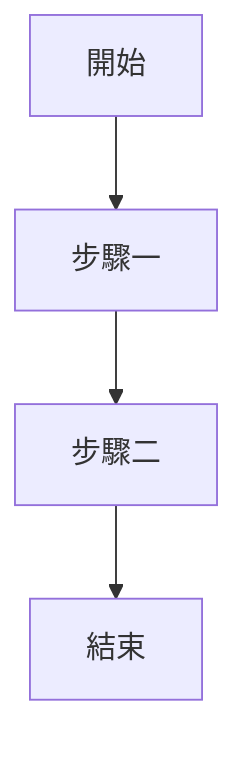
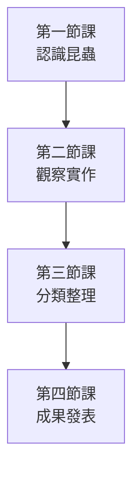
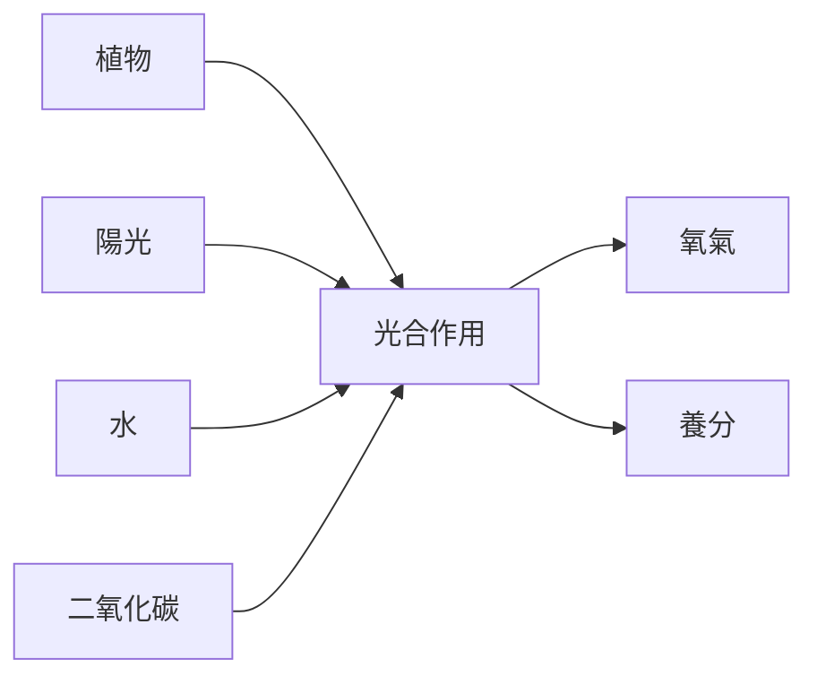
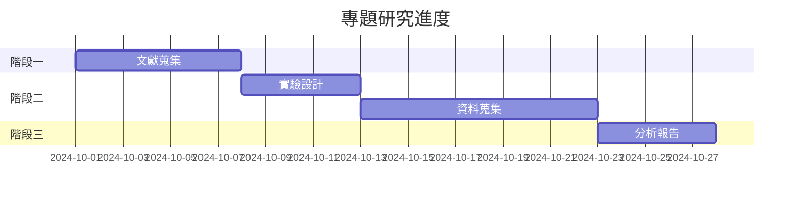
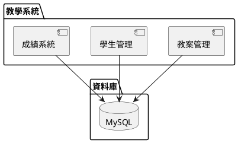
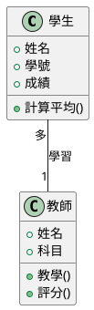
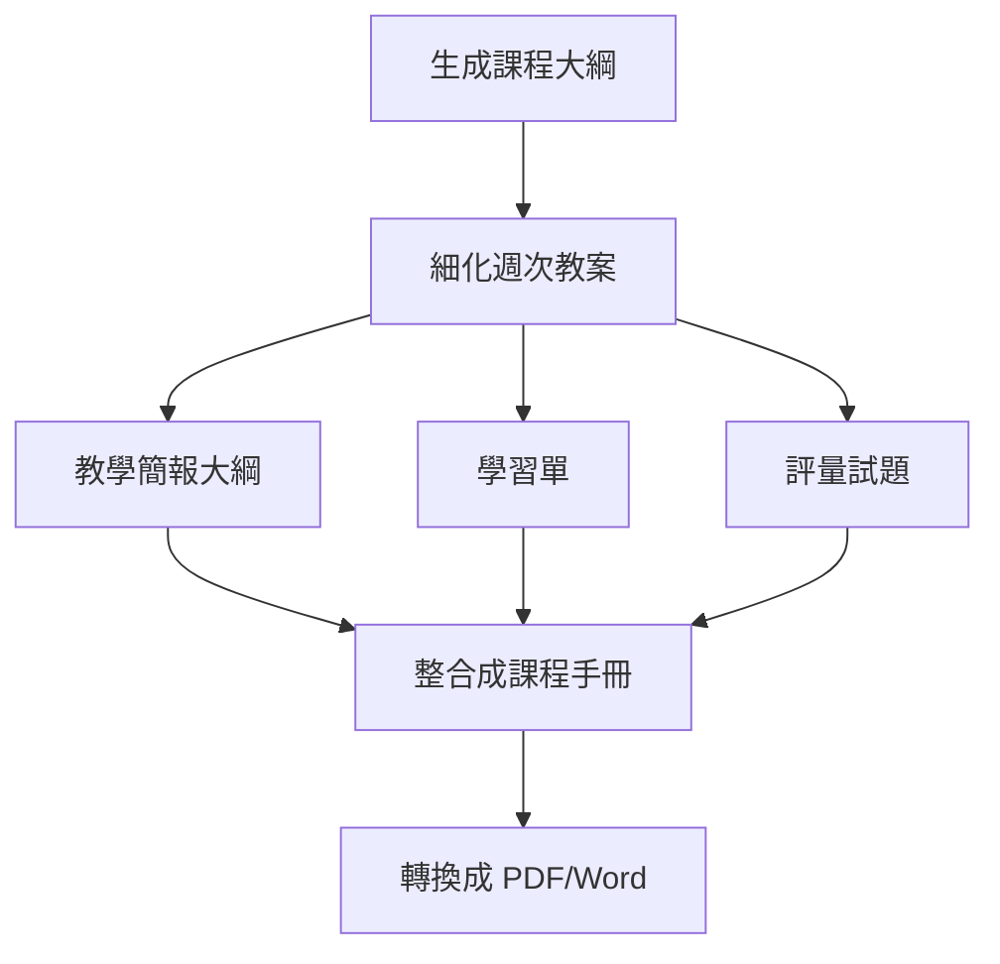

<!-- Path: AI_in_Education | Timestamp: 2025-10-15 15:50:00 | Version: supplement -->
# 單元四補充內容：進階章節

**說明**：以下內容需整合至 unit04_local_ai_setup_b02.md 的進階技巧章節中

---

## CLI + VSCode 整合的五大優勢

### 優勢一：一站式工作環境
**傳統方式**：
- 瀏覽器開 AI Studio → 複製結果 → 貼到 Word → 存檔
- 需要在多個視窗間切換
- 容易遺失內容

**CLI + VSCode 方式**：
```
同一個視窗內：
├── 左側：檔案總管（看到所有教材）
├── 中間：編輯區（檢視與編輯內容）
└── 下方：終端機（與 AI 對話）
```

**效益**：工作效率提升 50%

---

### 優勢二：批次處理多檔案（類似 NotebookLM）

**核心能力**：Gemini CLI 可一次讀取資料夾中的所有檔案，整合分析

**情境範例**：整週教案統整

**資料夾結構**：
```
week5_lessons/
├── monday_math.txt
├── wednesday_science.txt
├── friday_social.txt
└── assessment.txt
```

**指令**：
```bash
gemini "分析這個資料夾中的所有檔案，整理出本週的教學重點、學生表現與需改進之處"
```

**AI 自動**：
1. 讀取所有 4 個檔案
2. 整合資訊
3. 生成綜合報告

**vs NotebookLM 的差異**：

| 比較項目 | NotebookLM | Gemini CLI + VSCode |
|---------|-----------|---------------------|
| **檔案管理** | 網頁上傳，分散 | 本機資料夾，集中 |
| **修改檔案** | 需重新上傳 | 即時同步 |
| **工作流程** | 瀏覽器 → 複製 → 貼上 | 終端機 → 直接輸出檔案 |
| **隱私性** | 雲端處理 | 本機處理，資料不外流（註：仍會送 API） |
| **整合性** | 獨立工具 | 整合在開發環境 |

---

### 優勢三：輸出結果可直接存檔

**傳統方式**：
1. AI 生成內容
2. 手動複製
3. 開啟 Word
4. 貼上
5. 調整格式
6. 存檔

**CLI 方式**：
```bash
gemini "設計教案" > lesson_plan.md
```
**一行指令完成！**

---

### 優勢四：版本控制與歷程追蹤

**搭配 Git 使用**：
```bash
git add lesson_plan.md
git commit -m "AI生成初稿"

# 修改後
git add lesson_plan.md
git commit -m "調整難度"
```

**優點**：
- 追蹤每次修改
- 可回溯舊版本
- 團隊協作更容易

---

### 優勢五：自動化工作流程

**範例：每週自動生成教學週報**

建立腳本 `weekly_report.sh`：
```bash
#!/bin/bash
cd ~/teaching/week_$(date +%U)
gemini "整理本週教學檔案,生成週報" > weekly_report_$(date +%Y%m%d).md
echo "週報已生成！"
```

**執行**：
```bash
bash weekly_report.sh
```

---

## Markdown 格式輸出的優勢與應用

### 什麼是 Markdown？

**簡單定義**：一種輕量級的標記語言，用簡單符號表示格式

**核心理念**：
- 純文字，任何編輯器都能開啟
- 語法簡單，5 分鐘上手
- 轉換方便，可轉成 PDF、Word、HTML

### Markdown 基本語法

```markdown
# 這是標題 1
## 這是標題 2
### 這是標題 3

**粗體文字**
*斜體文字*

- 項目一
- 項目二
  - 子項目

1. 第一點
2. 第二點

[連結文字](https://example.com)


```

### 為何用 Markdown 撰寫教材？

#### 優勢 1：專注內容，不被格式干擾

**Word 的問題**：
- 調整字體、大小、顏色
- 對齊、縮排
- 花 30% 時間在格式上

**Markdown 的解法**：
- 只用符號標記
- 格式統一自動套用
- 專注在內容撰寫

#### 優勢 2：跨平台、永不過時

- 純文字檔，30 年後還能開
- 不依賴特定軟體（Word、Pages）
- 任何裝置都能編輯

#### 優勢 3：整合程式碼與圖表

**傳統方式**：
1. 用軟體畫流程圖
2. 截圖
3. 插入 Word
4. 修改？重新畫→截圖→插入

**Markdown + Mermaid**：
````markdown

````
**修改？直接改文字！**

---

### AI 輸出 Markdown 的範例

**Prompt**：
```bash
gemini "設計一份國小數學「分數加減」教案，用 Markdown 格式輸出，包含：
- 教學目標（條列）
- 教學流程（分段，用標題區分）
- 評量方式（表格呈現）
"
```

**AI 輸出**：
```markdown
# 分數加減教案

## 教學目標
- 學生能理解同分母分數相加
- 學生能運用分數解決生活問題
- 學生能說明分數加法的意義

## 教學流程

### 引起動機（10 分鐘）
使用披薩切片的例子...

### 發展活動（25 分鐘）
1. 教師示範...
2. 學生練習...

## 評量方式

| 評量項目 | 方式 | 佔分 |
|---------|------|------|
| 課堂練習 | 紙筆測驗 | 40% |
| 小組討論 | 觀察紀錄 | 30% |
| 回家作業 | 作業批改 | 30% |
```

---

### Markdown 進階應用：嵌入圖表

#### Mermaid：流程圖、架構圖

**範例：教學流程圖**
````markdown

````

**優點**：
- 文字描述就能生成圖表
- 修改方便
- 風格統一

---

## Mermaid vs PlantUML：差異與選擇

### 快速比較表

| 比較項目 | Mermaid | PlantUML |
|---------|---------|----------|
| **學習難度** | ⭐⭐ 簡單 | ⭐⭐⭐ 中等 |
| **圖表類型** | 流程圖、甘特圖、類別圖 | UML 全系列、架構圖 |
| **渲染方式** | 瀏覽器即時渲染 | 需要外部工具 |
| **適用對象** | 教師、一般用途 | 軟體工程師 |
| **VSCode 支援** | 內建預覽 | 需安裝擴充 |
| **適合情境** | 教學流程、概念圖 | 系統架構、程式設計 |

### Mermaid 適用情境

#### 1. 教學流程圖


#### 2. 概念關係圖


#### 3. 甘特圖（進度規劃）


### PlantUML 適用情境

#### 1. 系統架構圖


#### 2. 類別圖（程式設計用）


### 教師實務建議

**建議使用 Mermaid，理由：**
1. ✅ 學習曲線平緩，30 分鐘上手
2. ✅ VSCode 原生支援，即時預覽
3. ✅ 足夠應付教學需求（流程、概念圖）
4. ✅ Markdown 直接嵌入，不需額外工具

**PlantUML 適合：**
- 資訊科技老師
- 需要繪製軟體架構
- 專案管理複雜圖表

---

## 完整實戰案例：從大綱到完整教材設計

### 情境：設計「大型語言模型」教學教材

**對象**：高中資訊科技課程
**時間**：4 週，每週 2 小時

---

### 階段一：生成教學大綱

**檔案準備**：
在 VSCode 中創建資料夾 `llm_course/`

**Prompt**：
```bash
gemini "我要為高中生設計『大型語言模型入門』課程，共 4 週。

請生成課程大綱，以 Markdown 格式輸出：

## 課程名稱
## 目標學生
## 課程目標（3-5 點）
## 週次規劃

### 第一週：
- 主題
- 重點概念
- 教學活動

### 第二週：
...

請以 Markdown 格式完整輸出。" > course_outline.md
```

**生成結果**（部分）：
```markdown
# 大型語言模型入門課程

## 目標學生
高中一、二年級，具備基本電腦操作能力

## 課程目標
- 理解 AI 與大型語言模型的基本概念
- 能操作並評估 AI 工具（如 ChatGPT）
- 認識 AI 的應用與倫理議題
- 培養批判思考與資訊素養

## 週次規劃

### 第一週：認識 AI 與語言模型
**主題**：什麼是 AI？語言模型如何運作？

**重點概念**：
- AI、機器學習、深度學習的關係
- 語言模型的訓練方式
- Transformer 架構（簡化說明）

**教學活動**：
1. 破冰：讓學生試用 ChatGPT，紀錄驚訝與疑問
2. 講解：用比喻說明 AI 如何學習語言
3. 實作：設計不同提示詞，觀察 AI 回應差異

---

### 第二週：提示工程（Prompt Engineering）
...
```

---

### 階段二：根據大綱細化每週教材

**針對第一週，生成詳細教案**：

**Prompt**：
```bash
gemini "根據 course_outline.md 的第一週內容，設計完整的 2 小時教案。

輸出格式（Markdown）：
# 第一週教案：認識 AI 與語言模型

## 教學目標
## 教學準備
## 教學流程（分段，含時間）
### 引起動機（15 分鐘）
### 概念講解（30 分鐘）
### 實作活動（40 分鐘）
### 討論與總結（20 分鐘）
## 學習單設計
## 評量方式
## 延伸閱讀

請生成完整內容。" > week1_lesson_plan.md
```

---

### 階段三：生成教學簡報大綱

**Prompt**：
```bash
gemini "根據 week1_lesson_plan.md，設計一份教學簡報大綱（15-20 頁）。

以 Markdown 列表方式輸出，每個項目是一頁投影片的標題與重點：

## 投影片大綱

### 第 1 頁：課程標題
- 標題：認識 AI 與語言模型
- 副標題：探索 ChatGPT 背後的科學

### 第 2 頁：破冰活動
- 提問：你用過哪些 AI 工具？
- 互動：掃碼體驗 ChatGPT

...

請包含流程圖建議（用 Mermaid 語法）" > week1_slides_outline.md
```

---

### 階段四：生成學習單

**Prompt**：
```bash
gemini "根據 week1_lesson_plan.md，設計一份學習單。

格式：
# 學習單：認識 AI 與語言模型

## 第一部分：課前暖身（3 題）
## 第二部分：實作紀錄
### 任務一：設計 3 個提示詞
| 提示詞 | AI 回應摘要 | 你的觀察 |
|--------|------------|---------|
| ... | ... | ... |

## 第三部分：反思問題（2 題）
## 第四部分：延伸挑戰（選做）

請以 Markdown 表格與條列方式輸出完整內容。" > week1_worksheet.md
```

---

### 階段五：生成評量試題

**Prompt**：
```bash
gemini "根據 week1_lesson_plan.md，設計評量題目。

# 第一週評量

## 選擇題（5 題）
測驗基本概念理解

## 簡答題（3 題）
測驗應用與思考

## 實作題（1 題）
設計一個教學情境的 AI 應用，並說明提示詞設計

請附標準答案與評分標準。" > week1_assessment.md
```

---

### 階段六：整合所有檔案

**資料夾結構**：
```
llm_course/
├── course_outline.md (課程大綱)
├── week1/
│   ├── lesson_plan.md (教案)
│   ├── slides_outline.md (簡報大綱)
│   ├── worksheet.md (學習單)
│   └── assessment.md (評量)
├── week2/
├── week3/
└── week4/
```

**最後整合指令**：
```bash
gemini "統整 llm_course 資料夾中所有檔案，生成一份『完整課程手冊』，包含：
- 目錄（自動生成連結）
- 課程概覽
- 各週教學內容（引用各檔案）
- 附錄（參考資源、延伸閱讀）

輸出為 course_handbook.md" > course_handbook.md
```

---

### 完整流程圖



---

### 時間效益分析

| 任務 | 傳統方式 | AI + CLI 方式 | 節省時間 |
|------|---------|--------------|---------|
| 課程大綱 | 2 小時 | 5 分鐘 + 調整 15 分鐘 | 80% |
| 單週教案 | 3 小時 | 10 分鐘 + 調整 30 分鐘 | 70% |
| 學習單 | 1.5 小時 | 5 分鐘 + 調整 20 分鐘 | 70% |
| 評量設計 | 2 小時 | 10 分鐘 + 調整 30 分鐘 | 65% |
| **總計** | **34 小時** | **約 10 小時** | **70%** |

---

## 實用指令總結

### 多檔案整合分析
```bash
# 分析整個資料夾
gemini "分析這個資料夾的所有檔案並生成摘要"

# 指定特定檔案
gemini "整合 file1.txt, file2.txt, file3.txt 的內容"
```

### 輸出為 Markdown 檔案
```bash
# 直接輸出
gemini "生成教案" > lesson.md

# 追加內容
gemini "生成評量" >> lesson.md
```

### 使用 Mermaid 圖表
```bash
gemini "設計教學流程，用 Mermaid 流程圖呈現" > flow.md
```

### 批次處理
```bash
# 為每個單元生成教案
for unit in unit1 unit2 unit3; do
  gemini "為 $unit 生成教案" > ${unit}_plan.md
done
```

---

**補充完成**：以上內容應整合至 unit04_local_ai_setup_b02.md 的適當章節
