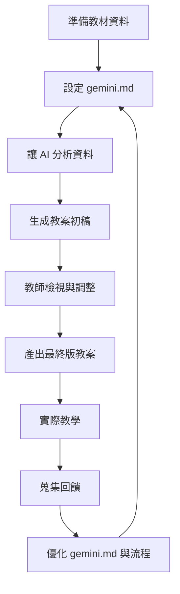
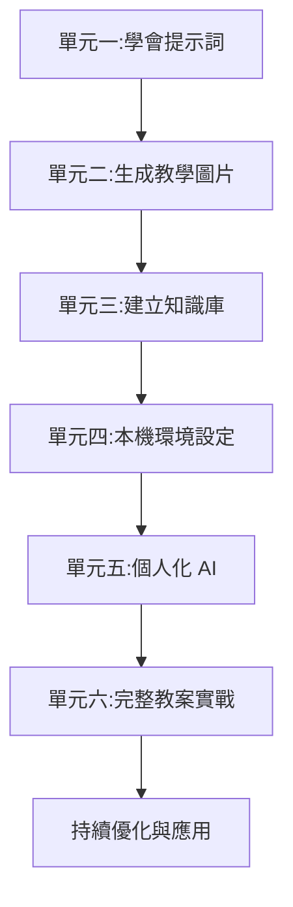

<!-- Path: AI_in_Education | Timestamp: 2025-10-15 14:55:00 | Version: b01 -->
# 單元六補充教材：實戰演練 - AI 幫我讀檔案、寫教案

## 單元目標

- 整合前五個單元所學技能
- 能夠完成從資料到教案的完整流程
- 學會檢視與優化 AI 生成的內容
- 建立可持續使用的 AI 輔助教學工作流程

---

## 核心概念詳解

### 1. AI 輔助教學的完整流程



**關鍵理念**：
- AI 是「起點」,不是「終點」
- 教師的專業判斷不可或缺
- 持續優化形成良性循環

---

### 2. 教案的核心要素

無論學科,優質教案通常包含：

| 要素 | 說明 | AI 可協助程度 |
|------|------|--------------|
| **教學目標** | 學生應達成的學習成果 | ⭐⭐⭐⭐ 高 |
| **教學準備** | 所需教材、器材 | ⭐⭐⭐⭐ 高 |
| **引起動機** | 吸引學生注意的開場 | ⭐⭐⭐⭐⭐ 極高 |
| **教學流程** | 分段的教學活動 | ⭐⭐⭐⭐⭐ 極高 |
| **形成性評量** | 檢核學習成效的方式 | ⭐⭐⭐⭐⭐ 極高 |
| **教學省思** | 課後反思與調整 | ⭐⭐ 低(需教師親自撰寫) |

---

### 3. 人機協作的黃金比例

**70% AI + 30% 教師**

- **AI 負責**：架構、範例、初稿、變化版本
- **教師負責**：目標確認、內容檢核、學生特性調整、教學藝術

---

## 詳細操作步驟

### 完整實戰：從零到完整教案

#### 情境設定
您是國小五年級自然科老師,下週要教「植物的繁殖」單元。

---

### 步驟一：準備工作環境

1. **建立專案資料夾**
```
plant_reproduction/
  ├── gemini.md (AI 設定檔)
  ├── textbook.txt (課本內容)
  ├── reference.txt (參考資料)
  └── output/ (存放 AI 生成的內容)
```

2. **在 VSCode 開啟資料夾**
- 檔案 → 開啟資料夾 → 選擇 `plant_reproduction`

---

### 步驟二：設定 gemini.md

**範例內容**：
```markdown
# AI 教學助理設定

你是一位經驗豐富的國小自然科教師,專長於小學高年級的科學教學。

## 教學理念
- 重視實作與觀察
- 培養科學思考能力
- 連結生活經驗

## 說話風格
- 清晰、有條理
- 使用適合小學生的語言
- 舉生活化的例子

## 教案設計原則
當我要求設計教案時,請包含:
1. 教學目標(認知、技能、情意)
2. 教學準備(教材、器材)
3. 引起動機(5 分鐘)
4. 教學活動(分段,含時間分配)
5. 總結與評量
6. 延伸活動(選用)

## 輸出格式
- 使用清楚的標題與分段
- 活動步驟用編號
- 重點用**粗體**標示
```

---

### 步驟三：準備教材檔案

**textbook.txt 內容範例**：
```
植物的繁殖

植物可以透過多種方式繁殖,主要分為兩大類:

一、有性生殖
透過種子繁殖,需要經過開花、授粉、結果的過程。
例如:大部分的開花植物,如向日葵、番茄。

二、無性生殖
不需要種子,可以用根、莖、葉等部位繁殖。
例如:
- 走莖:草莓
- 塊莖:馬鈴薯
- 扦插:玫瑰、聖誕紅

... (繼續補充課本內容)
```

---

### 步驟四：讓 AI 分析教材

**指令 1 - 理解內容**：
```bash
gemini "請摘要 textbook.txt 的核心概念,並列出 3-5 個關鍵教學重點"
```

**指令 2 - 學習難點預測**：
```bash
gemini "根據 textbook.txt,預測學生可能的學習困難或迷思概念"
```

**指令 3 - 生活連結**：
```bash
gemini "列出 5 個與 textbook.txt 內容相關的生活實例,適合用於課堂引導"
```

---

### 步驟五：生成教案初稿

**完整指令**：
```bash
gemini "根據 textbook.txt,設計一份完整的 40 分鐘教案。

要求:
- 適合國小五年級
- 包含一個實作活動(用常見材料即可)
- 引起動機要吸引人
- 評量方式多元(不只紙筆測驗)

請遵循 gemini.md 中的教案格式。"
```

---

### 步驟六：檢視與調整

**檢核清單**：
- [ ] 教學目標是否明確且可達成？
- [ ] 時間分配是否合理？
- [ ] 活動設計是否符合學生程度？
- [ ] 實作材料是否容易取得？
- [ ] 評量方式是否能真正檢核學習成效？
- [ ] 是否考慮到班級特殊學生的需求？

**調整指令範例**：
```bash
gemini "請將引起動機改成「影片導入」,推薦一部 3 分鐘內的影片主題"
```

```bash
gemini "實作活動的材料有點難取得,請改用學校常見的材料"
```

---

### 步驟七：產出完整檔案

**將結果複製到 Word 或 Google Docs**

**檔案命名建議**：
```
植物繁殖_教案_五年級_AI輔助_v1.docx
```

**儲存提醒**：
- 註明「AI 輔助生成」
- 保留調整版本記錄
- 加入教師個人省思欄位

---

## 跨學科完整範例

### 📐 數學科：分數加減教案

#### 資料夾結構
```
fraction_addition/
  ├── gemini.md
  ├── curriculum_guide.txt (課綱說明)
  ├── textbook_content.txt (課本內容)
  └── student_errors.txt (常見錯誤記錄)
```

#### 指令序列

**第一步：資料整合**
```bash
gemini "綜合這個資料夾中的所有檔案,整理出「分數加減」單元的教學重點與學生常見錯誤"
```

**第二步：教案生成**
```bash
gemini "設計一份 45 分鐘的分數加減教案,特別針對 student_errors.txt 中的錯誤類型,設計補救教學策略"
```

**第三步：差異化設計**
```bash
gemini "為這份教案設計三種難度的學習單:基礎版、標準版、進階版"
```

**第四步：評量設計**
```bash
gemini "設計 10 道題目作為課後評量,包含概念理解與應用題,附詳解"
```

---

### 🌱 自然科：水循環教案

#### 核心指令

**教案生成**：
```bash
gemini "根據 water_cycle.txt,設計一份包含「實驗演示」的教案。

實驗要求:
- 材料簡單(如透明杯、冰塊、熱水)
- 能清楚展示蒸發與凝結
- 10 分鐘內可完成
- 安全無虞

其他要求:
- 用故事化方式引導
- 設計小組討論問題
- 評量包含實驗觀察紀錄"
```

**延伸活動**：
```bash
gemini "設計一個課後作業:讓學生在家觀察並記錄「水循環」的現象,提供觀察引導單"
```

---

### 🌍 社會科：台灣地形教案

#### 核心指令

**教案生成**：
```bash
gemini "根據 taiwan_landform.txt,設計一份 40 分鐘教案。

要求:
- 使用地圖與圖片輔助教學
- 包含「地形配對」小遊戲
- 引導學生思考「地形如何影響人們的生活」
- 評量方式:學習單 + 口頭問答"
```

**圖片提示詞生成**：
```bash
gemini "列出 5 個 AI 圖片生成提示詞,用於產生台灣地形教學插圖(山地、丘陵、平原、盆地、台地)"
```

---

### 📖 國語科：課文教案

#### 資料準備
- 課文全文
- 作者背景資料
- 相關賞析文章

#### 核心指令

**教案生成**：
```bash
gemini "根據這個資料夾的資料,設計「背影」這篇課文的教案(2 節課,共 80 分鐘)。

第一節課:
- 介紹作者與時代背景
- 朗讀與初步理解
- 文本結構分析

第二節課:
- 修辭與情感探討
- 小組討論與分享
- 延伸寫作活動

請包含完整的提問設計(字面、推論、評鑑三層次)"
```

**仿寫活動**：
```bash
gemini "設計「仿寫『背影』」寫作活動,提供寫作架構、引導問題、範例開頭"
```

---

### 🌐 英語科：對話課教案

#### 核心指令

**教案生成**：
```bash
gemini "根據 unit5_dialogue.txt,設計一份 45 分鐘的英語對話課教案。

要求:
- Warm-up 活動(5 分鐘)
- 對話教學(15 分鐘,含句型講解)
- 角色扮演練習(15 分鐘)
- 口語評量(10 分鐘)

請提供:
- 教學步驟
- 教師用語範例(英文)
- 學生分組建議
- 評量標準"
```

**補充活動**：
```bash
gemini "設計 3 個延伸口說活動,讓學生在不同情境中練習本課句型"
```

---

## 進階技巧

### 技巧 1：使用「教案產生器」模式

**在 gemini.md 中設定**：
```markdown
## 教案產生器模式

當我說「生成教案」時,請按照以下步驟:

步驟 1: 先分析資料,列出核心概念
步驟 2: 預測學習難點
步驟 3: 設計教學流程
步驟 4: 提供完整教案
步驟 5: 附上教學提醒與注意事項

每個步驟請分段輸出,便於確認。
```

**使用方式**：
```bash
gemini "生成教案"
```
AI 會按步驟引導,每步驟都可確認與調整。

---

### 技巧 2：批次產生教案系列

**情境**：一次準備整個單元的教案

**指令**：
```bash
gemini "這個資料夾包含 5 週的教材。請為每週生成一份教案大綱(含主題、目標、核心活動),我會再個別細化"
```

**優點**：
- 先有整體架構
- 確保連貫性
- 再逐週細化

---

### 技巧 3：教案版本迭代

**流程**：
1. 生成 v1 版本
2. 實際教學後,記錄問題
3. 請 AI 根據問題優化

**指令範例**：
```bash
gemini "這是我上次使用的教案 (貼上內容)。實際教學時發現:
1. 時間不夠,學生寫學習單花了 20 分鐘
2. 引起動機效果不佳
3. 實作活動太複雜

請優化教案,產生 v2 版本"
```

---

### 技巧 4：多教師協作

**情境**：同年級多班,共同備課

**流程**：
1. 共同建立資料夾與 gemini.md
2. 一人產生教案初稿
3. 其他人提出修改建議
4. 請 AI 整合意見

**指令**：
```bash
gemini "這是教案初稿 [貼上]。以下是三位老師的修改建議:
- A 老師:增加視覺輔助
- B 老師:簡化實作步驟
- C 老師:加入形成性評量

請整合這些建議,產生修訂版"
```

---

## 實用技巧與注意事項

### ✅ AI 教案的品質檢核

#### 必檢項目

| 項目 | 檢核點 | 常見問題 |
|------|--------|---------|
| **教學目標** | 是否具體、可達成、可評量 | AI 可能寫得太抽象 |
| **時間分配** | 加總是否等於總節數 | AI 常高估或低估 |
| **材料可行性** | 是否容易取得 | AI 可能建議罕見材料 |
| **學生程度** | 是否符合年級能力 | AI 可能過難或過簡 |
| **評量方式** | 是否能檢核目標達成 | AI 可能只建議單一方式 |
| **安全性** | 實作活動是否安全 | AI 可能忽略風險 |

---

### ⚠️ 使用 AI 教案的注意事項

1. **不可照單全收**：AI 是起點,教師判斷是關鍵
2. **考慮班級特性**：特殊需求學生、班級氣氛 AI 不知道
3. **檢查正確性**：學科知識 AI 可能出錯
4. **保留彈性**：實際教學需隨機應變
5. **記錄回饋**：持續優化 AI 的設定

---

### 🎯 效率提升策略

#### 建立個人教案庫

```
teaching_plans/
  ├── templates/
  │   ├── math_template.md
  │   ├── science_template.md
  │   └── language_template.md
  ├── 2024_semester1/
  │   ├── week01/
  │   ├── week02/
  │   └── ...
  └── resources/
      ├── common_activities.md
      └── assessment_methods.md
```

**優點**：
- 累積可重複使用的素材
- 建立個人教學風格資料庫
- 越用越精準

---

## 延伸應用

### 應用 1：從教案到學習單

**流程**：


**指令**：
```bash
gemini "根據這份教案,設計一份 A4 單面學習單,包含:
1. 重點整理(填空)
2. 練習題 5 題
3. 延伸思考 1 題

格式:適合直接列印使用"
```

---

### 應用 2：從教案到評量卷

**指令**：
```bash
gemini "根據這份教案的教學目標,設計一份 20 分鐘的小測驗:
- 10 題選擇(每題 5 分)
- 5 題填空(每題 5 分)
- 1 題簡答(25 分)

請附上詳解與評分標準"
```

---

### 應用 3：從教案到教學簡報

**指令**：
```bash
gemini "根據這份教案,規劃一份教學簡報的架構(10-15 張投影片)。

每張投影片請說明:
- 標題
- 主要內容(條列)
- 建議的視覺元素(圖片、圖表)

我會根據架構製作簡報"
```

---

## 完整案例演示

### 案例：國小四年級自然「昆蟲」單元

#### 準備階段

**資料夾**：`insect_unit/`

**檔案清單**：
- `gemini.md` (自然科教師設定)
- `textbook.txt` (課本內容)
- `insect_photos.txt` (圖片描述清單)
- `field_guide.txt` (校園常見昆蟲)

#### 執行指令記錄

**第一步**：
```bash
gemini "摘要這個資料夾的內容,列出教學重點"
```
**輸出**：核心概念清單

---

**第二步**：
```bash
gemini "設計一份 40 分鐘教案,包含校園觀察活動"
```
**輸出**：教案初稿

---

**第三步**：
```bash
gemini "為觀察活動設計「觀察紀錄表」,包含:昆蟲名稱、發現地點、身體特徵、繪圖區"
```
**輸出**：紀錄表範本

---

**第四步**：
```bash
gemini "設計 5 道課後評量題目,測驗學生是否理解昆蟲的身體構造"
```
**輸出**：評量題目與答案

---

**第五步**(課後優化)：
```bash
gemini "實際教學發現學生很難辨識『胸部』與『腹部』,請在教案中加強這部分的說明與活動"
```
**輸出**：優化版教案

---

## 練習任務

### 綜合任務
選擇您下週要教的一個單元,完成以下流程:

1. ✅ 建立專案資料夾
2. ✅ 撰寫 gemini.md
3. ✅ 準備教材檔案
4. ✅ 用 AI 分析內容
5. ✅ 生成教案初稿
6. ✅ 檢視與調整
7. ✅ 產出完整教案
8. ✅ (選用)生成配套學習單

---

## 常見問題 Q&A

**Q1：AI 生成的教案可以直接用嗎？**
A1：不建議。AI 提供的是「高品質草稿」,仍需教師根據班級特性、教學風格調整。把 AI 當助手,不是替代品。

**Q2：每次都要重新下指令嗎？**
A2：不需要。將常用指令寫在 gemini.md 或建立「指令清單」檔案,複製使用即可。

**Q3：如果 AI 生成的內容有錯誤？**
A3：這是 AI 的限制。務必由教師檢核專業知識的正確性,尤其是學科概念、事實資料。

**Q4：使用 AI 教案需要註明嗎？**
A4：建議在檔案中註明「AI 輔助生成」,這是誠實且專業的做法。

**Q5：AI 可以幫我寫「教學省思」嗎？**
A5：不建議。教學省思需要真實的課堂經驗與個人反思,這是 AI 無法取代的專業核心。

**Q6：我的學校要求特定教案格式,AI 可以配合嗎？**
A6：可以！在 gemini.md 中提供格式範本,AI 會遵循輸出。

**Q7：使用 AI 會不會讓我失去教學專業？**
A7：不會。AI 處理的是「架構與內容產出」,教師的專業在於「教學藝術、學生理解、課堂互動」,這些 AI 無法取代。就像用電腦打字不會讓人失去寫作能力,AI 是工具,專業仍在教師身上。

**Q8：這樣的流程真的能節省時間嗎？**
A8：初期需要學習與調整,但熟悉後,備課時間可節省 50-70%。更重要的是,您可以把時間用在更需要專業判斷的部分,如了解學生、設計互動、關懷個別需求。

---

## 課程總結

### 六個單元的完整拼圖



### 您已經學會

✅ 與 AI 有效溝通(提示詞技巧)
✅ 生成視覺化教材(圖片生成)
✅ 建立有憑有據的知識庫(NotebookLM)
✅ 在本機環境高效工作(VSCode + CLI)
✅ 客製化專屬 AI 助理(gemini.md)
✅ 完成完整的教案設計流程

---

### 下一步：持續精進

1. **每週一教案**：選一個單元練習完整流程
2. **優化 gemini.md**：根據使用經驗調整設定
3. **建立素材庫**：累積常用的提示詞、範本、資源
4. **分享與交流**：與同事分享經驗,共同進步
5. **關注新工具**：AI 工具持續演進,保持學習

---

### 最後的提醒

> AI 是強大的助手,但**教育的核心是人**。
>
> 技術讓我們更有效率,但不要忘記:
> - 學生的眼神與反應
> - 課堂的溫度與互動
> - 教育的初心與熱情
>
> 讓 AI 處理重複性工作,讓教師專注於真正的教育。

---

**恭喜您完成全部六個單元！**

您現在已經具備完整的 AI 輔助教學能力。

期待您在教學現場,創造出更多精彩的課堂,幫助學生享受學習的樂趣！
