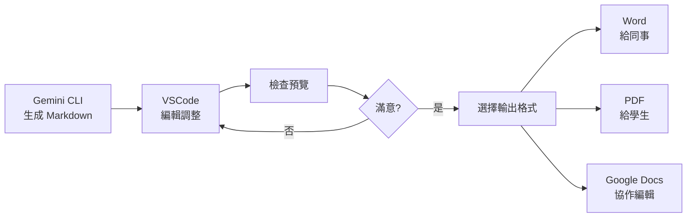

<!-- Path: AI_in_Education | Timestamp: 2025-10-15 16:00:00 | Version: supplement -->
# 單元六補充內容：進階應用

**說明**：以下內容需整合至 unit06_practical_lesson_plan_b02.md 的延伸應用章節中

---

## Markdown 轉換應用：從 AI 輸出到實用文件

### 為何從 Markdown 開始？

**核心優勢**：
1. **AI 天然輸出格式**：Gemini CLI 預設輸出就是 Markdown
2. **易於編輯**：純文字，VSCode 直接編輯
3. **靈活轉換**：可轉成 PDF、Word、PowerPoint、HTML

---

### 轉換方式一：Markdown → Word

#### 方法 A：使用 Pandoc（推薦）

**安裝 Pandoc**：
```bash
# Mac
brew install pandoc

# Windows（使用 Chocolatey）
choco install pandoc
```

**基本轉換**：
```bash
pandoc lesson_plan.md -o lesson_plan.docx
```

**進階：套用樣式範本**：
```bash
# 先創建參考範本
pandoc lesson_plan.md -o template.docx

# 在 Word 中調整 template.docx 的樣式（標題字體、間距等）

# 使用範本轉換其他文件
pandoc new_lesson.md --reference-doc=template.docx -o new_lesson.docx
```

**實用案例**：
```bash
# 轉換整個資料夾的 Markdown 檔案
for file in *.md; do
  pandoc "$file" --reference-doc=my_template.docx -o "${file%.md}.docx"
done
```

---

#### 方法 B：線上工具（無需安裝）

**推薦工具**：
1. **Dillinger** (https://dillinger.io/)
   - 線上編輯 Markdown
   - 直接匯出 Word、PDF

2. **Markdown to Word Converter** (https://markdowntoword.com/)
   - 上傳 MD 檔
   - 下載 DOCX

**操作步驟**：
1. 開啟 VSCode 中的 `.md` 檔案
2. 全選複製 (Ctrl+A, Ctrl+C)
3. 貼到線上工具
4. 點選「Export to Word」
5. 下載檔案

---

#### 方法 C：VSCode 擴充套件（推薦教師使用）

VSCode 提供多種擴充套件，從簡單到進階，滿足不同需求：

---

##### 📌 簡單方案：Markdown PDF（最快上手）

**特點**：一鍵轉 PDF，零設定

**安裝步驟**：
1. VSCode 左側點選「擴充功能」（或按 `Ctrl+Shift+X`）
2. 搜尋「Markdown PDF」（作者：yzane）
3. 點選「安裝」

**使用方式**：
1. 開啟 `.md` 檔案
2. 按 `Ctrl+Shift+P`（Mac: `Cmd+Shift+P`）開啟命令面板
3. 輸入「Markdown PDF: Export (pdf)」
4. 按 Enter，PDF 自動生成在同一資料夾

**優點**：
- ✅ 安裝即用，無需設定
- ✅ 支援中文
- ✅ 自動處理圖片與表格

**限制**：
- ⚠️ 只能轉 PDF
- ⚠️ Mermaid 圖表無法轉換（會顯示程式碼）

**適用情境**：快速產出 PDF 講義給學生

---

##### 📌 中階方案：Markdown All in One（多功能）

**特點**：Markdown 編輯神器 + 轉 HTML

**安裝步驟**：
1. 搜尋「Markdown All in One」（作者：Yu Zhang）
2. 安裝

**主要功能**：
- 即時預覽（`Ctrl+K V`）
- 自動目錄生成
- 表格格式化
- **轉換成 HTML**（可再轉 Word）

**轉 HTML 步驟**：
1. 開啟 `.md` 檔案
2. `Ctrl+Shift+P` → 「Markdown: Print current document to HTML」
3. 生成 `.html` 檔案
4. 用瀏覽器開啟 → 另存為 → 選擇 Word 格式

**優點**：
- ✅ 編輯功能強大
- ✅ HTML 保留完整格式
- ✅ 可自訂 CSS 樣式

**適用情境**：需要精細控制格式的教材製作

---

##### 📌 進階方案：Markdown Preview Enhanced（專業級）

**特點**：功能最完整，支援多種輸出格式與進階功能

**安裝步驟**：
1. 搜尋「Markdown Preview Enhanced」（作者：Yiyi Wang）
2. 安裝

**開啟預覽**：
- 方法 1：`Ctrl+K V`（側邊預覽）
- 方法 2：右鍵 → 「Markdown Preview Enhanced: Open Preview」

**轉換步驟**：
1. 在預覽視窗右鍵
2. 選擇「Export」或按快捷鍵
3. 選擇輸出格式：
   - **PDF**
   - **Word** (.docx)
   - **HTML**
   - **PNG/JPEG**（整頁截圖）
   - **ePub**（電子書格式）
   - **Presentation**（簡報模式）

**進階功能**：

**1. 支援 Mermaid 圖表**
```markdown
```mermaid
flowchart LR
    A[開始] --> B[步驟一]
    B --> C[結束]
```​
```
→ 預覽與輸出時自動轉成圖片！

**2. 支援數學公式**
```markdown
$$
E = mc^2
$$
```
→ 使用 KaTeX/MathJax 渲染

**3. 程式碼執行**（進階）
- 可在 Markdown 中執行 Python、JavaScript 程式碼
- 結果直接顯示在文件中

**4. 自訂 CSS 樣式**
- 建立 `style.less` 檔案
- 客製化輸出的 PDF/HTML 樣式

**優點**：
- ✅ 功能最完整
- ✅ 支援 Mermaid、數學公式
- ✅ 多種輸出格式
- ✅ 高度可自訂

**限制**：
- ⚠️ 學習曲線稍高
- ⚠️ 需要安裝額外工具（如 Puppeteer for PDF）

**適用情境**：
- 製作含圖表的專業教材
- 需要多種格式輸出
- 追求完美排版

---

##### 📌 專家方案：Pandoc + VSCode Tasks（完全自動化）

**特點**：最強大，但需要設定

**前置需求**：
1. 已安裝 Pandoc（參考前面的安裝說明）
2. 熟悉 VSCode Tasks

**設定步驟**：

**1. 建立 Tasks 設定檔**

在專案根目錄建立 `.vscode/tasks.json`：

```json
{
  "version": "2.0.0",
  "tasks": [
    {
      "label": "Markdown to Word",
      "type": "shell",
      "command": "pandoc",
      "args": [
        "${file}",
        "-o",
        "${fileDirname}/${fileBasenameNoExtension}.docx",
        "--reference-doc=template.docx"
      ],
      "group": "build",
      "presentation": {
        "reveal": "always",
        "panel": "new"
      }
    },
    {
      "label": "Markdown to PDF",
      "type": "shell",
      "command": "pandoc",
      "args": [
        "${file}",
        "-o",
        "${fileDirname}/${fileBasenameNoExtension}.pdf",
        "--pdf-engine=xelatex",
        "-V",
        "CJKmainfont=Microsoft YaHei"
      ],
      "group": "build"
    },
    {
      "label": "Markdown to HTML",
      "type": "shell",
      "command": "pandoc",
      "args": [
        "${file}",
        "-o",
        "${fileDirname}/${fileBasenameNoExtension}.html",
        "--standalone",
        "--css=style.css"
      ],
      "group": "build"
    }
  ]
}
```

**2. 使用方式**：
1. 開啟 `.md` 檔案
2. 按 `Ctrl+Shift+P` → 「Tasks: Run Task」
3. 選擇「Markdown to Word」或其他任務
4. 自動執行轉換！

**3. 快捷鍵綁定（選用）**

在 `keybindings.json` 中加入：
```json
[
  {
    "key": "ctrl+shift+w",
    "command": "workbench.action.tasks.runTask",
    "args": "Markdown to Word"
  },
  {
    "key": "ctrl+shift+p",
    "command": "workbench.action.tasks.runTask",
    "args": "Markdown to PDF"
  }
]
```

**優點**：
- ✅ 完全自動化
- ✅ 可批次處理
- ✅ 統一團隊工作流程
- ✅ 版本控制（設定檔可共享）

**適用情境**：
- 團隊協作
- 大量文件轉換需求
- 追求效率的進階使用者

---

##### 📊 方案比較表

| 方案 | 難度 | 輸出格式 | Mermaid | 數學公式 | 自訂樣式 | 推薦對象 |
|------|------|---------|---------|---------|---------|---------|
| **Markdown PDF** | ⭐ 簡單 | PDF | ❌ | ❌ | ❌ | 初學者 |
| **Markdown All in One** | ⭐⭐ 中等 | HTML | ❌ | ⭐ 基本 | ⭐ 基本 | 一般使用者 |
| **Preview Enhanced** | ⭐⭐⭐ 進階 | 多種 | ✅ | ✅ | ✅ | 進階使用者 |
| **Pandoc + Tasks** | ⭐⭐⭐⭐ 專家 | 全部 | ⚠️ 需處理 | ✅ | ✅ | 專業用戶 |

---

##### 💡 實務建議

**情境 1：快速產出 PDF 講義**
→ 使用 **Markdown PDF**，一鍵完成

**情境 2：教案包含流程圖**
→ 使用 **Markdown Preview Enhanced**，完整支援 Mermaid

**情境 3：需要 Word 格式給同事協作**
→ 使用 **Pandoc + 範本**，保持格式一致

**情境 4：大量文件轉換**
→ 設定 **VSCode Tasks**，批次自動化處理

---

##### 🔧 常見問題排解

**Q1：PDF 中文顯示亂碼？**
A：使用 Pandoc 時加入中文字型參數：
```bash
pandoc file.md -o file.pdf --pdf-engine=xelatex -V CJKmainfont="Microsoft YaHei"
```

**Q2：Mermaid 圖表無法轉換？**
A：
- 方法 1：使用 Markdown Preview Enhanced（原生支援）
- 方法 2：先將圖表截圖，插入 Markdown 後再轉換

**Q3：Word 轉換後格式跑掉？**
A：
- 使用 Pandoc 的 `--reference-doc` 參數，套用範本樣式
- 或先轉 HTML，再從瀏覽器另存為 Word

**Q4：如何批次轉換多個檔案？**
A：使用終端機搭配 Pandoc：
```bash
for file in *.md; do
  pandoc "$file" -o "${file%.md}.docx"
done
```

---

##### 📚 延伸資源

**官方文件**：
- Markdown Preview Enhanced: https://shd101wyy.github.io/markdown-preview-enhanced/
- Pandoc User Guide: https://pandoc.org/MANUAL.html

**中文教學**：
- VSCode Markdown 完整指南（推薦）
- Pandoc 中文排版設定

---

### 轉換方式二：Markdown → Google Docs

#### 方法 A：透過 Google Docs 匯入

**步驟**：
1. 開啟 Google Docs
2. 檔案 → 匯入
3. 選擇 `.md` 檔案
4. 自動轉換並保留格式

**優點**：
- 簡單快速
- 保留基本格式
- 雲端協作方便

**限制**：
- 進階格式可能跑掉（如 Mermaid 圖表）
- 需手動調整樣式

---

#### 方法 B：透過 Google Apps Script 自動化

**進階用途**：批次上傳 Markdown 至 Google Docs

**腳本範例**（Google Apps Script）：
```javascript
function markdownToGoogleDocs(markdownText, docName) {
  var doc = DocumentApp.create(docName);
  var body = doc.getBody();

  // 簡單的 Markdown 解析
  var lines = markdownText.split('\n');
  lines.forEach(function(line) {
    if (line.startsWith('# ')) {
      body.appendParagraph(line.substring(2)).setHeading(DocumentApp.ParagraphHeading.HEADING1);
    } else if (line.startsWith('## ')) {
      body.appendParagraph(line.substring(3)).setHeading(DocumentApp.ParagraphHeading.HEADING2);
    } else {
      body.appendParagraph(line);
    }
  });

  return doc.getUrl();
}
```

---

### 轉換方式三：Markdown → PDF

#### 方法 A：使用 Pandoc

```bash
# 基本轉換
pandoc lesson_plan.md -o lesson_plan.pdf

# 套用 LaTeX 模板（更專業）
pandoc lesson_plan.md -o lesson_plan.pdf --pdf-engine=xelatex -V CJKmainfont="Microsoft YaHei"
```

#### 方法 B：VSCode + Markdown Preview Enhanced

在預覽視窗：右鍵 → Export → PDF

#### 方法 C：線上工具

- **Markdown to PDF** (https://md2pdf.netlify.app/)
- **CloudConvert** (https://cloudconvert.com/md-to-pdf)

---

### 完整工作流程：AI 生成 → 編輯 → 轉換 → 分享



---

### 格式保留與注意事項

#### ✅ 通常能正確轉換的元素

- 標題（H1-H6）
- 粗體、斜體
- 列表（有序、無序）
- 連結
- 圖片（需確認路徑）
- 表格

#### ⚠️ 可能需要手動調整的元素

- **Mermaid 圖表**：需先轉成圖片再插入
- **程式碼區塊**：在 Word 中可能格式跑掉
- **複雜表格**：需手動調整欄寬
- **數學公式**：需使用 LaTeX 語法

#### 💡 實用技巧

**保留 Mermaid 圖表的方式**：
1. 在 VSCode 中開啟 Markdown
2. 預覽 Mermaid 圖表
3. 截圖或右鍵儲存為圖片
4. 在 Markdown 中用 `` 插入
5. 再轉換成 Word/PDF

---

## 成績處理應用：AI 輔助評分與分析

### 重要提醒：AI 的角色與限制

**✅ AI 可以協助**：
- 分析成績分布
- 計算統計數據
- 生成報表
- 提供評分建議

**❌ AI 不應完全取代**：
- 教師的專業判斷
- 學生個別差異考量
- 質性評估

**隱私原則**：
- 去識別化（移除學生姓名、學號）
- 本機處理，不上傳完整成績檔
- 僅用於分析，不公開

---

### 應用一：批改選擇題與簡答題

#### 情境：自動批改客觀題

**檔案準備**：`answer_key.txt`
```
1. B
2. A
3. D
4. C
5. A
6. B
7. D
8. A
9. C
10. B
```

**學生答案**：`student_001_answers.txt`
```
1. B
2. A
3. C
4. C
5. A
6. B
7. D
8. D
9. C
10. B
```

**批改指令**：
```bash
gemini "比較 answer_key.txt 和 student_001_answers.txt，計算正確題數與分數（每題 10 分）。列出答錯的題號。" > student_001_score.txt
```

**輸出結果**：
```
批改結果：
- 答對：8 題
- 答錯：2 題（第 3 題、第 8 題）
- 分數：80 分

答錯題目：
- 第 3 題：學生答 C，正確答案 D
- 第 8 題：學生答 D，正確答案 A

建議：針對這兩題的概念進行補救教學。
```

---

#### 情境：簡答題評分輔助

**標準答案**：`rubric.txt`
```
題目：說明光合作用的過程

評分標準：
- 提到「陽光」：2 分
- 提到「水」：2 分
- 提到「二氧化碳」：2 分
- 說明「產生氧氣與葡萄糖」：2 分
- 解釋過程步驟：2 分

總分：10 分
```

**學生答案**：`student_answer.txt`
```
植物需要陽光和水進行光合作用，會產生氧氣。葉綠素吸收陽光的能量，將二氧化碳和水轉換成葡萄糖。
```

**評分指令**：
```bash
gemini "根據 rubric.txt 的評分標準，為 student_answer.txt 評分。列出給分項目與理由。"
```

**AI 輸出**：
```
評分結果：

✓ 提到「陽光」：2 分
✓ 提到「水」：2 分
✓ 提到「二氧化碳」：2 分
✓ 說明「產生氧氣與葡萄糖」：2 分（有提到氧氣和葡萄糖）
△ 解釋過程步驟：1 分（有說明轉換過程，但不夠詳細）

總分：9 / 10 分

建議：
- 學生掌握了核心概念
- 可再加強過程的詳細步驟說明
```

---

### 應用二：計算學期成績

#### 檔案準備：`grades.csv`

```csv
姓名,平時成績,期中考,期末考,作業,出席
學生A,85,78,82,90,100
學生B,90,85,88,95,100
學生C,75,70,68,80,95
學生D,88,92,90,85,100
學生E,70,65,70,75,90
```

#### 計算總成績（加權）

**計算規則**：
- 平時成績：20%
- 期中考：25%
- 期末考：30%
- 作業：20%
- 出席：5%

**指令**：
```bash
gemini "根據 grades.csv，計算每位學生的總成績。

計算方式：
- 平時成績 × 20%
- 期中考 × 25%
- 期末考 × 30%
- 作業 × 20%
- 出席 × 5%

輸出格式：
| 姓名 | 總成績 | 等第 |
|------|--------|------|
| ... | ... | ... |

等第標準：
- A：90以上
- B：80-89
- C：70-79
- D：60-69
- F：60以下
" > final_grades.md
```

---

### 應用三：成績分析與視覺化

#### 分析成績分布

**指令**：
```bash
gemini "分析 grades.csv 的成績分布：

1. 計算各科目的平均分、最高分、最低分、標準差
2. 列出需要加強的學生（總成績低於 70）
3. 分析各評量項目的相關性（哪些項目表現相似）
4. 提供教學建議

輸出為 Markdown 報表格式。" > grade_analysis.md
```

**AI 輸出範例**：
```markdown
# 學期成績分析報告

## 一、整體統計

| 項目 | 平均分 | 最高分 | 最低分 | 標準差 |
|------|--------|--------|--------|--------|
| 平時成績 | 81.6 | 90 | 70 | 7.9 |
| 期中考 | 78.0 | 92 | 65 | 10.2 |
| 期末考 | 79.6 | 90 | 68 | 9.1 |
| 作業 | 85.0 | 95 | 75 | 7.9 |
| 出席 | 97.0 | 100 | 90 | 4.2 |

## 二、需關注學生

- 學生C：總成績 72.8，建議加強期中考與期末考表現
- 學生E：總成績 69.5，需全面性輔導

## 三、項目相關性分析

- 平時成績與期末考呈正相關（r=0.85）
- 作業完成度與整體成績高度相關
- 出席率普遍良好

## 四、教學建議

1. 加強形成性評量，平時成績能預測考試表現
2. 針對學生C、E 進行個別輔導
3. 鼓勵作業確實完成，對學習成效影響大
```

---

### 應用四：作文批改輔助

**注意**：AI 輔助，但不取代教師判斷

#### 快速給予回饋建議

**學生作文**：`essay.txt`

**評分向度**：`writing_rubric.txt`
```
評分項目：
1. 內容（30%）：主題明確、內容充實
2. 組織（25%）：結構完整、段落分明
3. 用詞（25%）：詞彙豐富、表達清晰
4. 文法（20%）：句子正確、標點適當
```

**指令**：
```bash
gemini "根據 writing_rubric.txt，評析 essay.txt：

請提供：
1. 各項目評分（滿分 100）
2. 具體優點（3 點）
3. 改進建議（3 點）
4. 整體評語（鼓勵性質）

語氣：正面、建設性" > feedback.md
```

---

### 應用五：試卷難度分析

**情境**：考試結束後，分析試卷品質

**檔案**：`test_results.csv`
```csv
題號,答對人數,總人數,鑑別度
1,25,30,0.45
2,28,30,0.35
3,10,30,0.65
4,20,30,0.55
...
```

**指令**：
```bash
gemini "分析 test_results.csv：

1. 列出「過難題目」（答對率 < 30%）
2. 列出「過易題目」（答對率 > 90%）
3. 列出「鑑別度不佳題目」（< 0.3）
4. 提供命題建議

輸出為分析報告。" > test_analysis.md
```

---

### 實用工具：成績處理腳本

**自動化腳本**：`grade_processor.sh`
```bash
#!/bin/bash

echo "開始處理成績..."

# 步驟 1：計算總成績
gemini "根據 grades.csv 計算總成績" > final_grades.md

# 步驟 2：分析成績分布
gemini "分析 grades.csv 的成績分布" > grade_analysis.md

# 步驟 3：生成學生個別報表（假設有學生清單）
for student in $(cat student_list.txt); do
  gemini "為 $student 生成個人成績報表" > reports/${student}_report.md
done

echo "處理完成！報表已生成於 reports/ 資料夾"
```

---

### 倫理與隱私守則

**使用 AI 處理成績時，務必遵守**：

1. **去識別化**：
   - 使用代號（學生 A、B、C）而非真實姓名
   - 移除學號、班級等可識別資訊

2. **本機處理**：
   - 避免上傳完整成績檔到雲端
   - 只分析必要的統計數據

3. **人工覆核**：
   - AI 建議僅供參考
   - 最終成績由教師決定
   - 特殊狀況（如學生身心狀況）AI 無法考量

4. **透明原則**：
   - 告知學生使用 AI 輔助分析
   - 說明 AI 的角色（輔助工具，非決策者）

5. **資料保護**：
   - 處理完畢後刪除暫存檔
   - 不分享或公開學生數據

---

## 綜合實戰：學期末成績處理完整流程

### 步驟一：資料準備

**檔案結構**：
```
semester_grades/
├── raw_data/
│   ├── midterm_exam.csv
│   ├── final_exam.csv
│   ├── assignments.csv
│   └── attendance.csv
├── rubrics/
│   └── grading_policy.txt
└── output/
```

### 步驟二：整合資料

**指令**：
```bash
gemini "整合 raw_data 資料夾中的所有 CSV，合併成一份完整成績表，包含所有評量項目。輸出為 grades_combined.csv" > output/grades_combined.csv
```

### 步驟三：計算總成績

```bash
gemini "根據 rubrics/grading_policy.txt 的加權規則，計算 output/grades_combined.csv 的總成績與等第。" > output/final_grades.md
```

### 步驟四：生成分析報告

```bash
gemini "分析 output/final_grades.md：
- 成績分布統計
- 需關注學生清單
- 各項目表現分析
- 教學成效評估
輸出為完整報告。" > output/semester_report.md
```

### 步驟五：轉換為 PDF 報告

```bash
pandoc output/semester_report.md -o output/semester_report.pdf
```

---

## 未來展望：AI 在教育評量的可能性

### 短期（1-2 年）
- ✅ 客觀題自動批改普及化
- ✅ 作文評分輔助系統
- ✅ 個人化學習建議

### 中期（3-5 年）
- 🔮 多模態評量（結合影音、互動）
- 🔮 即時形成性評量回饋
- 🔮 學習歷程完整記錄與分析

### 長期（5-10 年）
- 🌟 AI 家教系統
- 🌟 適性化評量（每人題目不同）
- 🌟 全方位學習建議（學科 + 非學科）

**但永遠不變的是**：
- 教師的關懷與理解
- 學生的主體性
- 教育的溫度

---

**補充完成**：以上內容應整合至 unit06_practical_lesson_plan_b02.md 的延伸應用章節
