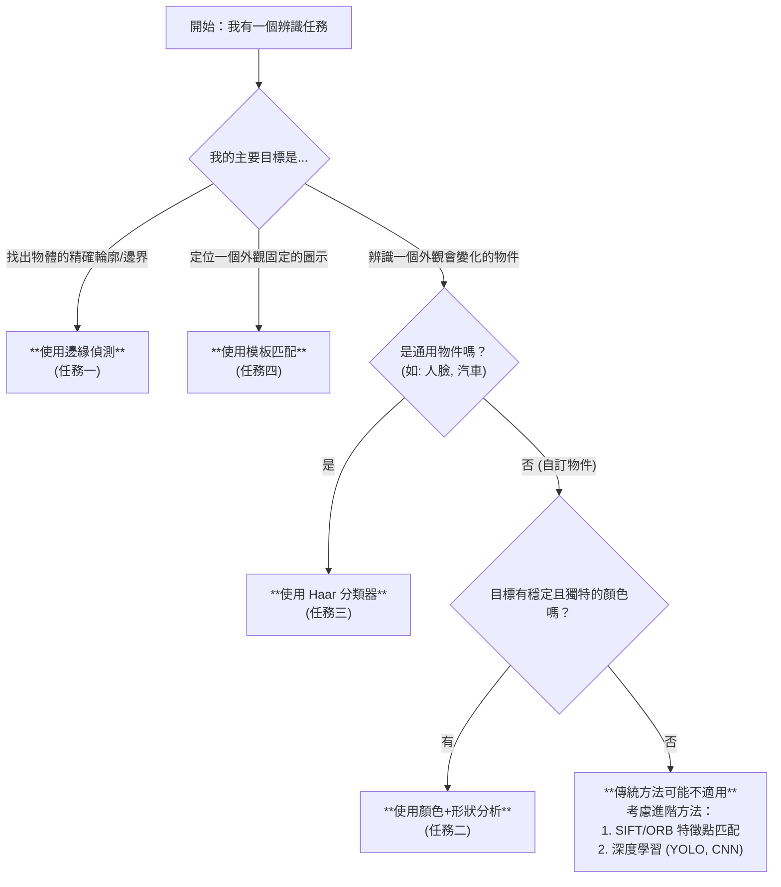

<!-- Path: General_python/openCV/影像辨識-傳統方法 | Timestamp: 2025-10-07 12:00:00 | Version: b07 -->
# 課程總結：傳統影像辨識的回顧與展望

恭喜你完成了四項核心的傳統電腦視覺辨識任務！這份文件旨在幫助你整合所學，建立一個更高層次的理解框架。你將能根據問題選擇最適合的工具，並理解為何需要學習更進階的深度學習方法。

---

## 🎯 四大核心任務目標總結

這四個練習分別代表了傳統電腦視覺中四種極具代表性的解題思路，構成了一個從基礎到應用的完整學習路徑。

### 1. **任務一：物體輪廓描繪 (Canny 邊緣偵測)**
-   **核心技術**：**邊緣偵測 (Edge Detection)**
-   **思維模型**：像是一位**素描畫家**，只用線條快速勾勒出物體的形狀，忽略其色彩與光影細節。

### 2. **任務二：紅綠燈辨識系統**
-   **核心技術**：**顏色分割 (HSV) + 形狀分析 (Contour)**
-   **思維模型**：像是在用一個「**特定顏色的篩子**」過濾圖片，然後再用「**特定形狀的模具**」檢查篩出來的東西是否合格。

### 3. **任務三：智慧型隱私保護系統**
-   **核心技術**：**特徵分類器 (Haar Cascades) + 階層式偵測 (ROI)**
-   **思維模型**：像是聘請了一位受過專業訓練的「**偵探**」（Haar 分類器），他知道人臉的通用特徵，然後派他去圖片中找出所有符合特徵的嫌疑人。

### 4. **任務四：遊戲道具定位系統**
-   **核心技術**：**模板匹配 (Template Matching)**
-   **思維模型**：像是在玩「**大家來找碴**」，拿著一張小小的「樣本照片」（模板），在整張大圖上逐一比對，找出長得一模一樣的地方。

---

## 🧠 核心技術比較與選擇策略 (後設認知)

當你未來遇到一個新的影像辨識問題時，可以參考下表來決定哪種方法是最佳的起點。

| 技術方法 | 核心原理 | 優點 | 缺點 | 適用情境 |
| :--- | :--- | :--- | :--- | :--- |
| **邊緣偵測 (Canny)** | 計算像素梯度的變化，找出影像中強度急遽變化的點（邊緣）。 | - 對光線變化不敏感 - **速度快** - 能有效凸顯物體結構 | - 對雜訊敏感 - 只產生線段而非封閉輪廓 - **無法辨識物體類別** | - 物體計數（前處理） - 影像分割 - 工業瑕疵檢測（如裂縫） |
| **顏色 + 形狀** | 基於像素的顏色值和物體的幾何特徵進行篩選。 | - **速度極快** - 直觀易懂 - 不需訓練，參數可調 | - 對光線、陰影、顏色變化**非常敏感** - 對形狀不規則的物體效果差 - 背景顏色不能與目標太相似 | - **工業應用**：產線上的特定顏色零件檢測 - **交通**：紅綠燈、車道線辨識 - **農業**：水果成熟度判斷 |
| **Haar 分類器** | 使用大量正負樣本訓練出的級聯分類器，檢測物體的結構特徵。 | - 對光線、角度有**一定容忍度** - 對於人臉等通用物件效果好 - 速度較快 | - 訓練自訂分類器**非常耗時** - 對於非剛性物體（如手勢）效果差 - 容易產生誤判，需仔細調參 | - **人臉偵測** - **行人、車輛偵測** - 其他具有固定結構特徵的物體（眼睛、貓臉等） |
| **模板匹配** | 在大圖上滑動一個小模板，計算每個位置的像素相似度。 | - **精確度極高**（像素級） - **簡單快速** - 不需訓練 | - 對**旋轉、縮放、變形**完全沒有抵抗力 - 對遮擋、光線變化敏感 | - **UI 自動化**：定位按鈕、圖示 - **遊戲外掛**：尋找遊戲中的固定圖示、道具 - **品管**：檢查產品上的 Logo 是否印刷正確 |

### 決策流程圖

---

## ⚖️ 傳統方法的優勢與侷限

在你掌握了這些強大的工具後，進行一次整體的優劣勢分析是至關重要的。這能幫助你理解為何在某些情境下傳統方法是最佳解，而在另一些情境下我們必須尋求新的典範。

### 優點 (Pros)

1.  **高效能與低資源消耗**：傳統演算法通常計算量較小，執行速度快，對 CPU 友好，不需要昂貴的 GPU 也能達到即時處理。
2.  **無需大量訓練資料**：除了 Haar 分類器需要預先訓練（但我們通常使用現成的），其他方法幾乎不需要資料集，可以直接應用。
3.  **高度可詮釋性 (White Box)**：演算法的每一步都是明確且可解釋的。如果辨識失敗，你可以輕易地追溯到是哪個環節出了問題（例如：HSV 範圍太窄、面積閾值太高、模板不匹配）。
4.  **適用於特定且受控的環境**：在工業自動化、產線檢測等場景，由於光照、角度、物體外觀都相對固定，傳統方法往往能以最低成本達到極高的穩定性與準確度。

### 缺點 (Cons)

1.  **穩定性與適應性不足**：這是傳統方法最大的罩門。它們對**光線變化、旋轉、縮放、視角改變、遮擋**等真實世界中的變因非常敏感，一個微小的改變就可能導致整個辨識流程失效。
2.  **手動特徵工程 (Manual Feature Engineering)**：你需要**親自告訴**演算法要找什麼特徵。例如，你必須手動定義「紅色」的 HSV 範圍，或是提供一個「完美」的模板。這使得方法難以泛化到新的、未知的物體上。
3.  **難以應對複雜類別**：傳統方法很難定義一個具有普適性的「貓」的特徵，因為貓有各種姿態、品種和顏色。對於類內差異大的物體，傳統方法幾乎無能為力。

---

## 🚀 銜接深度學習：為何需要新典範？

### 一個重要的區分：傳統方法 vs. OpenCV 函式庫

在進入深度學習之前，釐清一個重要觀念至關重要：我們所討論的「穩定性與適應性不足」，是**針對傳統影像辨識「方法」**，而非 **OpenCV 這個「函式庫」**。

您可以將 OpenCV 想像成一個**功能極其豐富的專業工具箱**：
-   **傳統方法**：就像是工具箱裡的**手動精밀工具**（扳手、螺絲起子）。當問題的規格固定時（螺絲尺寸已知），它們精準、快速且可靠。但一支 10mm 的扳手無法處理 12mm 的螺帽，這就是適應性不足。
-   **深度學習**：就像是工具箱裡的**全自動智慧電動工具**。它更笨重、更耗電（需要 GPU），但能自動適應各種尺寸和類型的螺絲，處理複雜多變的任務。

**OpenCV 這個工具箱本身極具彈性**，它不僅提供了所有傳統的手動工具，現代的 OpenCV（透過其 `dnn` 模組）也**完全支援**讓您使用深度學習這個強大的電動工具。問題不在於工具箱，而在於我們根據任務需求，選擇拿出哪一種工具。

### 從手動到自動：電腦視覺的思維轉變

正是因為傳統方法的上述侷限性，尤其是**穩定性與適應性不足**和**手動特徵工程**的瓶頸，驅使了電腦視覺領域朝向深度學習發展。深度學習不僅僅是另一種工具，它是一種根本性的**思維轉變**。

| 特性 | 傳統電腦視覺 (OpenCV) | 深度學習 (Deep Learning) |
| :--- | :--- | :--- |
| **特徵工程** | **手動 (Manual)** 由人類專家設計規則 (如顏色範圍、邊緣梯度) | **自動 (Automatic)** 模型從大量資料中**自動學習**最有效的特徵 |
| **資料需求** | 較少，甚至不需要 | **龐大** 需要成千上萬張標註好的圖片進行訓練 |
| **泛化能力** | **差** 為特定任務設計的演算法很難應用到新任務 | **強** 訓練好的模型能舉一反三，應對各種變化 |
| **穩定性／適應性** | **低** 對光線、角度、縮放等變化敏感 | **高** 能有效應對真實世界中的各種干擾 |
| **計算成本** | **低** (CPU-friendly) | **高** (通常需要 GPU 加速) |
| **可詮釋性** | **高 (白箱)** 決策過程清晰可見 | **低 (黑箱)** 難以直觀解釋模型為何做出某個判斷 |
| **適用情境** | 受控環境、定義清晰的簡單任務 | 複雜、多變的真實世界場景、大規模分類任務 |

### 總結

傳統方法讓你深刻理解了影像辨識的**基本邏輯與挑戰**——如何從像素中提取有意義的資訊。這段學習經驗是無價的，它讓你明白了為何「讓電腦看懂世界」如此困難。

現在，你可以將深度學習視為解決這些挑戰的**更強大、更通用的解決方案**。它將「如何定義特徵」這個最困難的任務交給了機器自己，讓我們得以專注於更高層次的應用與創新。有了傳統方法的基礎，你會更清晰地認識到深度學習的威力所在，以及它所要解決的真正問題。
