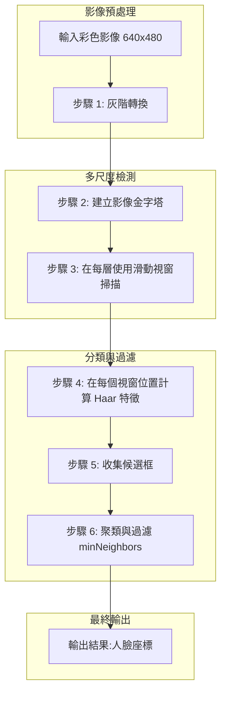
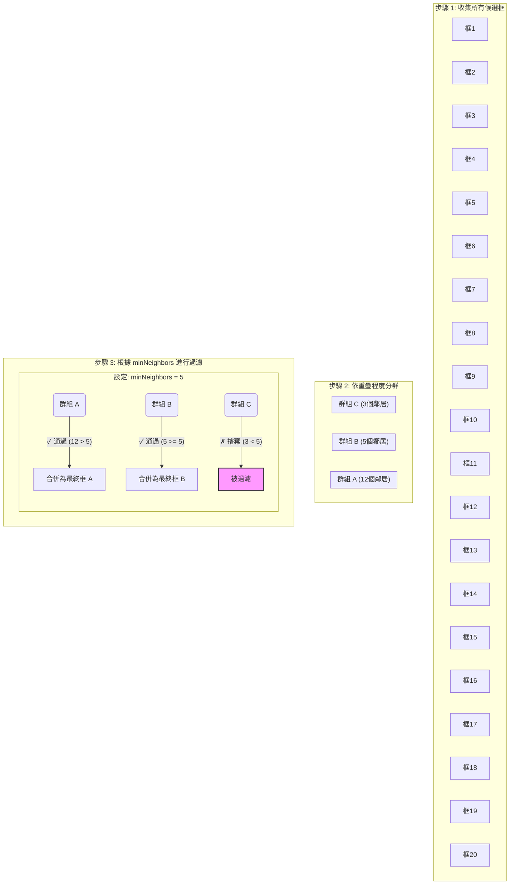

<!-- Path: General_python/openCV/影像辨識-傳統方法/opencv_img_classfied | Timestamp: 2025-11-01 16:40:00 | Version: b08 -->
# OpenCV 物件偵測原理:從 Haar Cascade 到影像金字塔

> 本文件整合了 Haar Cascade 的理論深度與影像金字塔的視覺化解釋,提供一份完整的 OpenCV 物件偵測學習指南。

---

### 🎯 核心概念摘要 (TL;DR)

*   **核心思想：** 透過「快速拒絕」策略，用一連串簡單到複雜的檢查關卡，快速篩掉不可能是人臉的區域。
*   **關鍵技術：**
    1.  **Haar 特徵：** 簡單的黑白矩形，用來捕捉人臉的明暗模式（如眼睛比臉頰暗）。
    2.  **積分圖：** 一種數學技巧，讓特徵計算速度提升千倍，是即時偵測的關鍵。
    3.  **影像金字塔：** 縮放影像而非偵測器，用「固定大小的尺」去量「不同大小的照片」，實現多尺寸偵測。
*   **重要參數：**
    *   `scaleFactor`: 控制搜尋的精細度與速度。
    *   `minNeighbors`: 控制結果的可信度，用於過濾雜訊。
    *   `minSize`: 決定要找的最小目標，是效能優化的主要手段。

### 🗺️ 學習路徑建議

*   **快速入門者：** 請閱讀 **[整體流程概覽](#-整體流程概覽)**、**[參數詳解](#-參數詳解detectmultiscale)** 和 **[參數調校策略](#-參數調校策略)**，即可開始動手實作與調校。
*   **深入理論者：** 請依序閱讀 **[基礎理論](#-基礎理論haar-cascade)** 和 **[核心機制](#-核心機制影像金字塔與滑動視窗)**，以徹底理解底層原理。
*   **實戰開發者：** 請直接參考 **[完整程式碼範例](#-完整程式碼範例)**，並對照 **[效能優化指南](#-效能優化指南)** 進行調整。

---

## 📚 目錄

1. [整體流程概覽](#-整體流程概覽)
2. [基礎理論:Haar Cascade](#-基礎理論haar-cascade)
3. [核心機制:影像金字塔與滑動視窗](#-核心機制影像金字塔與滑動視窗)
4. [參數詳解:detectMultiScale](#-參數詳解detectmultiscale)
5. [計算原理與複雜度分析](#-計算原理與複雜度分析)
6. [參數調校策略](#-參數調校策略)
7. [實際應用場景](#-實際應用場景)
8. [效能優化指南](#-效能優化指南)
9. [時代背景、優點與侷限性](#-時代背景優點與侷限性)
10. [完整程式碼範例](#-完整程式碼範例)

---

## 🎯 整體流程概覽

從輸入影像到最終檢測結果的完整影像辨識流程如下圖所示:



### 流程步驟詳解

**步驟 1:灰階轉換**
- 將彩色影像轉換為灰階影像
- 原因:Haar 特徵主要依賴亮度變化,顏色資訊對檢測影響不大
- 效益:計算量減少為原本的 1/3,處理速度顯著提升

**步驟 2:建立影像金字塔**
- 將原始影像縮放成不同尺寸的影像序列
- 目的:透過固定大小的檢測器在不同層級檢測,達到多尺度檢測效果
- 比喻:就像用同一把尺在不同大小的照片上測量,等同於用不同大小的尺在同一張照片上測量

**步驟 3:滑動視窗掃描**
- 在每一層金字塔影像上,固定大小的視窗從左到右、從上到下移動
- 視窗大小:通常為 24×24 像素
- 移動步長:通常為 1 像素

**步驟 4:計算 Haar 特徵**
- 在每個視窗位置計算 Haar 特徵值
- 特徵類型:邊緣、線條、中心對稱等
- 這些特徵能捕捉人臉的關鍵特性(如眼睛、鼻樑、嘴巴)

**步驟 5:收集候選框**
- 通過級聯分類器的視窗被標記為候選框
- 候選框特性:可能包含真實物體,也可能是誤報

**步驟 6:聚類與過濾**
- 使用 `minNeighbors` 參數過濾孤立的候選框
- 將重疊的候選框群組合併成最終檢測結果
- 目的:減少誤報,提高檢測精確度

**最終輸出**
- 格式:`(x, y, width, height)` 座標與尺寸
- 用途:在原始影像上繪製檢測框

---

## 🎓 基礎理論:Haar Cascade

### 📖 Haar Cascade 檢測原理

Haar Cascade 是一種基於機器學習的物體檢測方法,由 Paul Viola 和 Michael Jones 於 2001 年提出。其核心思想是「串聯式快速排除」:在早期階段快速過濾掉不可能的區域,從而顯著提升檢測速度。

#### 核心技術流程

```
Haar 特徵 → 積分圖 → 級聯分類器 → 滑動視窗 → 多尺度檢測
```

---

### 1️⃣ Haar 特徵 (Haar-like Features)

**定義**

Haar 特徵是簡單的矩形特徵,由兩個或多個相鄰矩形組成。特徵值計算公式:

```
特徵值 = Σ(白色區域像素值) - Σ(黑色區域像素值)
```

**基本類型**

```
邊緣特徵          線條特徵          中心特徵
┌─────┬─────┐    ┌──────────┐    ┌────┬────┬────┐
│ 白區 │ 黑區 │    │   黑區    │    │白區│黑區│白區│
├─────┼─────┤    ├──────────┤    ├────┼────┼────┤
│ 白區 │ 黑區 │    │   白區    │    │白區│黑區│白區│
└─────┴─────┘    └──────────┘    └────┴────┴────┘
```

**人臉檢測應用**

- **眼睛區域**:眼睛比額頭和臉頰暗 → 水平「亮-暗」邊緣特徵
- **鼻樑**:鼻樑比兩側亮 → 垂直「暗-亮-暗」線條特徵

**真實人臉特徵響應示意**

```
原始人臉:
    ┌─────────────┐
    │ ███████████ │  ← 深色頭髮
    │ ░░░░░░░░░░░ │  ← 亮色額頭
    │  ●●     ●●  │  ← 深色眼睛
    │ ░░░░░░░░░░░ │  ← 亮色臉頰
    │   ░░░░░░░   │  ← 亮色鼻子
    │  ░ ───── ░  │  ← 深色嘴巴
    │ ░░░░░░░░░░░ │  ← 亮色下巴
    └─────────────┘

特徵 1: 眼睛區域檢測
┌─────────────┐
│ ░░░░░░░░░░░ │ ← 額頭(亮)
├─────────────┤
│ ▓▓▓▓▓▓▓▓▓▓▓ │ ← 眼睛(暗)✓ 強特徵
└─────────────┘
特徵值:Σ(額頭) - Σ(眼睛) = 高正值

特徵 2: 眼睛對稱性檢測
┌────┬────┬────┐
│眼睛│鼻子│眼睛│ ✓ 強特徵
│ ░░ │ ▓▓ │ ░░ │
└────┴────┴────┘
特徵值:Σ(左右) - Σ(中間) = 正值
```

---

### 2️⃣ 積分圖 (Integral Image)

**目的**

以 O(1) 時間複雜度快速計算任意矩形區域的像素和,大幅加速 Haar 特徵計算。

**定義**

積分圖中 `ii(x, y)` 的值是原始影像左上角 `(0, 0)` 到 `(x, y)` 位置所有像素值的累加總和。

```
ii(x, y) = Σ(i≤x, j≤y) image(i, j)
```

---

### 📐 積分圖建立過程:累加方向與順序

積分圖的建立需要按照特定的方向和順序進行累加,以確保每個位置的值都包含了其左上角所有像素的總和。

#### 累加方向與順序

```
積分圖累加方向:從左到右、從上到下
═══════════════════════════════════════════════════════════════════════

掃描順序:
┌──────┬──────┬──────┬──────┐
│  ①   │  ②   │  ③   │  ④   │ ← 第 1 列:從左到右
├──────┼──────┼──────┼──────┤
│  ⑤   │  ⑥   │  ⑦   │  ⑧   │ ← 第 2 列:從左到右
├──────┼──────┼──────┼──────┤
│  ⑨   │  ⑩   │  ⑪   │  ⑫   │ ← 第 3 列:從左到右
├──────┼──────┼──────┼──────┤
│  ⑬   │  ⑭   │  ⑮   │  ⑯   │ ← 第 4 列:從左到右
└──────┴──────┴──────┴──────┘

累加規則:
每個位置的積分圖值 = 當前像素值 + 左側積分值 + 上方積分值 - 左上角積分值
                    (避免重複累加)
```

#### 遞推計算公式

```
ii(x, y) = image(x, y) + ii(x-1, y) + ii(x, y-1) - ii(x-1, y-1)
           └─────┬─────┘   └───┬───┘   └───┬───┘   └──────┬──────┘
            當前像素值      左側累加值   上方累加值   左上角累加值
                                                    (被加了兩次,需扣除)
```

#### 視覺化說明:為什麼需要減去左上角

```
計算位置 (x, y) 的積分圖值
═══════════════════════════════════════════════════════════════════════

     0   1   2   ...  x-1   x
   ┌───┬───┬───┬───┬─────┬───┐
 0 │   │   │   │   │     │   │
   ├───┼───┼───┼───┼─────┼───┤
 1 │   │ A │ ● │ ● │ ●B  │   │  A = ii(x-1, y-1) 左上角區域
   ├───┼───┼───┼───┼─────┼───┤
 2 │   │ ● │ ● │ ● │ ●   │   │  B = ii(x, y-1)   上方區域
   ├───┼───┼───┼───┼─────┼───┤
...│   │ ● │ ● │ ● │ ●   │   │  C = ii(x-1, y)   左側區域
   ├───┼───┼───┼───┼─────┼───┤
y-1│   │ ● │ ● │ ● │ ●   │   │
   ├───┼───┼───┼───┼─────┼───┤
 y │   │ C │ ● │ ● │ P   │   │  P = image(x, y)  當前像素
   └───┴───┴───┴───┴─────┴───┘

計算過程:
1. ii(x-1, y)   包含了區域 A + 左側部分
2. ii(x, y-1)   包含了區域 A + 上方部分
3. 相加時,區域 A 被計算了兩次
4. 因此需要減去 ii(x-1, y-1) 來修正

最終公式:
ii(x, y) = image(x, y) + ii(x-1, y) + ii(x, y-1) - ii(x-1, y-1)
```

---

### 🔢 積分圖逐步計算實例

以下使用 4×4 影像詳細展示積分圖的建立過程。

#### 原始影像

```
原始影像(4×4):
     列 0   列 1   列 2   列 3
   ┌──────┬──────┬──────┬──────┐
列0 │  5   │  2   │  3   │  4   │
   ├──────┼──────┼──────┼──────┤
列1 │  1   │  3   │  2   │  1   │
   ├──────┼──────┼──────┼──────┤
列2 │  2   │  1   │  4   │  3   │
   ├──────┼──────┼──────┼──────┤
列3 │  3   │  2   │  1   │  2   │
   └──────┴──────┴──────┴──────┘
```

#### 逐步計算過程

```
步驟 1: 計算第 0 列
═══════════════════════════════════════════════════════════════════════
位置 (0,0): ii(0,0) = 5
           = image(0,0) + 0 + 0 - 0
           = 5

位置 (1,0): ii(1,0) = 2 + 5 = 7
           = image(1,0) + ii(0,0) + 0 - 0
           = 2 + 5 = 7

位置 (2,0): ii(2,0) = 3 + 7 = 10
           = image(2,0) + ii(1,0) + 0 - 0
           = 3 + 7 = 10

位置 (3,0): ii(3,0) = 4 + 10 = 14
           = image(3,0) + ii(2,0) + 0 - 0
           = 4 + 10 = 14

第 0 列結果:
   ┌──────┬──────┬──────┬──────┐
列0 │  5   │  7   │  10  │  14  │ ← 第一列水平累加
   └──────┴──────┴──────┴──────┘


步驟 2: 計算第 1 列
═══════════════════════════════════════════════════════════════════════
位置 (0,1): ii(0,1) = 1 + 5 = 6
           = image(0,1) + 0 + ii(0,0) - 0
           = 1 + 5 = 6

位置 (1,1): ii(1,1) = 3 + 5 + 7 - 5 = 11
           = image(1,1) + ii(0,1) + ii(1,0) - ii(0,0)
           = 3 + 6 + 7 - 5 = 11

           視覺化:
           ┌─────┬─────┐
           │  5  │  7  │ ii(0,0)=5, ii(1,0)=7
           ├─────┼─────┤
           │  6  │ [11]│ ii(0,1)=6, ii(1,1)=?
           └─────┴─────┘
           = 當前像素(3) + 左側(6) + 上方(7) - 左上(5)
           = 3 + 6 + 7 - 5 = 11

位置 (2,1): ii(2,1) = 2 + 11 + 10 - 7 = 16
           = image(2,1) + ii(1,1) + ii(2,0) - ii(1,0)
           = 2 + 11 + 10 - 7 = 16

位置 (3,1): ii(3,1) = 1 + 16 + 14 - 10 = 21
           = image(3,1) + ii(2,1) + ii(3,0) - ii(2,0)
           = 1 + 16 + 14 - 10 = 21

目前結果:
   ┌──────┬──────┬──────┬──────┐
列0 │  5   │  7   │  10  │  14  │
   ├──────┼──────┼──────┼──────┤
列1 │  6   │  11  │  16  │  21  │
   └──────┴──────┴──────┴──────┘


步驟 3: 計算第 2 列
═══════════════════════════════════════════════════════════════════════
位置 (0,2): ii(0,2) = 2 + 6 = 8

位置 (1,2): ii(1,2) = 1 + 8 + 11 - 6 = 14

位置 (2,2): ii(2,2) = 4 + 14 + 16 - 11 = 23

           視覺化完整區域:
           ┌─────┬─────┬─────┐
           │  5  │  7  │ 10  │
           ├─────┼─────┼─────┤
           │  6  │ 11  │ 16  │
           ├─────┼─────┼─────┤
           │  8  │ 14  │[23] │
           └─────┴─────┴─────┘
           23 包含了從(0,0)到(2,2)的所有9個像素的總和
           = 5+2+3+1+3+2+2+1+4 = 23 ✓

位置 (3,2): ii(3,2) = 3 + 23 + 21 - 16 = 31

目前結果:
   ┌──────┬──────┬──────┬──────┐
列0 │  5   │  7   │  10  │  14  │
   ├──────┼──────┼──────┼──────┤
列1 │  6   │  11  │  16  │  21  │
   ├──────┼──────┼──────┼──────┤
列2 │  8   │  14  │  23  │  31  │
   └──────┴──────┴──────┴──────┘


步驟 4: 計算第 3 列(最後一列)
═══════════════════════════════════════════════════════════════════════
位置 (0,3): ii(0,3) = 3 + 8 = 11

位置 (1,3): ii(1,3) = 2 + 11 + 14 - 8 = 19

位置 (2,3): ii(2,3) = 1 + 19 + 23 - 14 = 29

位置 (3,3): ii(3,3) = 2 + 29 + 31 - 23 = 39

           這是整個影像所有像素的總和
           驗證: 5+2+3+4+1+3+2+1+2+1+4+3+3+2+1+2 = 39 ✓
```

#### 最終積分圖

```
積分圖(累加結果):
     列 0   列 1   列 2   列 3
   ┌──────┬──────┬──────┬──────┐
列0 │  5   │  7   │  10  │  14  │ ← 第一列累加
   ├──────┼──────┼──────┼──────┤
列1 │  6   │  11  │  16  │  21  │ ← 加上前面的總和
   ├──────┼──────┼──────┼──────┤
列2 │  8   │  14  │  23  │  31  │
   ├──────┼──────┼──────┼──────┤
列3 │  11  │  19  │  29  │  39  │ ← 右下角 = 全部像素總和
   └──────┴──────┴──────┴──────┘

每個位置的意義:
- ii(0,0) = 5   → 從(0,0)到(0,0)的總和 = 5
- ii(1,1) = 11  → 從(0,0)到(1,1)的總和 = 5+2+1+3 = 11
- ii(2,2) = 23  → 從(0,0)到(2,2)的總和 = 5+2+3+1+3+2+2+1+4 = 23
- ii(3,3) = 39  → 整個影像的總和
```

---

### 🎯 使用積分圖快速計算矩形區域和

建立積分圖後,任意矩形區域的像素和可以透過 4 次查表和 3 次加減運算完成。

#### 矩形區域和計算公式

```
矩形區域示意:
     0   1   2   3
   ┌───┬───┬───┬───┐
 0 │   │   │   │   │
   ├───┼───┼───┼───┤
 1 │   │ A─────B   │  A = ii(0, 0) = 5
   │   │ │ 矩形│   │  B = ii(2, 0) = 10
   ├───┼───┼───┼───┤  C = ii(0, 2) = 8
 2 │   │ C─────D   │  D = ii(2, 2) = 23
   │   │       │   │
   └───┴───┴───┴───┘

矩形區域和 = ii(D) - ii(B) - ii(C) + ii(A)
          = 23 - 10 - 8 + 5
          = 10

驗證(查原始影像):
矩形區域(從列1到列2,從行0到行2)的像素:
列1: 1 + 3 + 2 = 6
列2: 2 + 1 + 4 = 7
總和: 6 + 7 = 13... ✗ 錯誤!

修正理解:矩形應該是從(1,1)到(2,2)
     0   1   2   3
   ┌───┬───┬───┬───┐
 0 │   │   │   │   │
   ├───┼───┼───┼───┤
 1 │   │[3] [2] │   │  矩形區域
   ├───┼───┼───┼───┤
 2 │   │[1] [4] │   │
   │   │       │   │
   └───┴───┴───┴───┘

正確計算:
A = ii(0, 0) = 5
B = ii(2, 0) = 10
C = ii(0, 2) = 8
D = ii(2, 2) = 23

矩形和 = D - B - C + A = 23 - 10 - 8 + 5 = 10
驗證: 3 + 2 + 1 + 4 = 10 ✓
```

#### 為什麼這個公式有效

```
視覺化理解:
═══════════════════════════════════════════════════════════════════════

D(23) 包含的區域:          B(10) 包含的區域:
┌─────────────┐            ┌─────────────┐
│ 整個左上區塊│            │  B區域      │
│ (0,0)-(2,2) │            │ (0,0)-(2,0) │
│             │            └─────────────┘
│   包含目標   │
│   矩形區域   │            C(8) 包含的區域:
└─────────────┘            ┌───────┐
                           │ C區域 │
A(5) 包含的區域:           │(0,0)- │
┌───┐                      │(0,2)  │
│ A │                      └───────┘
└───┘

計算過程:
1. D 包含了整個左上區塊
2. 減去 B,移除了上方多餘的部分
3. 減去 C,移除了左側多餘的部分
4. 但 A 區域被減了兩次(在 B 和 C 中都包含),需加回來一次

最終: D - B - C + A = 目標矩形區域的像素和
```

---

### 🚀 積分圖的關鍵優勢

**時間複雜度對比**

```
傳統方法計算矩形區域和:
- 需要遍歷矩形內所有像素
- 時間複雜度: O(寬度 × 高度)
- 例如 100×100 的矩形需要 10,000 次加法

使用積分圖:
- 只需 4 次查表 + 3 次加減運算
- 時間複雜度: O(1) 常數時間
- 無論矩形大小,都是 7 次運算

加速比例:
- 對於 100×100 矩形: 加速 10,000 / 7 ≈ 1,428 倍
- 對於 Haar Cascade 需要計算數百萬個矩形特徵的場景:
  這是使檢測達到即時效能的關鍵
```

**生活化比喻**

```
積分圖就像是「帳本的累計餘額」:

傳統方法(暴力計算):
├─ 想知道第 5 天到第 15 天的總支出
├─ 需要把這 10 天的帳目逐筆相加
└─ 10 筆資料 → 需要加 9 次

積分圖方法(累計餘額):
├─ 帳本記錄的是「累計支出」
├─ 第 15 天的累計 - 第 4 天的累計 = 第 5-15 天的總和
└─ 只需要 1 次減法

當需要頻繁查詢不同時間段的總和時:
├─ 傳統方法: 每次都要重新加總(慢)
└─ 積分圖: 瞬間查表計算(快)
```

---

### 💻 積分圖實作程式碼

```python
import numpy as np

def compute_integral_image(image):
    """
    建立積分圖

    Args:
        image: 原始影像(灰階)

    Returns:
        積分圖(與原始影像相同尺寸)
    """
    height, width = image.shape
    integral = np.zeros((height, width), dtype=np.int64)

    # 計算第一列(只需水平累加)
    integral[0, 0] = image[0, 0]
    for x in range(1, width):
        integral[0, x] = integral[0, x-1] + image[0, x]

    # 計算第一行(只需垂直累加)
    for y in range(1, height):
        integral[y, 0] = integral[y-1, 0] + image[y, 0]

    # 計算其餘位置(使用完整公式)
    for y in range(1, height):
        for x in range(1, width):
            integral[y, x] = (
                image[y, x] +           # 當前像素
                integral[y-1, x] +      # 上方累加值
                integral[y, x-1] -      # 左側累加值
                integral[y-1, x-1]      # 左上角(避免重複)
            )

    return integral

def rect_sum(integral, x1, y1, x2, y2):
    """
    使用積分圖計算矩形區域和 O(1)

    Args:
        integral: 積分圖
        x1, y1: 矩形左上角座標
        x2, y2: 矩形右下角座標

    Returns:
        矩形區域的像素總和
    """
    # 處理邊界情況
    A = integral[y1-1, x1-1] if y1 > 0 and x1 > 0 else 0
    B = integral[y1-1, x2] if y1 > 0 else 0
    C = integral[y2, x1-1] if x1 > 0 else 0
    D = integral[y2, x2]

    return D - B - C + A

# 範例使用
if __name__ == '__main__':
    # 建立測試影像
    image = np.array([
        [5, 2, 3, 4],
        [1, 3, 2, 1],
        [2, 1, 4, 3],
        [3, 2, 1, 2]
    ], dtype=np.uint8)

    # 建立積分圖
    integral = compute_integral_image(image)
    print("積分圖:")
    print(integral)

    # 計算矩形區域和(從 (1,1) 到 (2,2))
    rect_sum_value = rect_sum(integral, 1, 1, 2, 2)
    print(f"
矩形 (1,1)-(2,2) 的像素和: {rect_sum_value}")

    # 驗證
    manual_sum = image[1:3, 1:3].sum()
    print(f"手動計算驗證: {manual_sum}")
    print(f"結果一致: {rect_sum_value == manual_sum}")
```

---

### 3️⃣ 級聯分類器 (Cascade Classifier)

**結構設計**

將數千個 Haar 特徵透過 AdaBoost 演算法訓練並組合成多個階段 (stages),形成級聯結構。

**工作原理**

檢測視窗必須「通過所有階段」才能被判定為目標物體。任一階段失敗,立即拒絕,無需後續計算。

**級聯架構示意(人臉檢測)**

```
輸入:一個 24×24 的檢測窗口
│
├─► 階段 1 (簡單特徵,如邊緣)
│   └─ 快速拒絕約 50% 的非人臉區域 (天空、牆壁等)
│
│   ✓ 通過 (剩下 50%) ──────────┐
│   ✗ 拒絕 (50%) ──► ❌ 非人臉    │
│                                 │
├─► 階段 2 (稍複雜特徵) ◄────────┘
│   └─ 在剩餘區域中再拒絕約 70%
│
│   ✓ 通過 (剩下 15%) ──────────┐
│   ✗ 拒絕 (35%) ──► ❌ 非人臉    │
│                                 │
│            ...                  │
│                                 │
├─► 最終階段 (最複雜的特徵) ◄────┘
│   └─ 進行最終的精確判斷
│
│   ✓ 通過 (最終 <1%) ─────────┐
│   ✗ 拒絕 ──► ❌ 非人臉         │
│                                 │
└─► ✓ 確定是人臉候選框 ◄─────────┘
```

**加速效果**

- 大部分非目標區域在早期階段(1-3 階段)就被過濾
- 平均每個視窗只需計算 10-20 個特徵(而非全部數千個)
- 相比暴力計算所有特徵,速度提升 **100 倍以上**

---

## 🏔️ 核心機制:影像金字塔與滑動視窗

### 影像金字塔 (Image Pyramid)

**面臨的問題**

檢測器大小固定(如 24×24 像素),但影像中物體大小各異。

**解決方案**

保持檢測器大小不變,將原始影像縮放成多個不同尺寸的影像,形成「影像金字塔」。

**工作原理**

在金字塔的每一層使用固定大小的檢測器,等同於在原始影像上用不同大小的檢測器進行檢測。

---

### 🗼 影像金字塔視覺化圖示

#### 完整的金字塔結構(scaleFactor=1.2, minSize=30)

```
影像金字塔 (Image Pyramid) - 由大到小逐層縮放
═══════════════════════════════════════════════════════════════════════

                    ┌─ 固定大小的檢測器 [24×24] 在每一層掃描
                    │
層級 0              ▼
640×480     ┌─────────────────────────────────────┐
(原始)      │░░░░░░░░░░░░░░░░░░░░░░░░░░░░░░░░░░░░░│ [24×24]
            │░░░░░░░░░░░░░░░░░░░░░░░░░░░░░░░░░░░░░│ 檢測器
            │░░░░░░░░░░░░░░░░░░░░░░░░░░░░░░░░░░░░░│
            │░░░░░░░░░░░░░░░░░░░░░░░░░░░░░░░░░░░░░│ → 映射回原圖:
            │░░░░░░░░░░░░░░░░░░░░░░░░░░░░░░░░░░░░░│   可檢測 24×24
            └─────────────────────────────────────┘   的物體
                           │
                           │ ÷ 1.2 (scaleFactor)
                           ▼
層級 1
533×400      ┌──────────────────────────────────┐
             │▒▒▒▒▒▒▒▒▒▒▒▒▒▒▒▒▒▒▒▒▒▒▒▒▒▒▒▒▒▒▒▒▒▒│ [24×24]
             │▒▒▒▒▒▒▒▒▒▒▒▒▒▒▒▒▒▒▒▒▒▒▒▒▒▒▒▒▒▒▒▒▒▒│ 檢測器
             │▒▒▒▒▒▒▒▒▒▒▒▒▒▒▒▒▒▒▒▒▒▒▒▒▒▒▒▒▒▒▒▒▒▒│
             │▒▒▒▒▒▒▒▒▒▒▒▒▒▒▒▒▒▒▒▒▒▒▒▒▒▒▒▒▒▒▒▒▒▒│ → 映射回原圖:
             └──────────────────────────────────┘   可檢測 29×29
                           │                         的物體
                           │ ÷ 1.2
                           ▼
層級 2
444×333       ┌───────────────────────────────┐
              │▓▓▓▓▓▓▓▓▓▓▓▓▓▓▓▓▓▓▓▓▓▓▓▓▓▓▓▓▓▓▓│ [24×24]
              │▓▓▓▓▓▓▓▓▓▓▓▓▓▓▓▓▓▓▓▓▓▓▓▓▓▓▓▓▓▓▓│ 檢測器
              │▓▓▓▓▓▓▓▓▓▓▓▓▓▓▓▓▓▓▓▓▓▓▓▓▓▓▓▓▓▓▓│
              └───────────────────────────────┘ → 映射回原圖:
                           │                      可檢測 35×35
                           │ ÷ 1.2                的物體
                           ▼
層級 3
370×278        ┌────────────────────────────┐
               │████████████████████████████│ [24×24]
               │████████████████████████████│ 檢測器
               └────────────────────────────┘
                           │                 → 映射回原圖:
                           │ ÷ 1.2             可檢測 41×41
                           ▼                   的物體

                          ...
                    (持續縮放)
                          ...

層級 15
80×60           ┌──────────┐
                │██████████│ [24×24]         → 映射回原圖:
                └──────────┘                   可檢測 348×348
                     │                         的物體
                     │ ÷ 1.2
                     ▼
層級 16
67×50            ┌────────┐
                 │████████│ [24×24]          → 映射回原圖:
                 └────────┘                    可檢測 418×418
                     │                         的物體
                     │ ÷ 1.2
                     ▼
層級 17 ⚠️
56×42            ┌──────┐
                 │██████│ ✗ 停止!            minSize=(30,30)
                 └──────┘                      限制達到
                          56 < 60 或 42 < 60

═══════════════════════════════════════════════════════════════════════
總層數:17 層
掃描總次數:約 2,100,000 次(所有層級的滑動視窗總和)
═══════════════════════════════════════════════════════════════════════
```

---

### 📐 影像金字塔的建立過程與參數關係

影像金字塔的建立過程直接受到 `scaleFactor` 和 `minSize` 兩個參數的控制。

#### 建立規則

```
當前層尺寸 = 上一層尺寸 ÷ scaleFactor
持續建立直到:當前層尺寸 < minSize
```

#### 參數關係視覺化

```
參數如何控制金字塔
═══════════════════════════════════════════════════════════════════════

┌─────────────┐
│ scaleFactor │ ──► 控制層間距離
└─────────────┘
     │
     ├─ 1.05 → 每層縮小  5% → 金字塔層數:~63 層 (極密集)
     ├─ 1.1  → 每層縮小 10% → 金字塔層數:~32 層 (密集)
     ├─ 1.2  → 每層縮小 20% → 金字塔層數:~17 層 (中等)
     └─ 1.3  → 每層縮小 30% → 金字塔層數:~12 層 (稀疏)

┌─────────┐
│ minSize │ ──► 控制停止條件
└─────────┘
     │
     ├─ (30, 30)   → 可建立更多層,疊得高
     ├─ (60, 60)   → 跳過一些層,疊得中等
     └─ (100, 100) → 跳過很多層,疊得矮

┌───────────────┐
│ 檢測器 24×24  │ ──► 固定不變
└───────────────┘
     │
     └─ 在每一層都使用相同大小的檢測器
        但映射回原圖的尺寸會隨著層級增加而變大

═══════════════════════════════════════════════════════════════════════
```

#### 實例演算:640×480 影像的金字塔建立

**參數設定:`scaleFactor=1.2`, `minSize=(30, 30)`, 檢測器基礎大小 `24×24`**

```
層級 0 (原始層):640 × 480
├─ 檢測器在此層的有效大小:24×24
└─ 能檢測到原圖中 24×24 的物體

層級 1:640÷1.2 = 533 × 400
├─ 檢測器在此層的有效大小:24×24
├─ 映射回原圖:24 × 1.2¹ = 28.8 ≈ 29×29
└─ 能檢測到原圖中約 29×29 的物體

層級 2:533÷1.2 = 444 × 333
├─ 檢測器在此層的有效大小:24×24
├─ 映射回原圖:24 × 1.2² = 34.56 ≈ 35×35
└─ 能檢測到原圖中約 35×35 的物體

層級 3:444÷1.2 = 370 × 278
├─ 映射回原圖:24 × 1.2³ ≈ 41×41
└─ 能檢測到原圖中約 41×41 的物體

...持續縮放...

層級 15:80 × 60
├─ 映射回原圖:24 × 1.2¹⁵ ≈ 348×348
└─ 能檢測到原圖中約 348×348 的物體

層級 16:67 × 50
├─ 映射回原圖:24 × 1.2¹⁶ ≈ 418×418
└─ 能檢測到原圖中約 418×418 的物體

層級 17:56 × 42 ⚠️
└─ 停止!因為 56 < minSize(60) 或 42 < minSize(60)
```

**總層數:17 層**

---

### 🎯 不同參數組合的金字塔對比

#### 案例 1:密集掃描(高精度)

```
參數:scaleFactor=1.1, minSize=(30, 30)
═══════════════════════════════════════════════════════════════════════

層數計算:n ≈ log(640/30) / log(1.1) ≈ 32 層

金字塔結構(簡化):
層級    影像尺寸      檢測物體大小     層間差距
  0     640×480   →   24×24          ─┐
  1     582×436   →   26×26           │ 僅 2 像素
  2     529×396   →   29×29           │ 差距
  3     481×360   →   32×32          ─┘
  ...     ...          ...
 31     30×23     →   約620×620

✓ 優點:層數多 (32層),尺寸覆蓋密集,不易漏檢
✗ 缺點:計算量大,速度慢 (約 120ms)
📊 漏檢率:1-2%
```

#### 案例 2:快速掃描(高速度)

```
參數:scaleFactor=1.3, minSize=(30, 30)
═══════════════════════════════════════════════════════════════════════

層數計算:n ≈ log(640/30) / log(1.3) ≈ 12 層

金字塔結構(簡化):
層級    影像尺寸      檢測物體大小     層間差距
  0     640×480   →   24×24          ─┐
  1     492×369   →   31×31           │ 7 像素
  2     378×284   →   40×40           │ 差距
  3     291×218   →   52×52          ─┘ 跳躍大
  ...     ...          ...
 11     38×29     →   約500×500

✓ 優點:層數少 (12層),速度快 (約 50ms)
✗ 缺點:尺寸跳躍大,容易漏檢介於層間的物體
📊 漏檢率:5-8%
```

#### 案例 3:跳過小物體(專注大物體)

```
參數:scaleFactor=1.1, minSize=(100, 100)
═══════════════════════════════════════════════════════════════════════

理論層數:n ≈ log(640/100) / log(1.1) ≈ 19 層
實際有效層數:約 10 層(因為跳過了映射回原圖 < 100 的層級)

金字塔結構(簡化):
層級    影像尺寸      檢測物體大小     狀態
  0     640×480   →   24×24          ✗ 跳過 (< 100)
  1     582×436   →   26×26          ✗ 跳過
  ...     ...          ...            ✗ 跳過
  8     274×206   →   約60×60        ✗ 跳過
  9     249×187   →   約66×66        ✗ 跳過
 10     226×170   →   約73×73        ✗ 跳過
 11     206×154   →   約87×87        ✗ 跳過
 12     187×140   →   約105×105      ✓ 開始檢測
 ...     ...          ...            ✓
 19     100×75    →   約620×620      ✓

✓ 優點:跳過小尺寸層級,大幅提升速度 (約 20ms,快 6倍)
✗ 缺點:無法檢測小於 100×100 的物體
📊 適用:自拍、近距離人臉檢測
```

---

### 🔢 參數組合影響對照表

**影響因素對照表**

| 參數 | 影響的層面 | 效果 |
|:-----|:----------|:-----|
| **scaleFactor** | 控制層間距離 | 越小 → 層數越多 → 掃描越細緻 → 速度越慢 |
| **minSize** | 控制金字塔範圍 | 越大 → 有效層數越少 → 速度越快 → 無法檢測小物體 |
| **原始影像尺寸** | 決定金字塔高度 | 越大 → 層數越多 → 計算量越大 |

**生活化類比**

```
影像金字塔 = 一疊由大到小的照片

scaleFactor = 每張照片與上一張的縮小比例
├─ 1.1 → 每次縮小 10%(照片多,間距小,像一本厚字典)
└─ 1.3 → 每次縮小 30%(照片少,間距大,像一本薄冊子)

minSize = 最小可接受的照片尺寸
├─ (30, 30) → 照片可以很小,疊得很高
└─ (100, 100) → 照片不能太小,疊得較矮

檢測器 = 一把固定大小的放大鏡 (24×24)
├─ 在大照片上看到的是小範圍(檢測小物體)
└─ 在小照片上看到的是大範圍(檢測大物體,映射回原圖)
```

---

### 📊 金字塔層數計算公式與實用表

**理論公式**

```
層數 n = ⌊log(原始尺寸 / minSize) / log(scaleFactor)⌋ + 1
```

**實用計算表(640×480 原始影像)**

| scaleFactor | minSize | 理論層數 | 處理時間 | 有效掃描區域 | 適用場景 |
|:------------|:--------|:---------|:---------|:------------|:---------|
| 1.05 | (30, 30) | ~63 層 | 250ms | 極密集 ⭐⭐⭐⭐⭐ | 證件照處理 |
| 1.1 | (30, 30) | ~32 層 | 120ms | 密集 ⭐⭐⭐⭐ | 通用平衡 |
| 1.2 | (30, 30) | ~17 層 | 50ms | 中等 ⭐⭐⭐ | 監控錄影 |
| 1.3 | (30, 30) | ~12 層 | 30ms | 稀疏 ⭐⭐ | 即時視訊 |
| 1.1 | (60, 60) | ~25 層 | 80ms | 中密集 ⭐⭐⭐ | 中大物體 |
| 1.1 | (100, 100) | ~19 層 (有效 10 層) | 20ms | 較稀疏 ⭐⭐ | 自拍/近距離 |

---

### 💡 參數調校建議(針對影像金字塔)

**目標:提升速度**
1. 增大 `scaleFactor`(1.1 → 1.2)→ 減少層數
2. 增大 `minSize`(30 → 60)→ 跳過早期層級
3. 組合使用效果最佳
4. 例:`scaleFactor=1.3, minSize=(100,100)` 速度提升 6-8 倍

**目標:提升精度**
1. 減小 `scaleFactor`(1.1 → 1.05)→ 增加層數
2. 減小 `minSize`(60 → 30)→ 掃描更多層級
3. 代價是速度顯著下降(慢 2-3 倍)
4. 例:`scaleFactor=1.05, minNeighbors=8` 誤報率降低 80%

**目標:平衡**
- `scaleFactor=1.1`, `minSize=(40, 40)` 是常用的平衡點
- 適合大多數應用場景

---

### 🔍 滑動視窗 (Sliding Window)

**運作方式**

固定大小的視窗(如 24×24)在每一層金字塔影像上,從左到右、從上到下逐步移動。

**單層掃描示意**

```
層級 0 的掃描 (640×480)
檢測器窗口大小:24×24
步長:1 像素

掃描過程:
┌──────────────────────────────────────┐
│[24×24]→[24×24]→[24×24]→ ...          │
│   ↓                                  │
│[24×24]→[24×24]→[24×24]→ ...          │
│   ↓                                  │
│ ...                                  │
└──────────────────────────────────────┘

總掃描位置數 = (640-24) × (480-24) = 280,896 個位置
```

**計算複雜度**

- 單層掃描位置:約 280,000 個
- 金字塔總層數(scaleFactor=1.1):約 32 層
- 總掃描位置:約 2,100,000 個

---

## 📋 參數詳解:detectMultiScale

### 函數原型

```python
faces = face_cascade.detectMultiScale(
    image,              # 輸入圖片(灰階)
    scaleFactor=1.1,    # 影像金字塔縮放比例
    minNeighbors=5,     # 最小鄰居數(過濾閾值)
    minSize=(30, 30),   # 最小檢測尺寸
    maxSize=None,       # 最大檢測尺寸(可選)
    flags=0             # 執行模式(可選)
)
```

---

### 1️⃣ image - 輸入圖片

**要求**
- 必須是 8-bit 灰階圖片 (`CV_8U`)
- 原因:Haar 特徵基於亮度差異,彩色資訊會增加 3 倍計算量且無助於檢測

**預處理建議**

```python
# 方法 1:基礎灰階轉換
gray = cv2.cvtColor(img, cv2.COLOR_BGR2GRAY)

# 方法 2:直方圖均衡化(增強對比度)
gray = cv2.equalizeHist(gray)

# 方法 3:CLAHE(自適應對比度增強)- 推薦
clahe = cv2.createCLAHE(clipLimit=2.0, tileGridSize=(8, 8))
gray = clahe.apply(gray)
```

---

### 2️⃣ scaleFactor - 影像縮放比例

**定義**

每次建立金字塔下一層時,影像尺寸的縮小比例。

**值域**

`> 1.0`,通常介於 `1.05` 到 `1.4` 之間。

**計算過程**

1. 從原始影像尺寸開始
2. 重複將當前尺寸除以 `scaleFactor` 得到下一層
3. 持續直到影像尺寸小於 `minSize`

**金字塔層數公式**

```
n ≈ log(原始寬度 / minSize寬度) / log(scaleFactor)
```

**參數影響對比**

```
═══════════════════════════════════════════════════════════════

scaleFactor = 1.1 (密集掃描)
├─ 金字塔層數:約 32 層
├─ 檢測精度:⭐⭐⭐⭐⭐ (極高)
├─ 處理速度:⏱️⏱️⏱️ (較慢,約 120ms)
└─ 漏檢率:1-2%

scaleFactor = 1.2 (跳躍掃描)
├─ 金字塔層數:約 16 層
├─ 檢測精度:⭐⭐⭐ (中等)
├─ 處理速度:⏱️ (快,約 50ms)
└─ 漏檢率:5-8%

scaleFactor = 1.5 (稀疏掃描)
├─ 金字塔層數:約 7 層
├─ 檢測精度:⭐ (低)
├─ 處理速度:⚡ (極快,約 15ms)
└─ 漏檢率:20-30%
```

**調整策略**

- **值越小**(如 1.05)
  - ✅ 優點:檢測精細,召回率高
  - ❌ 缺點:計算量大,速度慢

- **值越大**(如 1.2)
  - ✅ 優點:計算量小,速度快
  - ❌ 缺點:可能漏檢尺寸介於兩層之間的物體

---

### 3️⃣ minNeighbors - 最小鄰居數

**定義**

候選框周圍必須有的重疊候選框數量,才被認為是有效檢測。

**作用**

過濾誤報 (False Positives) 的關鍵參數。

**計算過程**

1. **收集候選框**:在所有金字塔層和掃描位置收集通過級聯分類器的候選框
2. **分組 (Clustering)**:計算候選框之間的重疊程度,重疊超過閾值的視為「鄰居」
3. **計數與過濾**:計算每個候選框的鄰居數,小於 `minNeighbors` 的被捨棄
4. **合併**:將通過篩選的候選框群組合併成最終檢測框

#### `minNeighbors` 過濾過程視覺化



**過濾效果對比**

```
minNeighbors = 3 (寬鬆)
┌─────────────────────────────────────────┐
│  ██████   ✓ 12個框 → 保留              │
│          ████  ✓ 5個框 → 保留          │
│    ███  ✓ 3個框 → 保留 (可能是誤判)    │
└─────────────────────────────────────────┘
結果:可能包含誤報

minNeighbors = 5 (標準)
┌─────────────────────────────────────────┐
│  ██████   ✓ 12個框 → 保留              │
│          ████  ✓ 5個框 → 保留          │
│    ███  ✗ 3個框 → 捨棄 (被過濾)        │
└─────────────────────────────────────────┘
結果:誤報減少

minNeighbors = 8 (嚴格)
┌─────────────────────────────────────────┐
│  ██████   ✓ 12個框 → 保留              │
│          ████  ✗ 5個框 → 捨棄 (可能漏檢) │
│    ███  ✗ 3個框 → 捨棄                 │
└─────────────────────────────────────────┘
結果:誤報極少,但可能漏檢
```

**調整策略**

- **值越小**(1-3)
  - ✅ 優點:減少漏檢
  - ❌ 缺點:可能保留誤報

- **值越大**(5-8)
  - ✅ 優點:有效去除誤報
  - ❌ 缺點:可能過濾掉信號較弱的真實物體

---

### 4️⃣ minSize & maxSize - 尺寸限制

**定義**

- `minSize`:檢測器尋找的物體最小尺寸 (寬, 高)
- `maxSize`:檢測器尋找的物體最大尺寸

**計算過程**

- **minSize**:跳過縮放後尺寸小於 `minSize` 的金字塔層級
- **maxSize**:跳過縮放後尺寸大於 `maxSize` 的金字塔層級

**影響對比**

```
minSize = (30, 30) - 檢測所有尺寸
├─ 執行時間:120ms
└─ 檢測到:大人臉 ✓, 中人臉 ✓, 小人臉 ✓

minSize = (60, 60) - 檢測中大尺寸
├─ 執行時間:50ms (快 2.4 倍)
└─ 檢測到:大人臉 ✓, 中人臉 ✓, 小人臉 ✗

minSize = (100, 100) - 只檢測大尺寸
├─ 執行時間:20ms (快 6 倍)
└─ 檢測到:大人臉 ✓, 中人臉 ✗, 小人臉 ✗
```

**調整建議**

合理設定 `minSize` 是最重要的效能優化手段。根據應用場景設定盡可能大的 `minSize`。

---

### 5️⃣ flags - 執行模式(進階)

**可用選項**

- **`cv2.CASCADE_SCALE_IMAGE`**(預設)
  - 縮放影像進行多尺度檢測
  - 最常用且效果最穩定

- **`cv2.CASCADE_DO_CANNY_PRUNING`**
  - 使用 Canny 邊緣檢測預過濾
  - 適用於背景簡單場景(牆壁、天空)
  - 速度提升約 30%,但複雜背景可能漏檢

- **`cv2.CASCADE_FIND_BIGGEST_OBJECT`**
  - 只回報最大的物體
  - 適用於單一目標場景(自拍、證件照)

---

## 🔬 計算原理與複雜度分析

### 完整運算流程

以 640×480 影像為例,參數:`scaleFactor=1.1`, `minNeighbors=5`, `minSize=(30, 30)`

**運算步驟與耗時**

1. **灰階轉換與積分圖計算**
   - 複雜度:O(W×H)
   - 耗時:約 1-2 ms

2. **建立影像金字塔**
   - 層數:約 32 層
   - 耗時:約 5-8 ms

3. **計算每層積分圖**
   - 耗時:約 8-12 ms

4. **滑動視窗檢測**(效能瓶頸)
   - 總掃描位置:約 2,100,000 個
   - 每位置計算特徵:平均 10-20 個
   - **佔總時間:70-80%**
   - 耗時:約 80-100 ms

5. **候選框聚類與過濾**
   - 複雜度:O(N²),N 為候選框數量
   - 候選框數:約 400-500 個
   - 耗時:約 2-5 ms

**總時間估算:100-130 ms**

---

### 參數對效能的影響

| 參數 | 影響程度 | 優化效果 |
|:-----|:---------|:---------|
| `scaleFactor` | ⭐⭐⭐⭐⭐ | 從 1.1 增至 1.2,速度提升 **2.4 倍** |
| `minSize` | ⭐⭐⭐⭐ | 從 (30,30) 增至 (60,60),速度提升 **2.4 倍** |
| `minNeighbors` | ⭐ | 對速度影響 <2%,主要影響精度 |

---

## 🎨 參數調校策略

### 先問自己:遇到什麼問題?

根據不同問題,選擇對應的調整策略。

---

### ⚡ 問題 1:速度太慢,處理時間過長

**策略 1:增大 scaleFactor(1.1 → 1.2+)**

- 📚 **生活化比喻**
  就像爬樓梯時一次跨兩階而不是一階一階爬,雖然快很多,但可能會錯過某些樓層的細節。

- 🎯 **效果**
  金字塔層數減少,掃描次數大幅降低,速度提升 2-3 倍。

- ⚠️ **代價**
  可能漏掉尺寸剛好在兩層之間的物體。

**策略 2:增大 minSize(30 → 60+)**

- 📚 **生活化比喻**
  像是在人群中只找身高 180cm 以上的人,自然比找所有身高的人要快得多。

- 🎯 **效果**
  跳過許多小尺寸的金字塔層級,速度提升 2-6 倍。

- ⚠️ **代價**
  無法檢測到小物體(如遠處的人臉)。

**策略 3:降低輸入影像解析度**

- 📚 **生活化比喻**
  把一張 4K 照片縮小成 720p 再處理,雖然細節變少了,但處理速度快很多。

- 🎯 **效果**
  像素數量減少,整體運算量降低,速度提升 4-9 倍。

- ⚠️ **代價**
  小物體可能因解析度不足而無法檢測。

**策略 4:使用 ROI (Region of Interest) 限制檢測區域**

- 📚 **生活化比喻**
  就像安檢人員只檢查行李的特定區域而不是整個行李箱,大幅節省時間。

- 🎯 **效果**
  只檢測畫面特定區域(如中央 50%),速度提升 2-4 倍。

- ⚠️ **代價**
  ROI 外的物體不會被檢測到。

---

### 🚫 問題 2:誤報太多,檢測出太多假目標

**策略 1:提高 minNeighbors(5 → 7+)**

- 📚 **生活化比喻**
  像是要求「至少要有 7 個人都說看到 UFO,我才相信」,而不是「只要 3 個人說就信」,這樣可以過濾掉很多誤報。

- 🎯 **效果**
  只保留有足夠多重疊候選框支持的檢測結果,誤報率降低 50-70%。

- ⚠️ **代價**
  可能過濾掉一些信號較弱的真實物體。

**策略 2:減小 scaleFactor(1.1 → 1.05)**

- 📚 **生活化比喻**
  像是用更細的篩子篩麵粉,雖然慢一點,但能更精確地分類。

- 🎯 **效果**
  金字塔層數增加,每個物體在更多層級被檢測到,累積更多證據,提高準確度。

- ⚠️ **代價**
  處理時間增加 2-3 倍。

**策略 3:適度提高 minSize**

- 📚 **生活化比喻**
  如果你知道要找的人臉不會太小(如自拍照),就不要浪費時間在小尺寸上瞎猜。

- 🎯 **效果**
  跳過容易產生誤報的小尺寸檢測,提高精確度。

- ⚠️ **代價**
  無法檢測到小物體。

**策略 4:加入五官驗證(二次驗證)**

- 📚 **生活化比喻**
  就像身份驗證不只檢查臉型,還要確認有沒有眼睛、鼻子、嘴巴,雙重保險。

- 🎯 **效果**
  對檢測到的人臉進行眼睛、鼻子等五官驗證,誤報率降低 80-90%。

- ⚠️ **代價**
  需要額外的檢測器,處理時間增加約 30-50%。

---

### 😢 問題 3:漏檢太多,應該找到的物體沒找到

**策略 1:降低 minNeighbors(5 → 3)**

- 📚 **生活化比喻**
  降低「可信度門檻」,原本要 5 個人證實才採信,現在只要 3 個人說就相信,這樣不容易錯過。

- 🎯 **效果**
  保留更多候選框,召回率提升 20-40%。

- ⚠️ **代價**
  誤報率也會相應增加。

**策略 2:減小 scaleFactor(1.1 → 1.05)**

- 📚 **生活化比喻**
  更密集地搜索每一個可能的尺寸,就像梳子的齒距變小,不容易漏掉頭髮。

- 🎯 **效果**
  金字塔層數增加,更不容易錯過尺寸剛好在兩層之間的物體。

- ⚠️ **代價**
  處理時間增加 2-3 倍。

**策略 3:降低 minSize**

- 📚 **生活化比喻**
  如果你在人群照片中找人臉,連遠處的小人臉也要找,就必須放寬尺寸限制。

- 🎯 **效果**
  能夠檢測到更小的物體,召回率提升。

- ⚠️ **代價**
  處理時間大幅增加,且小尺寸容易誤報。

**策略 4:使用影像增強(如 CLAHE)**

- 📚 **生活化比喻**
  就像把一張模糊的老照片重新沖洗、增強對比度,讓原本看不清的細節變得清晰。

- 🎯 **效果**
  改善低對比度或光線不佳的影像,提升檢測成功率 10-30%。

- ⚠️ **代價**
  需要額外的預處理時間(約 5-10ms)。

---

### ⚖️ 問題 4:不確定問題在哪,想要平衡的通用設定

**建議的平衡參數組合**

| 參數 | 設定值 | 說明 |
|:-----|:-------|:-----|
| `scaleFactor` | `1.1` | 中等步伐,平衡速度與精度 |
| `minNeighbors` | `5` | 適中門檻,平衡準確度與召回率 |
| `minSize` | `(40, 40)` | 適合大多數場景的最小尺寸 |

**適用場景**

- ✅ 一般照片或影片處理
- ✅ 物體大小範圍適中的場景
- ✅ 需要在速度與準確度之間取得平衡的應用

---

### 📐 參數組合推薦表

| 場景 | scaleFactor | minNeighbors | minSize | 特點 |
|:-----|:------------|:-------------|:--------|:-----|
| **證件照處理** | 1.05 | 8 | (100, 100) | 極高精度,極低誤報 |
| **自拍/視訊** | 1.3 | 3 | (100, 100) | 極快,適合大臉 |
| **群體照片** | 1.08 | 4 | (30, 30) | 高召回率,找到所有人 |
| **監控錄影** | 1.2 | 7 | (60, 60) | 低誤報,固定尺寸範圍 |
| **通用平衡** | 1.1 | 5 | (40, 40) | 平衡精度與速度 |

---

## 🎬 實際應用場景

### 場景 1:即時視訊人臉檢測

**應用特性**

- 需要即時處理(30 FPS)
- 人臉通常較大(近距離)
- 可接受少量漏檢以換取速度

**完整程式碼**

```python
import cv2

# 步驟 1:初始化攝影機和分類器
cap = cv2.VideoCapture(0)  # 使用預設攝影機
face_cascade = cv2.CascadeClassifier(
    cv2.data.haarcascades + 'haarcascade_frontalface_default.xml'
)

# 步驟 2:設定即時處理優化參數
scaleFactor = 1.3      # 較大的縮放因子,加快速度
minNeighbors = 3       # 較低的鄰居數,減少漏檢
minSize = (60, 60)     # 忽略小臉,因為即時場景人臉通常較大

# 步驟 3:主處理迴圈
while True:
    # 讀取一幀影像
    ret, frame = cap.read()
    if not ret:
        print("無法讀取攝影機影像...")
        break

    # 步驟 4:預處理 - 縮小影像以加速
    small_frame = cv2.resize(frame, None, fx=0.5, fy=0.5,
                             interpolation=cv2.INTER_AREA)
    gray = cv2.cvtColor(small_frame, cv2.COLOR_BGR2GRAY)

    # 步驟 5:執行檢測
    faces = face_cascade.detectMultiScale(
        gray,
        scaleFactor=scaleFactor,
        minNeighbors=minNeighbors,
        minSize=minSize
    )

    # 步驟 6:繪製結果(座標需乘以 2 還原)
    for (x, y, w, h) in faces:
        orig_x, orig_y = x * 2, y * 2
        orig_w, orig_h = w * 2, h * 2
        cv2.rectangle(frame, (orig_x, orig_y),
                     (orig_x + orig_w, orig_y + orig_h),
                     (255, 0, 0), 2)

    # 步驟 7:顯示結果
    cv2.imshow('Video Face Detection', frame)

    # 按下 'q' 鍵退出
    if cv2.waitKey(1) & 0xFF == ord('q'):
        break

# 步驟 8:釋放資源
cap.release()
cv2.destroyAllWindows()
```

---

## 🚀 效能優化指南

### 優化策略優先級

**1. 降低輸入解析度**(最有效)
- 將影像縮小至合理尺寸(寬度 640-800 像素)
- 速度提升:4-9 倍

**2. 合理設定 minSize**
- 根據應用場景設定盡可能大的 `minSize`
- 速度提升:2-6 倍

**3. 增大 scaleFactor**
- 在可接受漏檢率範圍內使用較大值(1.2-1.3)
- 速度提升:2-3 倍

**4. 使用 ROI (Region of Interest)**
- 只對畫面特定區域進行檢測
- 速度提升:2-4 倍

**5. 快取機制(視訊流)**
- 不必每幀都檢測
- 可每隔 N 幀檢測一次,中間使用追蹤演算法(如 KCF Tracker)

**6. 多執行緒處理**
- 對於批次處理,使用多執行緒並行處理

---

## 📜 時代背景、優點與侷限性

### 時代意義

Haar Cascade 分類器由 Paul Viola 和 Michael Jones 在 2001 年的論文《Rapid Object Detection using a Boosted Cascade of Simple Features》中提出，是電腦視覺發展史上的里程碑。在那個深度學習尚未普及的年代，它首次讓物件偵測（特別是人臉偵測）能夠在普通 CPU 上達到即時（Real-time）效能，極大地推動了相關應用的普及。

### 主要優點

*   **速度極快：** 由於積分圖和級聯結構的設計，它在 CPU 上的偵測速度遠超當時的其他方法。
*   **資源需求低：** 不依賴 GPU，可以在各種嵌入式系統、舊款電腦或低功耗設備上運行。
*   **模型簡單：** 預訓練好的模型（XML 檔案）很小，易於部署。

### 主要缺點（侷限性）

*   **角度敏感：** 對於非正面、非直立的人臉（如旋轉、傾斜、側臉）偵測效果很差。
*   **光照與遮擋敏感：** 在複雜光照（過曝、陰影）或部分遮擋（戴口罩、太陽眼鏡）的情況下，準確率會顯著下降。
*   **訓練困難：** 訓練一個自訂的 Haar Cascade 分類器過程非常緩慢、耗時（可能需要數天甚至數週），且需要大量的正負樣本。
*   **精度有限：** 相較於現代方法，其準確率和召回率都較低，且容易產生誤報。

### 現代替代方案

隨著技術發展，許多更先進的方法在精度上已經超越了 Haar Cascade：

*   **HOG + SVM：** 方向梯度直方圖（HOG）特徵結合支持向量機（SVM）分類器，在行人偵測等領域表現出色，比 Haar 更穩健。
*   **深度學習方法 (Deep Learning)：**
    *   **R-CNN 系列 (R-CNN, Fast R-CNN, Faster R-CNN):** 開創了使用深度學習進行物件偵測的先河，精度高但速度較慢。
    *   **YOLO (You Only Look Once):** 將偵測視為單一的回歸問題，實現了極高的偵測速度，是目前最流行的即時物件偵測框架之一。
    *   **SSD (Single Shot MultiBox Detector):** 另一種高速的單階段偵測器，在速度和精度之間取得了良好平衡。

**結論：** 雖然 Haar Cascade 在精度上已不是最佳選擇，但因其 **高速** 和 **低資源佔用** 的特性，在某些對硬體資源極其敏感的特定場景（如簡易的嵌入式設備）中，至今仍有其應用價值。對於初學者而言，它也是一個理解傳統電腦視覺偵測原理的絕佳範例。

---

## 💻 完整程式碼範例

### 可配置的人臉檢測系統

**系統特性**

- 使用 dataclass 管理配置
- 支援五官驗證以減少誤報
- 模組化設計,易於擴展

**完整程式碼**

```python
import cv2
from dataclasses import dataclass
from typing import Tuple

# ========== 配置結構 ==========
@dataclass
class DetectionConfig:
    """
    檢測配置類別

    Attributes:
        scaleFactor: 影像金字塔縮放比例
        minNeighbors: 最小鄰居數
        minSize: 最小檢測尺寸
        enable_validation: 是否啟用五官驗證
    """
    scaleFactor: float = 1.1
    minNeighbors: int = 5
    minSize: Tuple[int, int] = (30, 30)
    enable_validation: bool = False

# ========== 人臉檢測系統 ==========
class FaceDetectionSystem:
    """
    完整的人臉檢測系統

    功能:
    - 可配置的檢測參數
    - 影像預處理(CLAHE 增強)
    - 可選的五官驗證
    """

    def __init__(self, config: DetectionConfig = None):
        """
        初始化檢測系統

        Args:
            config: 檢測配置,若無則使用預設值
        """
        self.config = config or DetectionConfig()

        # 載入檢測器
        self.face_cascade = cv2.CascadeClassifier(
            cv2.data.haarcascades + 'haarcascade_frontalface_default.xml'
        )
        self.eye_cascade = cv2.CascadeClassifier(
            cv2.data.haarcascades + 'haarcascade_eye.xml'
        )

    def preprocess(self, img):
        """
        影像預處理流程

        Args:
            img: 輸入彩色影像

        Returns:
            處理後的灰階影像
        """
        # 轉換為灰階
        gray = cv2.cvtColor(img, cv2.COLOR_BGR2GRAY)

        # CLAHE 增強局部對比度
        clahe = cv2.createCLAHE(clipLimit=2.0, tileGridSize=(8, 8))
        gray = clahe.apply(gray)

        return gray

    def detect_faces(self, img):
        """
        執行人臉檢測

        Args:
            img: 輸入影像

        Returns:
            檢測到的人臉列表 [(x, y, w, h), ...]
        """
        # 預處理
        gray = self.preprocess(img)

        # 多尺度檢測
        faces = self.face_cascade.detectMultiScale(
            gray,
            scaleFactor=self.config.scaleFactor,
            minNeighbors=self.config.minNeighbors,
            minSize=self.config.minSize
        )

        # 五官驗證(可選)
        if self.config.enable_validation:
            validated_faces = [
                face for face in faces
                if self.validate_face(gray, face)
            ]
            return validated_faces

        return faces

    def validate_face(self, gray, face):
        """
        通過檢測眼睛來驗證人臉

        Args:
            gray: 灰階影像
            face: 人臉座標 (x, y, w, h)

        Returns:
            bool: 是否為有效人臉
        """
        x, y, w, h = face
        roi_gray = gray[y:y+h, x:x+w]

        # 在人臉區域內檢測眼睛
        eyes = self.eye_cascade.detectMultiScale(
            roi_gray,
            scaleFactor=1.05,
            minNeighbors=6,
            minSize=(20, 20)
        )

        # 至少檢測到 2 隻眼睛才視為有效
        return len(eyes) >= 2

# ========== 使用範例 ==========
if __name__ == '__main__':
    # 讀取測試圖片
    # 注意: 請將 'your_image.jpg' 替換為你自己的圖片路徑
    img = cv2.imread('your_image.jpg') 

    if img is None:
        print("錯誤:無法讀取圖片,請檢查路徑是否正確。")
    else:
        # 選擇檢測配置

        # 配置 1:快速模式
        # config = DetectionConfig(
        #     scaleFactor=1.3,
        #     minNeighbors=3,
        #     minSize=(80, 80)
        # )

        # 配置 2:高精度模式(推薦)
        config = DetectionConfig(
            scaleFactor=1.05,
            minNeighbors=8,
            minSize=(40, 40),
            enable_validation=True
        )

        # 建立檢測系統
        detector = FaceDetectionSystem(config)

        # 執行檢測
        detected_faces = detector.detect_faces(img)
        print(f"檢測到 {len(detected_faces)} 張人臉。")

        # 繪製結果
        for (x, y, w, h) in detected_faces:
            cv2.rectangle(img, (x, y), (x+w, y+h), (0, 255, 0), 3)

        # 顯示結果
        cv2.imshow('Detected Faces', img)
        cv2.waitKey(0)
        cv2.destroyAllWindows()
```

---

## 📌 總結

本文件完整介紹了 OpenCV Haar Cascade 物件偵測的原理與實作,涵蓋:

1. **理論基礎**:Haar 特徵、積分圖、級聯分類器
2. **核心機制**:影像金字塔、滑動視窗
3. **參數調校**:詳細的參數說明與調優策略
4. **時代背景**:了解其歷史定位與現代替代方案
5. **實務應用**:完整可用的程式碼範例

透過理解這些核心概念,你可以根據實際需求靈活調整參數,在速度與精度之間取得最佳平衡。

---

**文件版本資訊**
- 版本:b08
- 更新日期:2025-11-01
- 主要改進:
  - 新增「核心概念摘要」與「學習路徑建議」,優化閱讀體驗。
  - 新增 `minNeighbors` 參數的視覺化 Mermaid 圖表。
  - 新增「時代背景、優點與侷限性」章節,提供更完整的技術脈絡。
  - 調整目錄與總結以反映新增內容。
